# NVMe SSD

为了能够更快地采用PCie ssd，定义了NVMe标准。NVMe是基于PCIe从开始构建的非易失性内存，主要关注延迟、性能和并行性。

NVMe SSD 是一种固态驱动器，可以使用专用的 PCIe 连接插槽直接插入计算机系统的主板。最流行的 NVMe SSD 形式是 M.2 外形尺寸。NVMe SSD 直接与 CPU 通信，可实现高达 3,500 MB 读取和 2,500 MB 写入的超快数据传输速度。M.2 NVMe SSD 非常适合放置在需要性能和能源效率的紧凑型计算机中。

NVMe 专为**高性能和非易失性存储介质而设计**，是唯一在高要求和计算密集型企业、云和边缘数据生态系统中脱颖而出的协议。

特性上，大体相同：

1. 延迟上写快读慢
2. 写尾延迟比平均延迟大两个数量级，由于内部的额磨损均衡
3. 4KB的随机访问和顺序访问性能接近。因为SSD内部会将逻辑块映射为物理块，顺序的概念已经被模糊
4. 类似NVM，小数据的随机读还是比顺序读慢
5. 4kb，读延迟在100us左右，写延迟60us左右，但不同的SSD延迟表现差异很大

## 什么是NVMe

<https://blog.westerndigital.com/nvme-important-data-driven-businesses/>

NVMe 是一种**高性能、NUMA（非统一内存访问）优化且高度可扩展**的存储协议，可将主机连接到内存子系统。该协议相对较新，功能丰富，并且从头开始设计用于通过 PCIe 接口直接连接到 CPU 的非易失性存储介质（NAND 和持久性存储器）（参见图 #1）。该协议建立在高速 PCIe 通道上。PCIe Gen 3.0 链路可提供比 SATA 接口快 2 倍以上的传输速度。

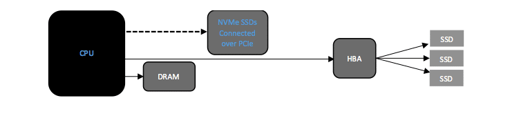

## IO 栈 (SATA 与 NVMe)

<http://www.cs.binghamton.edu/~tameesh/pubs/systor2015.pdf>

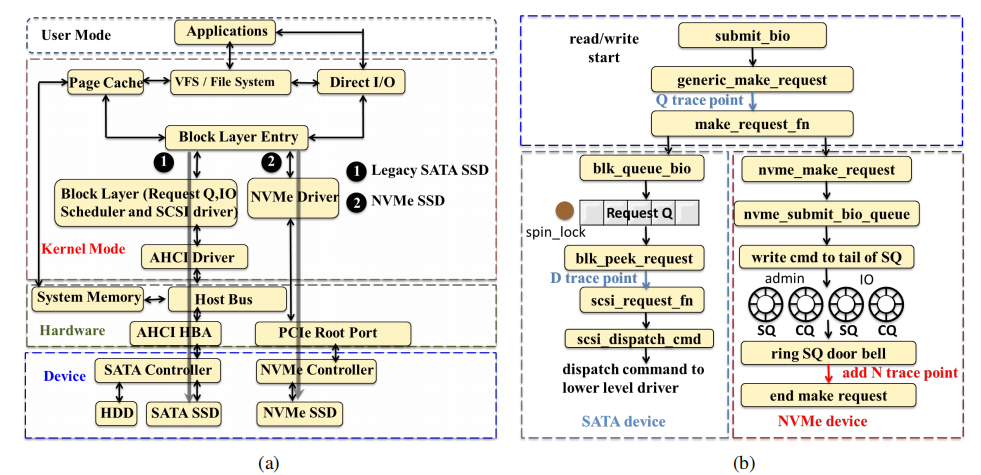

<https://premioinc.com/blogs/blog/what-is-nvme-ssd-guide>

与SATA相比，PCIe支持更高的吞吐量：虽然SATA支持多达600MB/s，但**单个PCIe通道允许多达1GB/s的传输。典型的基于PCIe的ssd是×4PCIe第3代设备，最多支持4个GB/s**。现代的基于x86的芯片组带有×8和×16PCIe插槽，允许存储设备具有高达8-16GB/s的I/O带宽。因此，存储接口仅受微处理器支持的最大PCIe通道数的限制。

此外，NVMe 接口允许 NVMe SSD 直接与 CPU 通信，从而减少通信所需的延迟。另一方面，对于 SATA SSD 和硬盘驱动器，SSD 或 HDD 必须先与 SATA 控制器通信，然后再与 CPU 通信，导致与 NVMe 相比延迟增加。与 SATA 的 6 微秒相比，NVMe 的平均延迟为 2.8 微秒。(这种也太快了)

尽管这似乎是一个很小的差异，但减少的延迟使得在需要**实时数据处理和分析的边缘执行机器学习等任务**成为可能。一些应用程序，例如自动驾驶汽车，需要在短短一毫秒内做出响应；NVMe 驱动器通过降低延迟使此类应用成为可能。

也就是说，硬盘驱动器仍然普遍用于消费类计算机和工业计算机，因为它们以可承受的价格提供大存储容量。尽管如此，闪存存储正变得越来越普遍，因为它具有超快的性能和成本变得更加实惠。

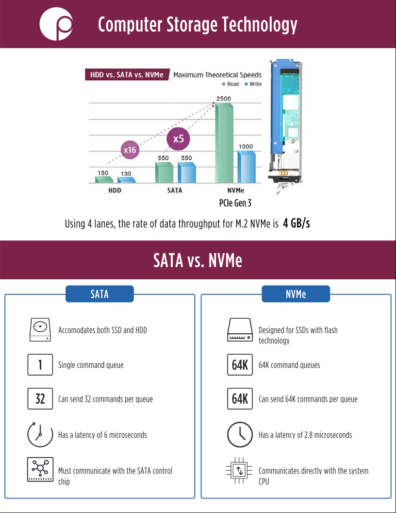

## NVMe 工作原理

SQ CQ scatter/gather IOs

让我们更深入地了解 NVMe 架构以及它如何实现高性能和低延迟。NVMe 可以支持多个 I/O 队列，**最多 64K，每个队列有 64K 条目**。Legacy SAS 和 SATA 只能支持单个队列，每个队列分别可以有 254 和 32 个条目。NVMe 主机软件可以根据系统配置和预期工作负载创建队列，最高可达 NVMe 控制器允许的最大值。NVMe 支持分散/收集 IO，最大限度地减少数据传输的 CPU 开销，甚至提供根据工作负载要求更改其优先级的能力。

下图（图#2）是主机和 NVMe 控制器之间通信的非常简化的视图。这种**架构允许应用程序同时启动、执行和完成多个 I/O 请求**，并以最有效的方式使用底层媒体来最大化速度和最小化延迟。

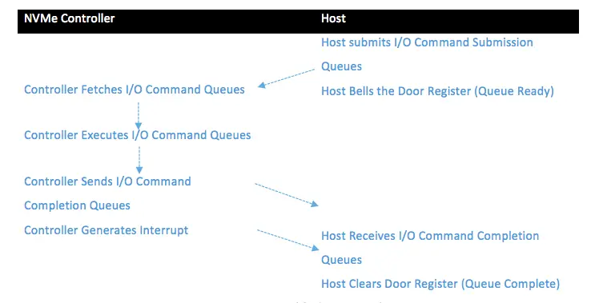

其工作方式是主机写入**I/O 命令队列和门铃寄存器**（doorbell registers，I/O 命令就绪信号）；NVMe 控制器然后**选择 I/O 命令队列，执行它们并发送 I/O 完成队列**，然后向主机发送中断。（这里应该是用户了）主机记录 I/O Completion Queues 并清除门寄存器（door register，I/O Commands Completion Signal）。见图表#2。与 SAS 和 SATA 协议相比，这意味着开销显着降低。

### 为什么 NVMe 从多核处理器中获得最高性能

正如我上面提到的，NVMe 是一个 NUMA 优化的协议。这允许多个 CPU 内核共享队列的所有权、它们的优先级以及仲裁机制和命令的原子性。因此，**NVMe SSD 可以分散/收集命令并不按顺序处理它们**，以提供更高的 IOPS 和更低的数据延迟。

## 影响NVMe SSD的性能因素

<https://my.oschina.net/fileoptions/blog/2412905>

如下图所示，其主要包括主机CPU、PCIe互连带宽、SSD控制器及FTL软件、后端NAND Flash带宽、NAND Flash介质。影响SSD性能的主要因素可以分成硬件、软件和客观环境三大部分，具体分析如下。

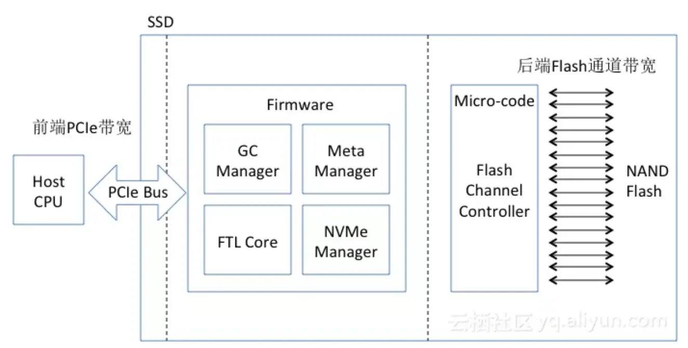

### 硬件因素

a)    **NAND Flash本身**。不同类型的NAND Flash本身具有不同的性能，例如SLC的性能高于MLC，MLC的性能优于TLC。选择不同的工艺、不同类别的NAND Flash，都会具有不同的性能。
b)    **后端通道数（CE数量）及总线频率**。后端通道数决定了并发NAND Flash的数量，决定了并发能力。不同的SSD控制器支持不同数量的通道数，也决定了SSD的后端吞吐带宽能力。NAND Flash Channel的总线频率也决定了访问Flash的性能。
c)    SSD控制器的处理能力。SSD控制器中会运行复杂的FTL（Flash Translation Layer）处理逻辑，将逻辑块读写映射转换成NAND Flash 读写请求。在大数据块读写时，对处理器能力要求不是很高；在小数据块读写时，对处理器能力要求极高，处理器能力很容易成为整个IO系统的性能瓶颈点。
d)    SSD控制器架构。通常SSD控制器采用SMP或者MPP两种架构，早期的控制器通常采用MPP架构，多个小处理器通过内部高速总线进行互连，通过硬件消息队列进行通信。内存资源作为独立的外设供所有的处理器进行共享。这种架构和基于消息通信的分布式系统类似。MPP架构的很大优势在于性能，但是编程复杂度较高；SMP架构的性能可扩展性取决于软件，编程简单，和在x86平台上编程相似。不同的控制器架构会影响到SSD的总体性能，在SSD设计时，会根据设计目标，选择不同类型的SSD控制器。
e)    **内存支持容量**。为了追求高性能，SSD内部的映射资源表会常驻内存，映射表的内存占用大小是盘容量的0.1%，当内存容量不够大时，会出现映射表换入换出的问题，影响到性能。
f)    **PCIe的吞吐带宽能力**。PCIe前端带宽体现了SSD的前端吞吐能力，目前NVMe SSD采用x4 lane的接入方式，上限带宽为3GB/s，当后端NAND Flash带宽和处理器能力足够时，前端PCIe往往会成为性能瓶颈点。NAND Flash具有很高的读性能，目前来看，SSD的读性能在很大程度上受限于PCIe总线，**因此需要快速推进PCIe4.0标准**。
g)    温度对性能造成影响。在NAND Flash全速运行的情况下，会产生较大的散热功耗，当温度高到一定程度时，系统将会处于不正常的工作状态，为此，SSD内部做了控温系统，通过温度检测系统来调整SSD性能，从而保证系统温度维持在阈值之内。调整温度会牺牲性能，本质上就是通过降低SSD性能来降温。因此，当环境温度过高时，会影响到SSD的性能，触发SSD内部的温度控制系统，调节SSD的性能。
h)    使用寿命对性能造成影响。NAND Flash在不断擦除使用时，Flash的bit error会不断上升，错误率的提升会影响到SSD的IO性能。

### 软件因素

a)    **数据布局方式**。数据布局方法需要充分考虑NAND Flash中的并发单元，如何将IO操作转换成NAND Flash的并发操作，这是数据布局需要考虑的问题。例如，**采用数据交错的方式在多通道page上进行数据布局**，通过这种方式可以优化顺序带宽。
b)    垃圾回收/wear leveling调度方法。数据回收、wear leveling、data retention等操作会产生大量的NAND Flash后端流量，后端流量直接反应了SSD的写放大系数，也直接体现在后端带宽的占用。垃圾回收等产生的流量也可以称之为背景流量，背景流量会直接影响到前端用户性能。因此需要对背景流量和用户流量之间进行合理调度，使得用户IO性能达到最佳。
c)    **OP预留**。为了解决坏块、垃圾回收等问题，在SSD内部预留了一部分空闲资源，这些资源被称之为OP（Overprovisioning）。OP越大，GC过程中平均搬移的数据会越少，背景流量会越小，因此，写放大降低，用户IO性能提升。反之，OP越小，性能会越低，写放大会越大。在SSD容量较小的时代，为了提升SSD的使用寿命，往往OP都设置的比较大。
d)    Bit error处理影响性能。在SSD内部采用多种机制来处理NAND Flash所产生的Bit error。ECC纠错、read retry、soft LDPC以及RAIN都是用来纠正bit翻转导致的错误。当Bit错误率增加时，软件处理的开销越大，在bit控制在一定范围之内，完全可以通过硬件进行纠正。一旦软件参与到bit纠正的时候，会引入较大的性能开销。
e)    FTL算法。FTL算法会影响到SSD性能，对于不同用途的SSD，FTL的设计与实现是完全不同的，企业级SSD为了追求高性能，通常采用Flat mapping的方式，采用大内存缓存映射表；消费级SSD为了追求低成本，通常采用元数据换入换出的方式，并且采用pSLC+TLC的组合方式进行分层存储，也可以采用主机端内存缓存元数据信息，但是这些方式都会影响到性能。
f)    IO调度算法。NAND Flash具有严重的性能不对称性，Flash Erase和Program具有ms级延迟，Flash read的延迟在us级。因此，如何调度Erase、Program以及read是SSD后端设计需要考虑的问题。另外，前端IO以及背景IO之间的调度也是需要权衡考虑，通过IO调度可以达到最佳性能表现。在IO调度过程中，还需要利用NAND Flash的特性，例如Program Suspension，通过这些特性的利用，最优化SSD前端IO性能。
g)    **驱动软件**。驱动软件运行在主机端，**通常分为内核态和用户态两大类**，内核态驱动会消耗较多的CPU资源，存在频繁上下文切换、中断处理，因此性能较低；用户态驱动通常采用Polling IO处理模式，去除了上下文切换，可以充分提升CPU效率，提升整体IO性能。
h)    **IO Pattern对性能产生影响**。IO Pattern影响了SSD内部的GC数据布局，间接影响了GC过程中的数据搬移量，决定了后端流量。当IO Pattern为全顺序时，这种Pattern对SSD内部GC是最为友好的，写放大接近于1，因此具有最好的性能；当IO Pattern为小块随机时，会产生较多的GC搬移数据量，因此性能大为下降。在实际应用中，需要通过本地文件系统最优化IO Pattern，获取最佳性能。

### 客观因素

a)    **使用时间越长会导致SSD性能变差**。使用时间变长之后，SSD内部NAND Flash的磨损会加重，NAND Flash磨损变大之后会导致bit错误率提升。在SSD内部存在一套完整的bit错误恢复机制，由硬件和软件两大部分构成。当bit错误率达到一定程度之后，硬件机制将会失效。硬件机制失效之后，需要通过软件（Firmware）的方式恢复翻转的bit，软件恢复将会带来较大的延迟开销，因此会影响到SSD对外表现的性能。在有些情况下，如果一块SSD在掉电情况下放置一段时间之后，也可能会导致性能变差，原因在于SSD内部NAND Flash中存储电荷的漏电，放置一段时间之后导致bit错误率增加，从而影响性能。SSD的性能和时间相关，本质上还是与NAND Flash的比特错误率相关。
b)    环境温度也会对性能造成影响。为了控制SSD温度不能超过上限值，在SSD内部设计有一套温度负反馈机制，该机制通过检测的温度对NAND Flash后端带宽进行控制，达到降低温度的效果。如果一旦温度负反馈机制开始工作，那么NAND Flash后端带宽将会受到限制，从而影响前端应用IO的性能。

## IO Pattern对性能的影响

IO Pattern会对SSD的性能产生严重影响，主要表现在如下几个方面：
1，    **不同的IO Pattern会产生不同的写放大系数，不同的写放大系数占用后端NAND Flash带宽不同**。当前端应用对SSD采用**完全顺序的方式**进行写入时，此时是最佳的IO Pattern，对于SSD而言写放大系数接近1，SSD内部的背景流量基本可以忽略，前端性能达到最佳。在实际应用中，很难采用这种完全顺序的数据写模型，但可以通过优化逼近顺序写入。
2，    **不同请求大小的IO之间会产生干扰**；读写请求之间会产生干扰。小请求会受到大请求的干扰，从而导致小请求的延迟增加，这个比较容易理解，在HDD上同样会存在这种情况。由于NAND Flash介质存在严重的读写不对称性，因此读写请求之间也会互相干扰，尤其是写请求对读请求产生严重的性能影响。

### 顺序写入Pattern对SSD性能优化的奥秘

<https://mp.weixin.qq.com/s/enknWPXgzJldhsneQMQYFQ>

SSD内部采用log-structured的数据记录模式，**并发写入的IO数据按照时间顺序汇聚成大数据块，合并形成的大数据块以Page stripe的方式写入NAND Flash**。多个Page stripe会被写入同一个GC单元（Chunk or Superblock），当一个GC单元被写完成之后，该GC单元进入sealed模式（只读），分配新的GC单元写新的数据。在这种模式下，**如果多个业务的数据流并发随机的往SSD中写入数据，那么多个应用的数据就会交错在一起被存储到同一个GC单元中**。如下图所示，不同应用的数据生命周期不同，当需要回收一个GC单元的时候，会存在大量数据的迁移，这些迁移的数据就会形成写放大，影响性能和使用寿命。

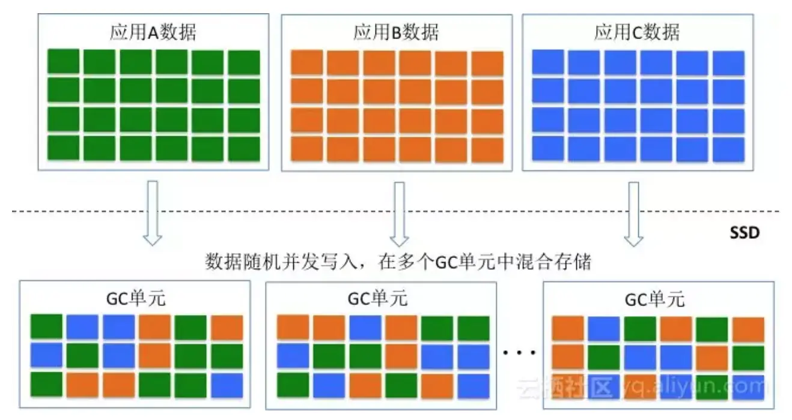

不同应用的数据交错存储在同一个GC单元，本质上就是不同冷热程度的数据交错存储的问题。从GC的角度来讲，相同冷热程度的数据存储在同一个GC单元上是最佳的，为此三星推出了Multi-stream SSD，该SSD就允许不同应用的数据存储到不同的Stream单元（GC单元），从而提升GC效率，降低写放大。Multi-stream是一种显式的设计方式，需要更改SSD接口以及应用程序。**从IO Pattern的角度考虑，可以通过顺序大块的方式也可以逼近类似的效果**。假设操作SSD只存在一个线程，不同的应用都采用大数据块的方式写入数据，那么在一个时间片段内只存在一个应用的数据往SSD中写入数据，那么在一个GC单元内存储的数据会变得有序和规则。如下图所示，采用上述方法之后，一个GC单元内存储的数据将会变得冷热均匀。在GC过程中会大大减少数据的搬移，从而减少背景流量。

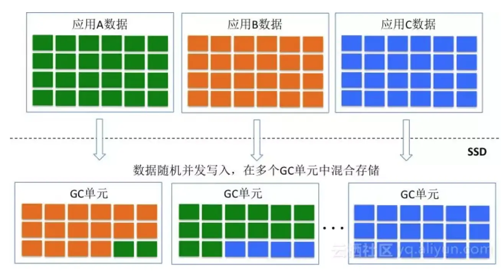

在实际应用中，上述IO Pattern很难产生，主要是应用很难产生非常大粒度的请求。**为此在存储系统设计过程中，可以引入Optane高性能存储介质作为SSD的写缓存。前端不同业务的写请求首先写到Optane持久化介质中，在Optane持久化介质中聚合形成大数据块**。一旦聚合形成大数据块之后，再写入SSD，通过这种方式可以最大程度的逼近SSD顺序写入过程，提升SSD的性能和使用寿命。

(牛逼)应用到我们的系统，就是可以把相同epoch的旧版本数据写到同一个块，这样可以一起回收。

### 读写冲突Pattern对性能的影响

如下图所示，NAND Flash介质具有很强的读写不对称性。Block Erase和Page Program的延迟会远远高于Page Read所耗费的时间。那么在这种情况下，**如果read请求在同一个Flash Channel上和Erase、Program操作冲突，那么read操作将会被Erase／program操作影响**。这是在读写混合情况下，读性能会受到影响的重要因素。

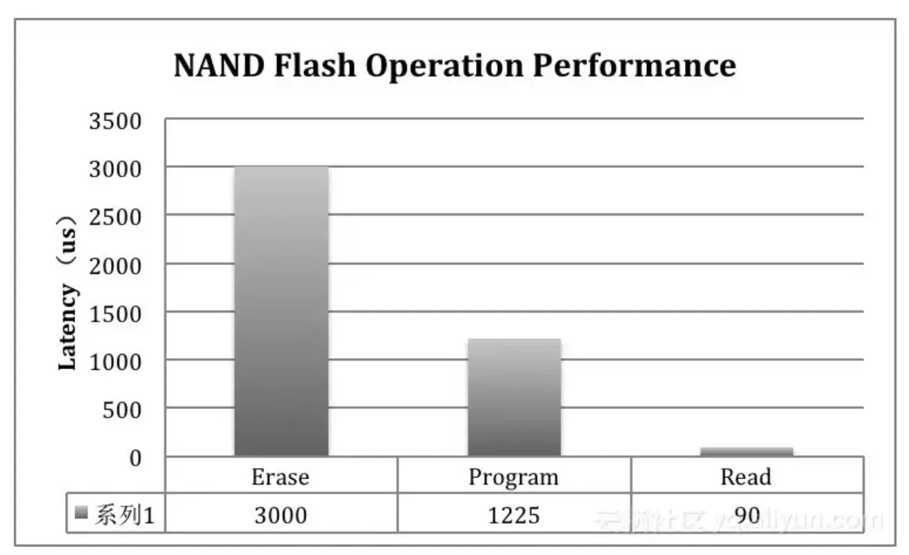

在实际应用过程中，经常会发现应用的测试结果和SSD Spec对不上，会比Spec给出的值要来的低。**Spec给出的值通常为纯读或者纯写情况下的性能指标，在读写混合的场景下，性能表现和Spec给出的值就会存在非常大的出入**。

对于不同的SSD，通过测试可以发现在读写混合情况下的性能表现差距会比较大。在SSD处于稳态条件下，应用随机读的情况下，如果引入一个压力不是很大的顺序写，那么会发现不同SSD的抗干扰能力是不同的。有些SSD在写干扰的情况下，读性能会急剧下降，延迟快速上升，QoS性能得不到保证。下图是两个SSD在相同情况下的测试结果，从结果来看，有些SSD的抗写干扰能力比较强，读性能不会急剧下降。

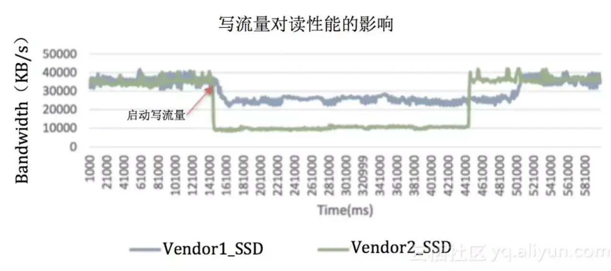

为什么有些SSD会具备比较强的抗写干扰能力呢？其中的奥秘就在于SSD内部的IO调度器。IO调度器会对write、read 和Erase请求进行调度处理，该调度器算法的不同就会表现出不同的抗干扰能力。目前很多NAND Flash可以支持Program／Erase Suspension的功能，**在IO调度处理的过程中，为了提升读性能，降低读请求延迟，可以采用Suspension命令对Program／Erase命令暂停，对read请求优先调度处理**。

读写冲突是SSD内部影响IO QoS的重要因素。在SSD内部通过IO调度器的优化可以提升SSD性能的QoS能力，但是还是无法与存储软件结合来协同优化QoS。为了达到最佳的SSD性能QoS，需要关注Openchannel技术。**Openchannel其实只是一种软硬件层次划分的方法**，通常来讲，SSD内部的逻辑可以划分为面向NAND资源的物理资源管理层以及面向数据布局的资源映射层。**物理资源管理由于和NAND Flash密切相关，因此可以放到SSD内部**。传统的NVMe SSD需要对外暴露标准的块设备接口，因此需要在SSD内部实现资源映射层。从端至端的角度来看，**资源映射层可以与存储软件层结合起来，为此将资源映射层从SSD内部剥离出来，集成至存储软件层**。一旦资源映射层从SSD内部剥离之后，需要定义一个新的SSD接口，其中的一种接口方式就是Openchannel。

**盘古分布式存储针对SSD QoS问题进行了大量研究，提出了Object SSD的概念，Object SSD也是一种新的SSD接口方式，其采用对象方式对SSD进行读写删操作，每个对象采用Append write操作方式**。这种接口方式可以很好的与分布式存储无缝结合。采用Object SSD之后，SSD内部的大量工作被简化，IO的调度会更加灵活，存储软件与SSD协同配合，达到IO性能的最优化，以及QoS的最大化。

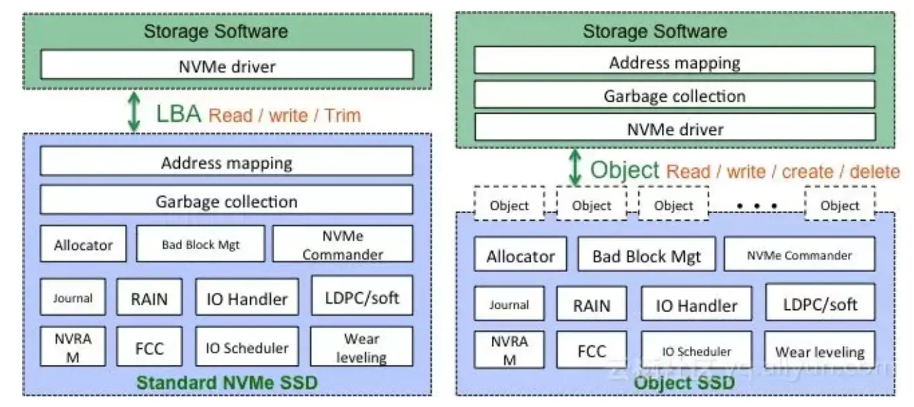

## SSD写性能分析模型

SSD内部的数据流分成两大类，一类为前端用户数据流；另一类为内部背景数据流。前端用户数据流和背景数据流会汇聚成NAND Flash后端流量。当背景数据流不存在时，NAND Flash带宽会被用户数据流全部占据，此时SSD对外表现的性能达到最佳。当SSD具有较大写放大时，会产生很大的背景数据流，背景流会抢占NAND Flash带宽，导致前端用户IO性能降低。为了稳定前端IO性能，在SSD内部的调度器会均衡前端和背景流量，保证前端性能的一致性。背景流量的占比反应了SSD的写放大系数，因此，站在NAND Flash带宽占用的角度可以分析SSD在稳态情况下的性能。

在此，假设写放大系数为WA，顺序写情况下的总带宽数为B，用户写入流量（随机写入流量）为U。那么，由于GC写放大造成的背景流量为：（WA - 1）* U
写放大流量为一读一写，都会占用带宽，因此，总带宽可以描述为：2  (WA - 1)  U + U = B
因此，**可以得到：U = B / (2(WA - 1) + 1) = B / (2  WA - 1)**
上述公式表述了前端用户流量和NAND Flash总带宽、写放大系数之间的关系。

根据Spec，Intel P4500的顺序写带宽为1.9GB/s，按照上述公式，在随机访问模式下的带宽为： 1900 / (2 * 4 - 1) = 270MB/s，IOPS为67K，根据该公式推导的结果和Spec给出的结果相同。

下图是Intel P4500和Samsung PM963随机写延迟和推导公式之间的对比。结果非常吻合。

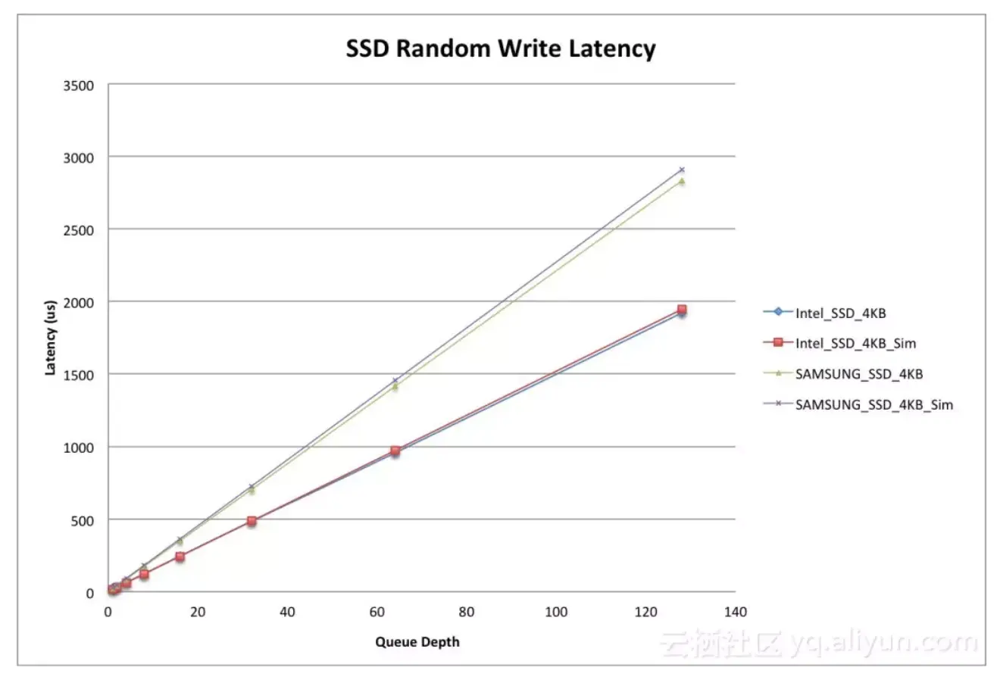

由此可以推出，**随机写性能由SSD内部后端带宽以及写放大系数来决定**。因此，从存储软件的角度出发，我们可以通过优化IO Pattern的方式减小写放大系数，从而可以提升SSD的随机写性能。

## 其他使用标准

我们看到在更多用例中使用的标准。一个例子是分区存储和 ZNS SSD。NVMe 分区命名空间 (ZNS) 是 NVM Express 组织正在考虑的一项技术提案。它将命名空间的 LBA 划分为区域，并且必须按顺序写入，如果再次写入，则必须显式重置。该规范引入了一种新型 NVMe 驱动器，与传统 NVMe SSD 相比，它具有多项优势，例如：

- 通过减少写入放大提高性能
- 通过减少过度配置来提高容量
- 由于 SSD 控制器 DRAM 占用空间减少，成本降低
- 改善延迟

最后，NVMe 协议不仅限于简单地连接闪存驱动器，它还可以用作网络协议，或NVMe over Fabrics。这种新的网络协议使高性能存储网络结构成为各种传输的通用框架。

ZNS更详细的介绍参考：<https://blog.westerndigital.com/what-is-zoned-storage-initiative/>

了解有关分区存储的更多信息: 

- 访问[ZonedStorage.io](https://zonedstorage.io/)
- 阅读有关使用 Zettabyte 存储开启 Zettabyte 时代的信息

## 参考

西部数据系列博客

1. <https://blog.westerndigital.com/nvme-important-data-driven-businesses/>
2. <https://blog.westerndigital.com/what-is-zoned-storage-initiative/>
