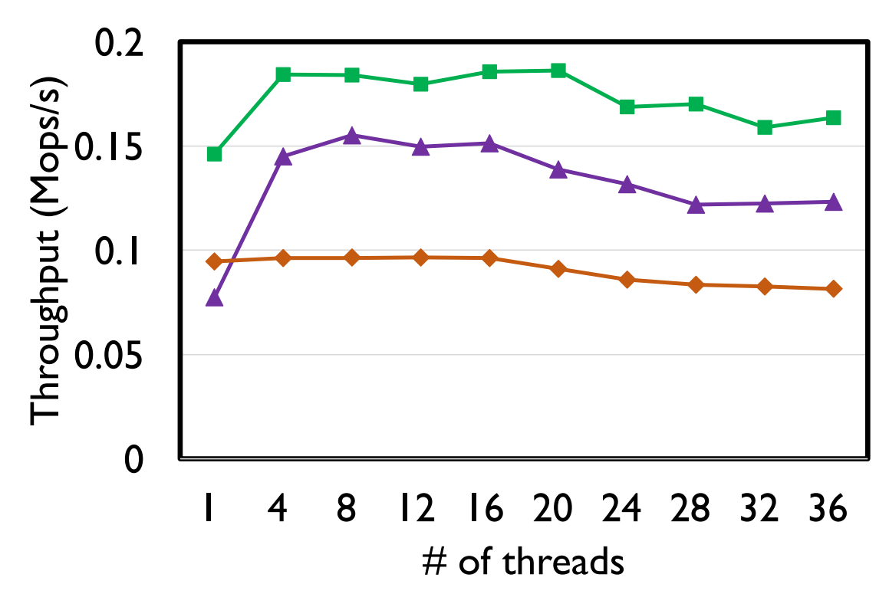

# 我的设计

基于PM和SSD的混合数据页管理

1. 一个好的AEP页淘汰机制
2. 线程可扩展性的log-structure写。不是每个inode一个log，也不是全局一个log，根据AEP的特性，限制并发写log的个数
3. 支持细粒度更新的AEP页管理。（256 512 1024 2048 4096 不同的等级）

## 背景

Nova，可扩展的设计，但实际测试并非可扩展。（来自kucofs）

## 空间管理

正如论文所说，如果放弃原地修改，或者系统要保证data的崩溃一致性，就不能向用户提供虚拟地址接口，即用户不能再像使用内存那样（通过对地址的load/store）来使用NVM，而是使用系统封装好的特定API来读写，API内部处理一些地址转换、索引、崩溃一致性的工作。这样对于一个NVM数据，我们不用虚拟地址标志它，而是使用对象ID。

针对非对齐写入优化

> 是否考虑更大范围的数据块？不一定要按照页来管理

针对细粒度的冷热管理方案。

传统文件系统需要使用DRAM作为数据缓存，对于写入，需要缓存脏数据页，然后定期刷回存储介质中。而NVM具有掉电数据不丢失的特性，可以使用NVM作为写缓存，从而避免写回的高开销，进而在垃圾回收过程中，根据页的访问情况，将冷数据刷回SSD中。

4.1 Goals
We aim to support the following properties in the proposed file system with journaling on NVMe SSD.
(i) **Performance**. The overall I/O performance in terms of IOPS is significantly improved compared to
the original journaling file system.
~~(ii) **Stability**. The I/O performance is relatively stable over time.~~
(iii) **Durability**. Once a write transaction is committed to the journal successfully, it will survive
permanently.
(iv) **Low cost**. The additional resource consumption incurred by the new design is maintained at a low
level.

OID分配：全局变量，原子增加。通过批量分配避免每次alloc对象都需要flush+fence

将空间切分成chunk（稍微小一点？4MB，再切成更小的Page来作为log比较好）
线程本地的chunk list（in use，free，to gc）

alloc size + free size，避免冲突

free的时候，需要把log entry标记为无效，为了避免随机写，添加free op log。后台进行GC，gc时会增加free size，当它发现该page的不在使用了，而且数据有效率低于一定的阈值，则可以进行page回收。page回收加入thread local的free list

> 暂时不考虑chunk丢回全局的操作

对于覆盖写的旧数据回收，通过扫描对象索引来发现，降低free的关键路径开销

优化1: 小对象的分配用单独的chunk，大对象用单独的chunk，即chunk有身份。因为不同的对象大小往往有不同的访问逻辑，相同大小的对象更有可能有相似的访问频率，这样可以提供cache的命中率

**需要重大创新的话**：或许可以考虑文件数据的extend方式索引，而不是按照page。考虑划分多级chunk、sub-chunk、page（或者说多级别page）

2022.10.5 最新的想法，NVM通过软件的方式暴露页结构，以兼容传统的SSD、HDD等块设备。实现不同存储介质的无缝迁移。NVM的页结构经过精心设计，对小写进行优化。

> 窃取机制，节约内存的。但不支持窃取机制有它的好处，就是可以减少IO次数。具体实现时需要权衡

为了提高效率，KucoFS只操作正常请求的DRAM元数据。为了确保元数据的持久性和崩溃的一致性，**KucoFS为每个分区树在PM中放置了一个仅附加的持久操作日志**。当Kfs更新元数据时，它首先原子地附加一个日志条目，然后实际更新DRAM元数据（参见4.2）。发生系统故障时，**可以通过重播操作日志中的日志条目来恢复DRAM元数据**。除了操作日志之外，额外的PM空间还被切割成4 KB的数据页和元数据页。免费PM页面通过PM中的**位图和DRAM中的免费列表**（用于快速分配）进行管理，并且位图在检查点阶段由Kfs延迟地持久化。（论文有log样例）

有一个inode table，通过这个table的空闲表象来分配 inode 号

> 可以对比直接原地修改，和log+dram方式的性能差距（可以避免pm的随机读写）。

为了限制DRAM消耗，可以进行元数据和数据的部分缓存。

## 混合存储

可以在内存中维护一个LRU buffer，每次读页数据时，在内存中重构，这样后面的读就不用多次log跳跃索引，不过这样显然会增加NVM的写入流量，适当增加DRAM buffer的大小，可以吸收大部分更新

数据用ntstore，元数据用clwb

## 索引

MemC3 [41] redesigns the hash ta- ble with Cuckoo hashing and removes LRU chain pointers. However, it does not consider some operations such as cas for atomic updates, does not support TTL expiration or other advanced eviction algorithms.

> [41] Bin Fan, David G Andersen, and Michael Kamin- sky. Memc3: Compact and concurrent memcache with dumber caching and smarter hashing. In Presented as part of the 10th USENIX Symposium on Networked Sys- tems Design and Implementation (NSDI 13), pages 371– 384, 2013.

解决并发索引的问题。最简单的方式就是分片哈希，单个哈希一个锁。

另外可以额外增加一个thread local的哈希索引，减少哈希读写冲突。

最主要的问题是，写入时的哈希扩展问题。
TODO: 探索可以读写并发的哈希结构

inode的管理可以参考 TridentFS，固定最大的inode大小。用bitmap标志是否使用。

> 链表式哈希表

## 垃圾回收

垃圾回收通过全局扫面可能比较消耗带宽，考虑正常的访问中收集垃圾回收信息。全盘扫描肯定不行，但可以优化，
内存中维护GC链表，每线程一个

可以将垃圾回收和冷热管理相结合，冷的数据直接写回SSD。热数据考虑顺便进行碎片整理

选择算法：
(i) Greedy [30], which selects the sealed segments with the
highest GPs, and (ii) Cost-Benefit [30,31], which selects the
sealed segments that have the highest values GP∗age (where 1−GP
age refers to the elapsed time of a sealed segment since it
is sealed) for GC.

> 感觉Cost-Benefit简单实用

过多的GC线程会影响前台的IO性能，只有极端情况下，才开启多线程GC

Besides data placement, existing studies propose segment selection algorithms to reduce the WA of flash-level GC. In addition to Greedy and Cost-Benefit (§2.1), Cost-Age-Times [11] considers the cleaning cost, data age, and flash erasure counts in segment selection. Windowed Greedy [17], Random- Greedy [24], and d-choices [36] are variants of Greedy in segment selection. Desnoyers [14] models the WA of different segment selection algorithms and hot-cold data separation. SepBIT can work in conjunction with those algorithms.

## cache

尝试启用NVM作为二级Cache。DRAM中的cache淘汰时判断是否先写回NVM。

**思考可多线程扩展的LRU cache算法。**

调研NOVA是否在普通write的过程中就将数据写到NVM。如果是，我们只有在fsync的时候，将数据写回NVM也算是一个优化。

1. DRAM cache write。单独的每个page的元数据，标记哪些范围的数据是脏的（64B或者256B的粒度）。
2. 更简单的实现是，NVM中copy on write。原地修改，只有在fsync时才生成新版本。

具体来说，当 NVRAM 空间利用率超过预定义的阈值 TH（即高水位线）时，驱逐管理器开始执行驱逐，直到 NVRAM 空间利用率下降到另一个阈值 TL（即低水位线）以下 . 在当前实现中，TH 和 TL 分别设置为 100% 和 95%。

在选择驱逐数据（即元数据或文件数据）时考虑三个因素，即新近度、频率和大小。 TridentFS 尝试在 NVRAM 中保留最近使用、经常使用和小数据。 正如之前的研究[36, 37]所指出的，频率和新近度都是表明数据热度的重要因素。 另外，size也考虑，主要是因为驱逐大尺寸的数据有助于回收大量的NVRAM空间，可以用来容纳很多小尺寸的热点数据。

## 多线程扩展性

考虑以下几点：

1. AEP的线程扩展性。减少log的个数（每个线程一个log，每个文件一个log，全局log，折中-多个线程共享一个log，内存中同步）
2. 数据结构上的无锁设计（索引，数据页的索引，支持多线程同时修改同一个文件。参考kucoFs，每个文件有一个环形的ring lock，多线程无锁检查）
3. 读写并发，支持版本读（读不会阻塞写，kucofs版本读策略，依照版本一致性检查来不断重试以读取一致性快照）

## 编程

loadable module

## 测试

<https://link.springer.com/article/10.1007/s10586-019-03023-y>

TridentFS（2014）这篇论文有对不同测试benchmark的负载分析，感觉小文件还挺多的，可以对小文件进行特殊的优化。

在我们的评估中，我们试图回答以下问题：KucoFS是否实现了提供直接访问性能和高可伸缩性的目标？•KucoFS中的每种技术如何帮助实现上述目标？•KucoFS在宏基准测试和真实应用程序下表现如何？

我们使用FxMark [25]来分析个别技术的影响，它探讨了基本文件系统操作的可伸缩性。FxMark提供了19个微基准测试，并根据四个标准进行分类：数据类型（即数据或元数据）、模式（即读取或写）、操作和共享级别。我们只评估常用的操作（例如，读、写、mknod等）。由于空间有限。

Changwoo Min, Sanidhya Kashyap, Steffen Maass,
Woonhak Kang, and Taesoo Kim. Understanding
manycore scalability of file systems. In Proceedings
of the 2016 USENIX Conference on Usenix Annual
Technical Conference, USENIX ATC ’16, pages 71–85,
Berkeley, CA, USA, 2016. USENIX Association.

Filebench: Macro-Benchmarks
We then use Filebench [1] as a macro-benchmark to evaluate
the performance of KucoFS.

对于 NVM，我们将其与默认有序数据模式下的 Linux EXT4-DAX [1] 文件系统以及 PMFS [25] 和 NOVA [52] 进行比较。 在 SSD 上，我们与 F2FS [32] 进行比较。 在 HDD 上，我们与 EXT4 [35] 进行比较，也是在有序数据模式下。 有序模式是 EXT4 的 Linux 默认设置，因为它提供了性能和崩溃一致性之间的最佳折衷。

Strata：我们试图通过我们的实验评估来回答以下问题。•分层在记录到NVM并消化到存储层时的效率如何？它与为单个层设计和操作的文件系统相比如何？•常用的应用程序如何使用地层执行？在其他文件系统上的性能比较如何？•与上面（在用户层）和文件系统以下（在块层）的解决方案相比，Strata在跨层管理数据时的表现如何？•地层的多核可伸缩性是什么？它与其他文件系统相比如何？•与其他文件系统相比，在共享地层时，多个租户有多孤立？

Redis: Real-World Application
Redis exports a set of APIs allowing applications to process
and query structured data, and uses the file system for persistent data storage.

Detailed performance evaluation of PMFS with a PM
hardware emulator, comparing PMFS with traditional file
systems on a RAMDISK-like Persistent Memory Block
Device (PMBD).

## TODO

寻找一个线程可扩展的LRU算法，缓存算法

## 注意

尝试线程本地缓存优化

写流量测试，flush的cacheline个数*大小（简单计算flush+fence的个数就好）
线程扩展性测试
NVM碎片测试

垃圾回收的影响

恢复时间

## 缺点

1. 安全控制和检查
2. 进程间的共享

万老师，想问一下毕设相关的一些问题。毕设打算做NVM和SSD混合介质的文件系统方向，主要集中对数据布局的优化（比如针对不同的负载，读、小写、大写，来决策数据布局方式）。

最近也看了一些论文，也有了一些想法。主要的出发点有三个吧：1）针对小写（小于4KB）的优化，目前的工作都是按页cow，小写更新的写放大严重，没有充分发挥NVM的字节寻址优势；2）目前基于NVM的论文，没有充分考虑AEP的特性（256字节管理粒度、单个cacheline重复刷写延迟变高、多线程并发写性能低），打算在线程扩展性上做优化。3）和企业级的SSD相比，AEP的带宽并没有很大的优势，可以把一些大块的写直接导入SSD，充分发挥SSD和NVM设备的并行带宽。其他的，在NVM成本问题上也可以说一些。

主要的目标：接近NVM的性能，同时具备SSD的大容量。突出贡献目标是：1）小写优化。2）多线程扩展性；3）带宽明显提高，可以同时充分发挥NVM和SSD的并行带宽（设计时可以考虑多个SSD的情况，实现带宽随SSD的线性扩展）

目前的问题主要集中在实现上：

1）因为涉及两种介质，mount这种命令就不好支持，而且内核态开发也不熟悉，打算索性做成纯用户态的（通过pmdk和spdk来访问nvm和ssd），但这样会有安全性问题；
2）计划结合内存做一些优化。NVM和SSD都按照log的方式管理和写入，然后内存维护索引。问题是这样不支持多进程同时访问同一个fs。

所以感觉我这个和KV的使用方式更像，当做库一样被单个进程访问，不知道这样有没有问题？然后我考虑到我的工作不是要做整个文件系统，主要针对AEP和SSD混合介质的数据读写优化，索引部分打算照抄NOVA的，然后写作的时候淡化文件系统的概念，表示我只是通过这样一个原型系统来验证我的设计是否有效果，这样是否可以呢？

另外测试上，打算搬迁NOVA到纯用户态，作为对比方案，这样公平一些。但其他的对比方案就没那么多时间重写到用户态了，比如Libnvmmio是基于NVM的纯内核态FS，还有ext4和xfs是基于SSD的内核态FS。这样对比测试有问题吗？（感觉不太公平）

（怕答辩/送审的时候卡安全性、进程共享和测试上的问题）
