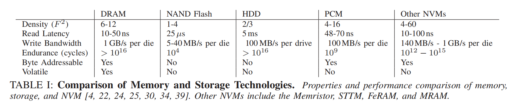

# A Study of Application Performance with Non-Volatile Main Memory

将下一代非易失性存储器（NVMs）连接到主内存总线上，可以提供对持久数据的低延迟、字节寻址访问，这将显著提高各种存储密集型工作负载的性能。我们提出了一个使用非易失性主存（NVMM）的存储应用程序性能的分析，使用一个硬件NVMM模拟器，允许对NVMM性能参数进行细粒度调整。我们的评估结果表明，NVMM比基于闪存的ssd和hdd显著提高了存储应用程序的性能。我们还比较了在现实的NVMM上运行的应用程序的性能与在理想化的NVMM上运行的具有与DRAM相同性能的相同应用程序的性能。我们发现，尽管NVMM预计比DRAM有更高的延迟和更低的带宽，但这些差异对应用程序性能的影响并不小。对NVMM性能的一个更大的拖累是确保数据安全驻留在NVMM中（而不是不稳定的缓存），以便应用程序能够对持久性和一致性提供强有力的保证。为此，我们提出了一种优化的方法来从CPU缓存中刷新数据，从而将此成本最小化。我们的评估表明，这种技术显著提高了需要严格持久性和一致性保证的应用程序的性能。

## 引言

下一代非易失性存储器（NVM）技术，如相变存储器（PCM）[14,16]、自旋传输转矩磁存储器（STTMs）[12,26,36]和忆阻器[39]，提供了低延迟访问、高带宽、高效的细粒度访问和持久性[33]。因此，它们有潜力在缓慢、持久的存储（即磁盘和ssd）和快速、易失性存储器（即DRAM）[17,18,25,39]之间建立起桥梁。表一总结了不同的NVM技术的特点，并将其与传统的内存和存储技术进行了比较。

我们通过我们的研究做出了几个发现。

- **使用NVMM的应用程序性能比使用ssd和hdd要好得多**。与基于闪存的ssd和hdd相比（高达28×），NVMM显著提高了存储应用程序的性能，即使没有任何应用程序更改。对于具有频繁写和功能同步的应用程序以及具有大型工作集的应用程序，其好处尤其大。这些结果证实，用NVMM取代ssd和hdd将有利于广泛的存储应用。
- N**VMM低于DRAM的性能对应用的影响很小**。NVMM的延迟和带宽可能会比DRAM差一些，但这种差异的影响很小。与 DRAM 相比，具有更长延迟和更低带宽的 NVMM 可提供与具有类似 DRAM 性能的理想化 NVMM 几乎相同的性能。对于我们的应用进程，除 Memcached 外，NVMM 增加的延迟和带宽的降低使性能相对于 DRAM 降低了不到 10%。这一发现意味着进一步优化NVMM的延迟和带宽将不会那幺有益。
- **数据持久性可能非常昂贵**。在NVMM上使数据持久化（即“同步”它）涉及到昂贵的处理器缓存刷新操作。对于经常同步大区域内存的应用程序来说，这种成本尤其高。

**基于这最后的发现，我们提出了选择性持久性冲洗（SPF），这是一种通过只从缓存中刷新修改过的数据来最小化确保数据持久性保证的成本的技术**。SPF显著提高了存储应用程序的性能，这需要严格的耐用性和对大区域内存的一致性保证。

