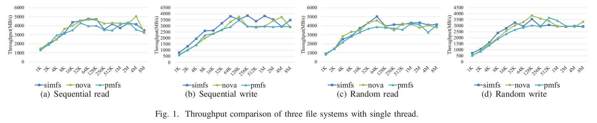
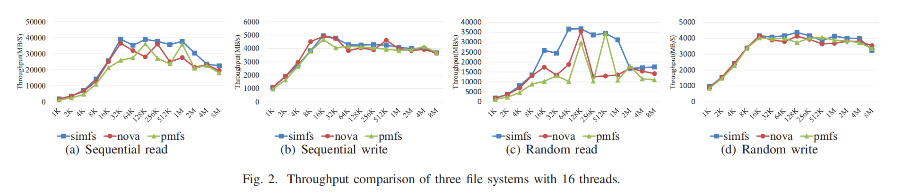
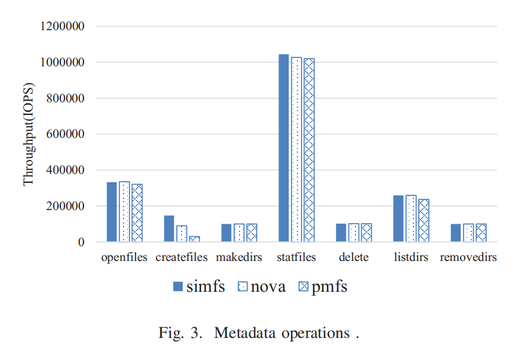
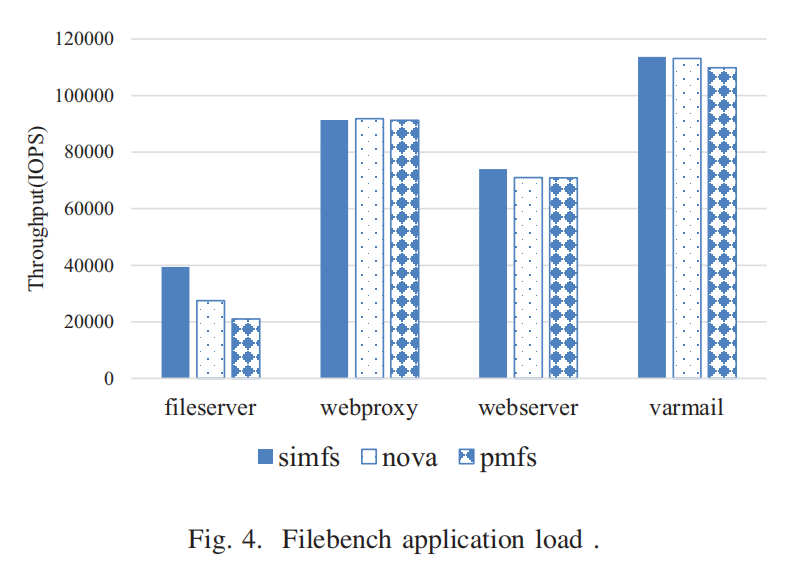
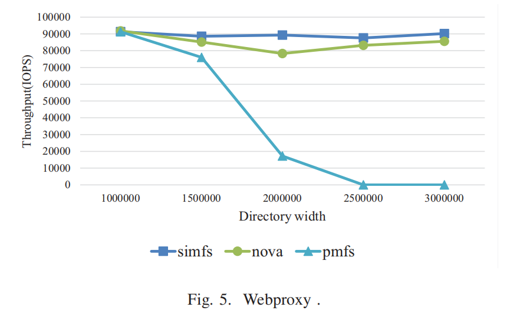
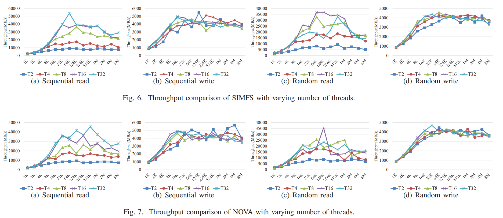
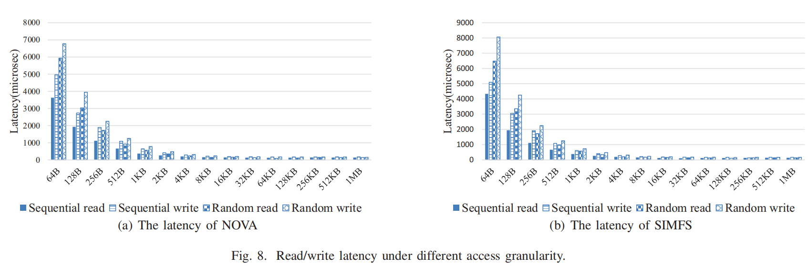
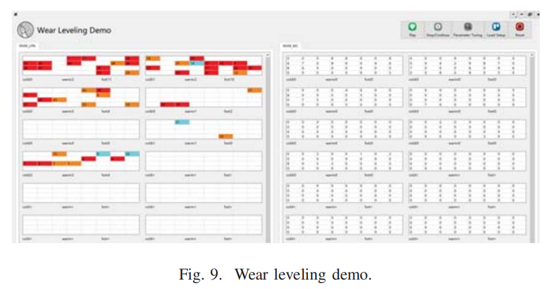

# An_Empirical_Study_of_NVM-based_File_System

## 摘要

新兴的可字节寻址、非易失性内存为在内存中保存文件提供了机会。然而，目前还没有针对不同文件系统的系统性能研究。本文通过一系列的初步研究来评估现代基于NVM的文件系统（如PMFS、SIMFS和NOVA）的性能。我们的研究得出了几个有趣的发现，文件系统设计人员在工作时要充分考虑。此外，本文还探讨了基于nvm的文件系统的可视化，**并开发了NVMPlayer。据我们所知，这是第一个显示基于NVM的文件系统内部机制的图形化工具**。它演示了可视化如何帮助我们阐明基于nvm的文件系统中的复杂现象，并揭示了优化的新机会。

## 引言

新兴的非易失性存储器（NVM）技术，如自旋转矩传输、相变、电阻性存储器[1,2,3]和3D XPoint，有望彻底改变I/O性能。基于这些技术的nv机作为内存级别的持久媒体的利用，越来越引起学术界和工业界[4,5]的兴趣。最流行的方法是将nvm与传统的DRAM一起放在处理器内存总线上，从而导致混合的易失性/非易失性主存储器体系结构。将更快、易失性的DRAM与稍慢、更密集的非易失性主存储器（NVMMs）相结合，提供了结合这两种技术的最佳特性的存储系统的可能性。

传统的文件系统不适合混合内存系统，因为它们是为磁盘的性能特性而构建的，并依赖于磁盘的一致性保证的正确性[^6]。为了利用NVM的高性能并有效地支持更灵活的访问模式，研究人员和公司已经开发了几个专门为NVMM设计的文件系统。其他工作已经通过添加DAX支持[7]，将现有的文件系统调整到NVMM。这些基于NVMM的文件系统的常见做法是绕过页面缓存和基于块的I/O软件堆栈，在其中，POSIX接口通常需要在DRAM中搜索元数据。通过新的 mmap 接口，CPU 可以直接根据映射加载/存储 NVMM，无需搜索元数据。 此接口也称为 DAX-mmap。 高性能使得该接口在基于 NVMM 的文件系统中发挥着重要作用。 但是，目前没有跨不同文件系统的系统性能研究。

本文评估了基于NVM的文件系统在NVM上的各种真实工作负载下的性能。我们选择了常用的服务器类工作负载，如web服务器、文件服务器、web代理，**因为它们在数据访问模式、元数据-数据比率等方面彼此不同**。我们评估并比较了上述在基于nvm的文件系统- SIMFS，NOVA，PMFS上的工作负载的结果。从这些评估中，可以发现几个有趣的观察结果，它们有助于未来的系统设计：

(1)一些基于NVM的文件系统使用日志记录来更新元数据，可能会**随着目录宽度的增加而导致性能下降**。
(2)不断增加**线程数，性能会更差，所以我们应该限制线程数**。
(3)不同的访问模式有不同的线程饱和点。多线程可以提高读取性能，特别是顺序读取，而不一定是写的性能。通常顺序读有最高的饱和点，其次是随机读。
(4)**当访问粒度太小时，基于nvm的文件系统的延迟就会急剧增加**。

最先进的NVM管理的日益复杂，需要采用新的研究和分析技术。就像图表说明了表格中难以识别的现象，就像一张图片值一千个单词一样，我们声称一个视频值一千张直方图。为了建立这一主张，我们开发了NVMPlayer，这是一个在NVM上可视化数据布局和移动的图形工具。这个工具将让我们更好地理解我们的数据如何从一个地方转移到另一个地方以及为什么这样。它还鼓励我们在本科课程和项目中使用NVMPlayer作为教育目的，并在学术会议和工业合作会议中展示新的想法和设计。

在本文的其余部分中，第二节介绍了研究的背景和相关的工作。在第三节中，我们将介绍实验环境和测试工具。然后，我们对第四节中的关键结果进行了总结和分析。最后，第六节是结论和未来的工作。

## 背景和相关工作

在本节中，我们将介绍一些基于nvm的文件系统的背景知识，以及与我们的工作相近的相关工作。

### 基于nvm的文件系统

为了利用NVM设备的高带宽、低延迟和字节可寻址特性，新的NVM感知文件系统，如PMFS [8]、SCMFS [9]、Ext4-DAX、NOVA [10]、SIMFS [11]和Ziggurat [12]等开始出现，以支持新的基于NVM的系统。**这些基于nvm的文件系统的常见做法是绕过页面缓存和基于块的I/O软件堆栈**。这是通过一种名为直接访问（DAX）的技术实现的，该技术允许应用程序将nvm支持的文件的页面映射到其地址空间中，然后通过加载和存储指令访问它。Ext4-DAX分别使用DAX特性扩展了原始的Ext4文件系统。SCMFS利用操作系统中现有的内存管理模块来帮助管理文件系统空间。PMFS是一个轻量级的DAX文件系统，它使用日志记录来进行元数据更新。**NOVA采用日志结构的文件系统技术来利用nvm提供的快速随机访问**。SIMFS充分利用了文件访问路径上的内存映射硬件，这是一个高效的文件系统。Ziggurat是一个分层的文件系统，它结合了NVMM和慢速磁盘，创建了一个具有接近NVMM性能和大容量的存储系统。

### Related Work

Priya Sehgal等人[13]专注于评估以下文件系统配置在不同工作负载下的性能： (a)默认访问传统文件系统，(b)通过挂载和格式选项对传统文件系统进行微调访问，以及(c)NVM优化的文件系统，如PMFS。他们使用各种就地更新和日志结构化的文件系统来评估传统的文件系统。Yang Li等人[19]将一些NVMM文件系统，如PMFS和NOVA与一些主流的传统文件系统进行了比较。然后，他们对这些具有特定工作负载的文件系统进行评估，并对实验结果进行分析，得出一些深刻的结论。

2015年，Gala Yang等人开发了SSDPlayer [14]，这是一个图形化工具，用于可视化导致ssd上数据移动的各种过程，

然而，据我们所知，目前还没有针对上述不同新兴文件系统的系统性能研究。此外，SSDPlayer也不适合用于基于nvm的文件系统的研究。

## 实验配置

在本节中，我们将比较三种典型的现有文件系统，SIMFS、NOVA和PMFS的性能。首先，我们给出了由标准基准FIO [16]和Filebench[17]获得的微操作结果。然后，我们展示了包括应用程序工作负载在内的宏操作结果。

实验结果表明，SIMFS 在大多数情况下优于其他文件系统，包括 NOVA 和 PMFS。 此外，实验还表明 SIMFS 在大 I/O 情况下几乎可以达到内存总线带宽。

该实验是在一个配备了48GB的DRAM和一个2.4 GHz的IntelE5-2640 10核处理器的系统上进行的。我们将16GB的DRAM配置为系统中易失性数据结构的易失性内存，并使用其余的32 GB内存作为内存中文件系统的持久内存，包括PMFS、SIMFS和NOVA。值得注意的是，我们的实验关注的是文件系统，而不评估不同类型的NVM（例如PCM、STT-MRAM、ReRAM等）。

## 实验结果和观察

本节从三个方面研究了基于nvm的PMFS、SIMFS、NOVA的访问性能，包括基本I/O性能、线程数、目录宽度、访问粒度对性能的影响。FIO用于生成四种不同的工作负载，随机读取、顺序读取、随机写取和顺序写取。我们还使用 Filebench来生成不同的工作负载，文件服务器，网络服务器，varmail，web代理。通过改变线程数、目录宽度大小、访问粒度大小等因素，探索了基于nvm的文件系统在不同工作负载下的访问性能。详细的实验方法和结果分析将如下所述。

### 单线程吞吐量

现在，我们比较了由单个线程访问的文件系统的性能。实验结果如图1所示。图中的“I/O请求的大小”是指由基准测试发出的每个I/O请求中所请求的数据的大小。请注意，从FIO的角度来看，目标文件系统是在硬盘还是内存上并不重要。即使1 KB/2 KB请求被提交到内存文件系统，I/O请求的大小仍然是1 KB/2 KB。测试文件的大小为512MB。

如图1所示，对于**顺序读取**，当访问粒度大于16KB时，NOVA表现最好，其次是SIMFS，然后是PMFS。对于**顺序写**，当访问粒度范围从16KB到128KB时，SIMFS具有最好的性能，其次是NOVA和PMFS。
对于随机读取，NOVA最适合于8KB内的小粒度访问，而SIMFS更适合于大粒度访问。对于随机写，在64KB以内的小粒度访问的情况下，SIMFS的性能是最好的，NOVA和PMFS基本相同。访问粒度从64KB到256KB，NOVA是最好的。此外，**每个文件系统的读取性能都优于写取性能**。

我们还发现，对于每种类型的操作，随着I/O请求的大小的增大，所有文件系统的吞吐量都会增加，如图1所示。这是因为，当I/O请求的大小增大时，由基准测试发布的I/O请求的数量就会减少，**然后I/O系统调用的开销就会减少**。

### 多线程吞吐

图2绘制了具有16个头的不同基于nvm的文件系统的FIO吞吐量。如图2所示，我们发现当线程数增加时，simfs的性能显著提高，特别是读取性能，无论是顺序的还是随机的，都优于NOVA和PMFS。这可以被解释为通过多个线程使用用户进程的虚拟地址空间的贡献优势。

PMFS和NOVA的元数据结构与SIMFS有很大的不同。PMFS按b-树组织文件数据页面。对PMFS中文件的数据访问在b树的软件搜索上有很大的开销。一个NOVA inode包含指向其日志的头部和尾部的指针。日志是一个包含4 KB页面的链接列表，尾部总是指向最新提交的日志条目。当系统第一次访问inode时，NOVA从头到尾扫描日志，重新重建DRAM数据结构。对NOVA中的文件的数据访问在软件搜索上也有很大的开销。相反，SIMFS中的一个文件通过嵌入到进程虚拟地址空间中的连续文件虚拟地址空间来组织其数据页。因此，对这样类文件的数据访问在搜索元数据方面没有什么开销。

### 元数据操作的性能

现在，我们使用Filebench来测量NOVA、PMFS和SIMFS的元数据操作的性能。

除了使用线程数设置为1外，我们对所有的工作负载都使用默认设置。在工作负载中，同一目录中的平均文件数被设置为100，但listdir操作设置为5。

元数据操作的实验结果如图3所示。我们发现，SIMFS在大多数案例中的表现优于NOVA和PMFS。与 PMFS 和 NOVA 相比，SIMFS 在创建文档、stafiles和listdirs上也获得了更好的性能，并且在除openfiles以外的其他情况下实现了大致相同的性能。与NOVA相比，SIMFS的性能稍弱一些。这是因为 SIMFS 直接定位具有索引的文档的 inode 地址，即 inumber，而 PMFS 则遍历 B 树以查找索引。尽管 SIMFS 必须在打开操作中将文件页表插入到进程页表中，但 SIMFS 仅比 NOVA 在打开文件操作稍慢（约 0.9%）。

### 文件台应用程序load

我们评估了由文件台产生的四个多线程应用程序工作负载的性能。我们对这四个工作负载使用默认设置。

图4绘制了不同的基于NVM的文件系统的filebench吞吐量。如图4所示，SIMFS在WebProxy负载下的性能略低于NOVA，在其他负载下是最好的。SIMFS的性能是PMFS的1.04倍（对于var邮件）到1.05倍（对于web服务器），以及1.88倍（对于文件服务器）。另外，SIMFS对NOVA的性能改进范围从5%（对于web服务器）到43.3%（对于文件服务器）。

通过简化的元数据结构和使用文件虚拟地址空间和MMU所获得的SIMFS的性能改进，这可以在论文[11]中得到参考。

不同工作负载下性能改进的变化是由工作负载的特性引起的。例如，文件服务器和web服务器的性能改进要高于varmail。这是因为文件服务器和web服务器提交了更多的数据访问和更少的元数据操作，并且SIMFS从数据访问中获得了显著的性能改进。Webproxy具有很深度的目录深度，NOVA为NVM设计的元数据管理策略可以帮助它更快地找到目标文件。

### 目录宽度对文件系统性能的影响

图5绘制了不同目录宽度的基于NVM的文件系统的文件台吞吐量。

如图5所示，随着目录宽度的增加，SIMFS的吞吐量略有变化，其次是NOVA，而PMFS的吞吐量急剧下降。我们可以得出结论，SIMFS对增加目录宽度最不敏感，性能变化很小，而PMFS的表现最差。这是因为，随着目录宽度的增加，目录的深度就会减小。当目录深度小于1时，所有的文件都包含在一个大的目录中。这类文件集的性能取决于在大型目录中如何处理查找和其他元数据操作。我们发现，SIMFS和NOVA使用哈希树（索引目录）来存储目录条目，而PMFS则不使用，因此它们的性能很差。

**发现1：**一些基于nvm的文件系统使用日志记录进行元数据更新，可能会随着目录宽度递减而导致性能下降。

### 线程数对文件系统组性能的影响

在本小节中，我们展示了由多个线程访问的内存中文档系统的性能。实验由FIO基准测试进行，其中线程可以读取/写入相同的文档。在实验中，文档的大小设置为 512MB。

图6和图7分别为具有多线程的SIMFS和NOVA的实验结果，其中纵轴表示线程的聚合吞吐量。测试中的线程数从2个到32个。由于每个线程都有自己的提交队列（SQ）和完成队列（CQ），所以当没有出现混淆发生时，我们可以互换使用术语“线程”和“队列”。如图6和图7所示，通常16或32个是支持基于NVM的文件系统的**足够线程数**，因为类似dram的NVM的吞吐量以非常低的队列深度饱和。

一种解释是，当将线程（队列）的数量增加到32个时，中断服务例程（ISRs）被调用的频率太频繁。由于NVMe支持65536个队列，因此这种ISR开销在现代系统中可能不可接受，并将成为未来NVM技术面临的一个严重问题。

如图6a和图7a所示，我们可以观察到，顺序读取性能随着测试中的线程数量的增加而提高。如图6c和图7c所示，我们可以观察到，随着测试中的线程数增加到16个，SIMFS的随机读取性能有所提高，而NOVA的值仅为8个。如图6b、图6d、图7b、图7d所示，随着测试中线程数的增加，写性能没有提高。

我们可以得出以下结论： (1)不同的文件系统有不同的线程饱和点，通常SIMFS的线程饱和点高于NOVA。(2)不同的访问模式有不同的线程饱和点，顺序读取的线程饱和点最高，其次是随机读取。

**发现2**: 我们观察到，不断增加线程的数量会显著影响平均吞吐量。**当线程计数超过饱和吞吐量的线程数时，性能就会迅速下降**，因为饱和点意味着给定的PCIe总线的带宽已经耗尽。

这是因为允许生成小型 I/O 请求的更多线程在块 NVM 下并发运行。**然而，类似DRAM的NVM通过使线程数翻倍带来的吞吐量远远小于PCIe总线带宽容量**。(dimm的并行度比pcie低)

系统应该同时最小化针对单个DIMM的并发线程的数量。**OptaneDIMM有限的存储性能和iMC和DIMM上有限的缓冲，限制了它同时处理来自多个线程的访问的能力。我们已经确定了导致这种效应的两种不同的机制。**

**发现3:** 不同的访问模式有不同的线程饱和点。多线程提高了读取性能，特别是顺序读取，而不一定是写性能。通常，**两个线程就足以饱和NVM的写带宽。更多的线程可能会降低性能**。

这可以解释为多个阅读器可以同时读取而不需要锁定，而多个写入器不能同时写，需要锁定，这增加了软件开销。

我们还发现，在大多数情况下，NVM设备的性能在16或32个线程中达到饱和，即使是高速的下一代NVMe。

### 访问粒度对文件系统性能的影响

在本小节中，我们将通过单个线程来评估访问粒度对文件系统组性能的影响。这些实验是由FIO基准测试进行的，其中一个线程可以读取/写相同的文件。在实验中，文件的大小被设置为512MB。

图 8 显示了 IO 请求大小分别为 64B、128B、256B、512B、1KB、2KB、...、512KB 和 1MB 的三个文件系统的顺序和随机读取（或写入）的延迟。如图8所示，通过此测试，我们可以得出结论，**当访问粒度低于256B时，延迟急剧增加。在内部，傲腾 DIMM 以 256B 的粒度更新傲腾内容。这种粒度与较大的内部存储延迟相结合，意味着较小的更新效率低下，因为它们需要 DIMM 执行内部读取-修改-写入操作，从而导致写入放大**。访问显示的局部性越少，对性能的影响就越严重。

发现4: 当访问粒度太小时，通常当访问粒度低于256B时，基于nvm的文件系统的延迟就会急剧增加。

## nvm播放器

此外，我们还探索了基于nvm的文件系统的可视化，并开发了NVMPlayer，这是一个图形化工具，用于可视化基于nvm的文件系统中的各种过程。

许多磨损水平优化[15] [18]会产生额外的内部数据移动。量化写放大对于分析这种优化对NVM设备的性能和持久性的影响是很重要的。然而，这样做并不总是微不足道的，并且需要深入了解每个设备内的数据移动的交互原因。

目前可用的模拟器以列表、表和直方图的形式输出内部状态和统计数据，从中推导出内部过程是很麻烦的，需要大量的技能和想象力。在图 9 中，逻辑页（或 inode）编号写在左侧，对应的写编号写在右侧。 NVMPlayer 根据页面的温度将页面分成分区。它与每个输入写入请求都由温度标签标记的跟踪一起使用。用户可以指定分区的数量。例如，有十个温度标签。当某一页的温度在[1,2]范围内时，可以指定它是冷页，在[3,5]中是暖页，当温度在6以上时为热页，迁移阈值为10。冷页、暖页、热页分别用蓝色、橙色、红色标记。迁移方法是先找到空闲页面，如果找不到，再找最冷的页面进行交换。当一页的温度变化时，它的颜色可能会相应变化，因此我们可以清楚地看到磨损均衡的过程。我们相信，随着可视化成为标准研究工具，可以识别和分析更复杂的现象。

## 总结

基于nvm的系统及其管理的日益复杂，使得分析相关的新方法和优化变得越来越困难。在本文中，我们评估了三种典型的基于nvm的文件系统的性能，并从经验评估中得出了一些有趣的观察结果，这将有助于系统设计师在开发基于nvm的文件系统中发挥作用。我们还展示了NVM上的数据移动过程的图形说明可以促进更深入地理解其原因和影响。因此，我们认为，可视化应该是每个面向NVM的研究或开发团队的工具箱中的一个标准机制。

## 我的总结

目录宽度的影响。
小写的延迟高
多线程的扩展性

多线程并发低的原因：
这是因为允许生成小型 I/O 请求的更多线程在块 NVM 下并发运行。**然而，类似DRAM的NVM通过使线程数翻倍带来的吞吐量远远小于PCIe总线带宽容量**。(dimm的并行度比pcie低)

系统应该同时最小化针对单个DIMM的并发线程的数量。**OptaneDIMM有限的存储性能和iMC和DIMM上有限的缓冲，限制了它同时处理来自多个线程的访问的能力。我们已经确定了导致这种效应的两种不同的机制。**

[^6]: T. S. Pillai, V. Chidambaram, R. Alagappan, S. Al-Kiswany, A. C.
Arpaci-Dusseau, and R. H. Arpaci-Dusseau. All File Systems Are Not
Created Equal: On the Complexity of Crafting Crash-Consistent Applications. In 11th USENIX Symposium on Operating Systems Design and
Implementation (OSDI 14), pages 433–448, Broomfield, CO, Oct. 2014.
USENIX Association.