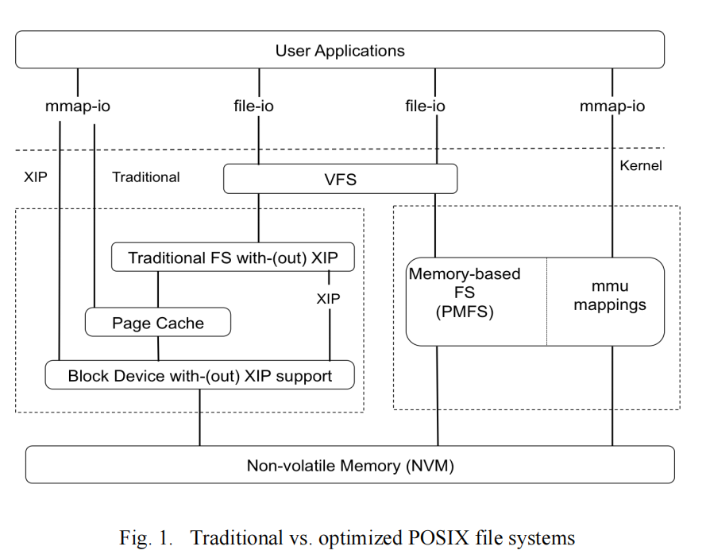

# An Empirical Study of File Systems on NVM

新兴的字节寻址、非易失性存储器，如相变存储器、STT-MRAM等。在DRAM的一个数量级内为延迟带来持久性，从而促使将它们包含在内存总线上。根据最近关于NVM的一些工作，传统的文件系统在从这种低延迟媒体访问数据方面是无效的和次优的。然而，目前还没有针对不同文件系统及其不同配置的系统性能研究来验证这一点。在这项工作中，我们评估了各种遗留Linux文件系统在不同的非易失性内存（NVM）上的真实工作负载下的性能，并将其与NVM优化的文件系统PMFS进行了比较。我们的结果表明，虽然默认的文件系统配置对于NVM大多是次优的，**但这些遗留的文件系统可以使用挂载和格式选项进行调整，以实现可与PMFS等NVM感知的文件系统相媲美的性能**。我们的实验表明，对于许多工作负载（TPCC和YCSB），PMFS和具有在位执行（XIP）选项的ext2/ext3之间的性能差异约为5%。此外，基于对我们的性能研究的学习，我们提出了一些关键的文件系统特性，如使用XIP的就地更新布局，以及并行元数据和数据分配等。文件系统设计人员可以利用这一点来提高NVM的旧文件系统和新文件系统的性能。

## INTRODUCTION

闪存的出现是一种破坏性的力量，导致了存储系统设计方式的巨大变化。然而，有一些新形式的非易失性内存（NVM）技术（如PCM、STT-MRAM、ReRAM）正在开发中，它们有望比flash更具破坏性。这些新的非易失性存储技术是字节寻址的，不像闪存是块寻址的，并且延迟接近DRAM，密度比DRAM [20,28,29]更好。因此，NVM可以增强内存总线上的DRAM，允许应用程序在接近内存延迟时保持它们的工作集。

每当一种新媒体到来时，就会有很多研究关于设计和开发新的文件系统来迎合这种媒体的特点。例如，对于非易失性内存，已经提出了新的文件系统，如PMFS [16,33]、SCMFS [19]和BPFS [10]。这些文件系统利用NVM的字节可寻址性和随机访问特性来获得最大的性能效益。此外，还有持续性内存抽象的大量研究，如Mnemosyne[6]、NV-Heaps [9]、PMem-Lib [30][8]。虽然这些方法似乎是最优的，但目前还没有评估NVM上现有的基于块的文件系统的工作。由于这些文件系统已经进行了几十年的工作，因此检查是否可以使用NVM的文件系统配置选项对这些遗留文件系统进行微调是很重要的。

在本文中，我们提出了一个研究，它评估了各种遗留文件系统在各种现实世界工作负载下的性能。我们选择了常用的服务器类工作负载，如web服务器、文件服务器、web代理、数据库和键值存储，因为它们在数据访问模式、元数据-数据比率等方面彼此不同。我们评估并比较了上述在NVM感知文件系统-PMFS、闪存感知文件系统-F2FS[3,25]和五种传统Linux文件系统上的工作加载结果： Ext2 [22]、Ext3 [23]、Ext4 [12,24]、XFS [34,36]和NILFS2 [32]上的结果。由于我们想确定是否可以对遗留文件系统进行微调，以执行与PMFS类似的性能，因此我们评估了这些文件系统在不同的挂载和格式选项下的性能。我们不同的一些选项包括不同的日志记录（journal）模式、分配策略，如延迟分配、使用就地执行（XIP）绕过缓冲区缓存的机制等。

我们的研究表明，现有的文件系统，经过很少的重新配置或轻微更改，执行的性能接近NVMaware文件系统。此外，我们还确定了一些可以在NVM上提高文件系统性能的文件系统特性。以下是我们研究中的一些关键发现的总结：

- 就地更新 vs 日志结构化(log-structure)布局：文件系统设计人员更喜欢针对不同类型媒体的日志结构化文件（LFS）布局[13]，因为它减轻了媒体限制，如在硬盘情况下的旋转延迟、在Flash情况下的块擦除粒度和写放大。对于完全基于dram（由磁盘支持备份）的系统中的内存分配（RAMCloud [18]），LFS也是首选的。尽管LFS提供了诸如连续快照等有用的特性，但我们的研究表明，**纯基于LFS的文件系统**（NILFS2）在**涉及读写混合的工作负载中**表现得远不如就地更新文件系统，如ext2、ext3、ext4和XFS。F2FS是一个混合文件系统，将大部分元数据就地更新和数据视为日志结构，它比NILFS2好得多，比就地文件系统的一些默认配置的性能相差只有15-25%。此外，NILFS2 和 F2FS 采用垃圾回收，利用 CPU 和内存资源来清理过时或删除的段，从而剥夺了活动文档系统对这些有用资源的依赖。这会对 LFS 或混合文档系统的性能产生负面影响。**因此，我们得出结论，数据和元数据的就地更新是 NVM 文档系统的首选布局**。
- 就地执行 vs 缓冲文件系统（Execute-in-place vs. Buffered file system:）：当文件系统存在于硬盘等慢速介质上，并且前端使用快速DRAM时，缓冲区缓存非常有用，并有助于提高性能。但是，在具有类似于DRAM的访问延迟的NVM上，缓冲区缓存引入复制开销而不是有用。就地执行（XIP）[21]通过直接从NVM媒体执行读取和读写，有助于绕过这个额外的副本，并提高在NVM上运行的文件系统性能。它还绕过了块级I/O调度。PMFS默认采用此特性。我们的实验表明，**如果我们只在现有文件系统（ext2和ext3）上启用XIP特性，它可以帮助现有文件系统执行与PMFS相同的性能——在许多工作负载中大约有5-20%的性能差异。以直接模式（O_DIRECT）打开文件也有助于绕过缓冲区缓存，但它只适用于数据更新，而不适用于元数据更新**。此外，在O_DIRECT的情况下，调度I/O的块层开销仍然存在。因此，我们在我们的研究中没有评估这一特征。
- 简单并行分配/解分配：我们发现，分配策略会影响某些工作负载的性能，这涉及到多个文件的创建/删除或文件大小的增加（例如，文件服务器和web代理）。首先，**诸如分配组[34]（XFS）或块组（ext3，ext4）等特性有助于扩展性能，因为它允许并行分配**。在涉及对大量文件（~500K或更多）的并行数据（读、写）和元数据（创建、删除）操作的工作负载中，我们发现PMFS在所有文件系统中的表现最差，大约比启用XIP的ext3差5倍。这是因为它只使用了一个单独的链表来分配数据和元数据（第四节B），从而抑制了它的可伸缩性。其次，由于NVM的快速随机访问速度，诸如延迟分配（XFS和ext4）等优化在数据密集型工作负载中没有用处。然而，如果工作负载涉及多个数据分配，那么延迟分配（delayed allocation）即使在高速NVM上也会提高性能，因为它会分摊分配成本。
- Fixed vs. variable block size (extent): **我们的实验结果显示，使用固定大小的块与可变大小的块块管理数据的传统文件系统的性能是接近的。**使用固定大小的数据块简化了维护空闲空间信息和关于文件和目录的索引信息所需的数据结构，即内节点。这反过来又减少了执行查找和维护这些数据结构所需的代码的CPU路径长度。因此，建议在ext2的NVM文件系统中使用固定大小的数据块，如ext2和ext3，而在XFS和ext4中使用可变大小的数据块。

本文的其余部分组织如下。第二节介绍了相关的工作；第三节描述了我们的实验方法。我们在第四节中介绍了评价和分析。最后，我们提出一些建议并在第五节进行总结。

## 背景及相关工作

在内存总线上出现的低速、字节可寻址的存储类存储器或非易失性存储器（NVM），导致了人们对访问和管理存储在这种快速媒体上的数据的方法的大量研究。先前与NVM相关的研究主要分为两个方面： (i)探索文件系统设计替代方案和（ii）探索提供给应用程序的接口或编程模型替代方案。虽然(i)需要进行粗粒度的空间管理和保护NVM媒体，但（ii）需要通过应用程序高效地访问数据和进行细粒度的数据管理。图1总结了可用的POSIX接口的组合：文件-io（打开、读、写）和mmap-io（打开、mmap和加载/存储），以及文件系统：传统和NVM优化，用于管理和访问来自NVM媒体的数据。现有的研究可以分类为：

1. 使用POSIX接口（打开/读/写或mmap/加载/存储），但重新设计NVM的文件系统（类别i）。PMFS [16,33]，SCMFS [19]和BPFS [10]就属于这一类。这些文件系统避免了传统的存储堆栈开销，并利用了NVM媒体特性，如字节寻址性、原子更新和快速随机访问速度。
2. POSIX库插入器在数据路径期间绕过文件系统，从而减少了访问数据的延迟（第ii类）。它只在控制路径中访问内核文件系统，即用于访问控制、从物理NVM媒体中分配空间等。Moneta-D [1,2]和Bankshot [14]采用了这种技术，并将一些文件系统功能转移到硬件中。Aerie [7]和[17]也属于这一类，但这取决于用户模式的文件系统。
3. 使用新的编程模型来简化应用程序对NVM的直接使用（第ii类）。例如Mnemosyne[6]、NV-Heaps [9]、PMem-Lib [30]和[8]。这些库提供了细粒度的数据管理、分配、去分配、持久性和事务管理，而粗粒度的空间管理则驻留在文件系统中。NV-Tree [11]和CDDS [15]为非易失性内存提出了一个一致和持久的数据结构（B+Tree变体）。
4. 使用现有的POSIX接口和传统的基于块的文件系统，但要调整操作系统、存储堆栈或文件系统配置，以提高NVM的性能。据我们所知，只有一篇论文[5]属于这一类，与我们的密切相关。

Lee等人[5]探索了各种I/O配置参数，如缓冲区缓存、预读、同步、直接I/O等。并与HDD上的结果进行比较。他们使用Ext4文件系统来进行所有的评估。我们的工作不同于之前的工作：我们专注于评估以下文件系统配置的性能在不同的工作负载NVM： (a) 默认访问的传统文件系统，(b) 通过挂载和格式选项微调访问的传统文件系统，和(c) NVM优化的文件系统，如PMFS。我们使用各种就地更新和日志结构化的文件系统来评估传统的文件系统。第三节提供了关于我们所评估的不同工作负载和文件系统配置的详细信息。

## 方法和限制

### 工作负载

在这项工作中，我们希望确定是否有可能重新配置或微调传统的文件系统，以使它们执行接近nvm优化的文件系统（PMFS）。此外，我们还想总结一下能够提高它们在NVM上的性能的关键文件系统特性。为了实现这一目标，我们在模拟的NVM上评估了不同工作负载下的不同Linux文件系统。本节详细介绍了我们评估的实验硬件和软件设置。我们在a节中描述了我们的测试平台。在B节和C节中，我们分别讨论了我们评估的两个重要维度：工作负载和文件系统。

- Fileserver: 此工作负载模拟承载多个用户（线程）的主目录的服务器。每个线程根据其ID获取一组不同的文件，并执行创建、删除、附加、读、写和统计操作的序列。这个工作负载同时模拟数据和元数据活动。元数据与数据操作的比率是1：1。
- Webproxy: 这模拟了一个简单的web代理服务器。它同时从大量线程中生成创建create、附加、读取和删除操作的组合。此工作负载的特点是相当平坦的名称空间层次结构，目录深度为0.7，即所有500K文件都包含在一个大目录中。元数据与数据操作的比率是1：3。
- Webserver: web服务器工作负载的特点是读写比率为10：1，包括所有线程的完整文件顺序读取，模拟web页面读取。所有的线程都将8K附加到一个公共的日志文件中。这个工作负载主要是读取密集型的。**它不仅练习快速查找和小文件读取，而且还将并发数据和元数据更新为单个的、不断增长的日志文件**
- OLTP Database。TPC-C 基准测试[35] 旨在对中等复杂度的在线事务处理 （OLTP） 工作负载进行建模。基准测试表示由 9 个表和 5 个存储过程组成的通用批发供应商工作负载。在我们的评估中，我们通过 MySQL 数据库 v5.5 运行了 TPC-C。我们使用了 400 个仓库，生成的数据库大小为 38GB。由于我们的服务器由 8 个 CPU 组成，因此我们使用 8 个并发线程来生成输入负载。请注意，每次提交事务后，MySQL都会在日志文档上调用fsync。
- Key-Value Stores: 雅虎！云服务基准测试（YCSB）[4]是一种工作负载，它代表了网络规模公司提供的大规模服务。这是一个键值的工作负载。我们在一个NoSQL数据库——MongoDB v2.6.7 [31]上运行YCSB，它对其数据库文件执行内存映射的I/O，并对其日志执行文件调用（写入系统调用）。MongoDB每120个ms对其日志调用fsync，每60秒对其数据库文件调用msync。在YCSB中，每个元组由唯一的键和10列各包含100个字节的随机字符串数据组成。因此，一个元组的总大小大约为1KB。YCSB由6个工作负载组成-A到f。表二描述了不同操作的百分比和每个YCSB工作负载的分布。对于所有的工作负载，我们将记录数设置为1600万，操作数设置为1000万。这个测试生成了一个36GB的工作集。我们使用了8个线程来生成输入负载。

### File Systems

我们希望确定适合于不同工作负载下的NVM环境的文件系统配置参数和特性集。基于不同的属性，我们在7个不同的文件系统上运行了我们的工作负载： PMFS、Ext2、Ext3、Ext4、XFS、NILFS2和F2FS。所有文件系统的区别特征是：

• Inode data structures: B-Tree vs. linear fixed size
• Block Size: Fixed vs. variable-sized extents
• Layout or update style: In-place update vs. log structured vs. hybrid
• Allocation strategies: Delayed vs. immediate, parallel allocation
• Journal modes: None vs. ordered vs. writeback vs. data
• Other features (e.g., atomic updates, XIP) designed for NVM

我们不仅在默认模式下评估了上述文档系统，而且还使用不同的挂载和格式化选项。我们改变的一些选项包括不同的日记模式，分配策略（如延迟分配），使用就地执行（XIP）绕过缓冲区缓存的机制以及与特定文档系统相关的更多选项。表 III 根据上述因素比较了这七个文档系统的不同属性。此表的最后一行提供了评估中使用的文档系统变体的缩写。

Ext4 [12,24]是ext3的一个高级级别，具有更多的可伸缩性（最大文件大小、文件数量）和更多的特性。与ext3文件系统相比，ext4是一个基于扩展域的文件系统，它有助于减少元数据开销。此外，ext4采用了改进的分配策略，如多块分配和延迟分配。虽然这些特性在磁盘世界中很有吸引力，但我们希望确定它们在非易失性内存中的有效性。因此，我们不仅报告了ext4的默认配置的结果，而且报告没有延迟分配特性的结果。

[12] M. Cao, S. Bhattacharya, and T. Tso. Ext4: The Next Generation of
Ext2/3 Filesystem. In Linux Storage & Filesystem Workshop, USENIX
Association, 2007.
[24] Ext4. https://www.kernel.org/doc/Documentation/filesystems/ext4.txt

XFS： XFS [34,36]是为可伸缩性而设计的：支持tb大小的文件、无限数量的文件和大型目录。XFS将其数据和元数据存储在可变大小的范围中。采用B+ Tree数据结构进行文件/目录节点，自由空间管理和动态分配。与ext2/3和ext4类似，XFS文件系统被划分为若干大小相同的块，称为分配组（AG）。每个AG独立地管理其组的自由空间和内节点。因此，增加AG计数可以扩展并行文件系统的操作，从而提高其性能。在我们的设置中，我们发现默认的AG计数被设置为4。我们将XFS的AG计数增加到464——与ext2家族文件系统的块组计数相同，并将其与默认配置进行比较。与ext4类似，XFS采用延迟分配策略来获得较大的连续范围。默认情况下，它支持回写日记。XFS使用两个B+树跟踪AG的自由空间：基于块数的(a)和(b)的自由空间块的大小。虽然空闲空间管理和对无限文件的支持（通过B+树使用动态inode分配）似乎对磁盘环境很有吸引力，但我们认为它对NVM的影响。

[34] SGI. XFS Filesystem Structure. http://oss.sgi.com/projects/xfs/papers/xfs_filesystem_structure.pdf
[36] XFS. https://www.kernel.org/doc/Documentation/filesystems/xfs.txt

F2FS： F2FS [3,25]是一个为闪存媒体设计的文件系统。该文件系统构建在LFS机制之上，但也解决了一些主要问题。首先，F2FS解决了漫游树的问题，即从叶节点递归地传播指数更新，将节点引导到间接节点等。这种递归传播会导致大量的复制和清理开销。其次，在LFS中，垃圾收集过程是昂贵的；在高磁盘利用率下，它会影响实际数据访问的性能。**F2FS借助节点地址表（NAT）解决了第一个问题，该表涉及到元数据的本地更新，而只以日志结构化的方式写入数据**。因此，F2FS可以看作是一个混合文件系统。为了解决垃圾收集问题，**F2FS在块分配期间将热数据和冷数据分离**。它同时运行多个活动日志头，并根据预期的更新频率将数据和元数据附加到分离的日志中。此外，**在高存储利用率时**，F2FS将日志记录策略更改为线程日志记录，即将新数据写**入脏段中的空闲空间，而不需要实际的清理过程**。默认情况下，活动日志数为6个。

PMFS在数据和元数据分配方面缺乏并行性。当必须分配一个新的inode时，PMFS会大大锁定整个inode表，并搜索未使用的inode。此外，对于数据分配，它搜索具有一个锁的未使用块的公共链表，从而降低了其可伸缩性。然而，ext2和ext3采用了块组等特性，类似于XFS中的分配组，它允许并行分配数据和元数据块，从而在此测试中比PMFS具有更好的性能。

## 总结

我们建议使用一些文件系统特性来帮助提高其在NVM上的性能。其中的一些功能包括：

- **就地更新布局**：对于非易失性内存，就地更新布局是首选，因为在同一位置更新减少了数据和元数据的额外副本，从而避免了垃圾收集过时的数据和元数据块的需要(不像日志结构化文件系统）
- Execute-in-place (XIP)：与XIP一起进行的本地更新有助于充分利用NVM媒体。它有助于绕过软件堆栈中的额外层，比如缓冲区缓存，这在NVM的情况下是冗余的。此外，正如在ext2和ext3中所讨论的，只向数据操作（即读取和写）添加XIP支持是相当简单的，并且涉及到文件系统代码中最小的更改。需要实现的函数之一是get_xip_mem。虽然使用XIP和原子更新同时访问数据和元数据是最佳的（PMFS），但仅为数据启用XIP特性也有助于提高传统文件系统的性能，而且它们的性能接近于PMFS。我们只在ext2和ext3上展示了XIP的好处，但它也可以扩展到其他就地更新文件系统。
- **简单和并行的分配策略**：对于涉及元数据和数据混合的工作负载，建议同时允许数据和元数据（inodes）的并行分配。有一个简单的链表保护一个锁的分配是无效的，并且不会扩展超过几个文件和分配请求。相反，像分配组这样的特性有利于在内存上扩展文件系统的性能。此外，分配的代码路径应该是简单和简短。为磁盘世界添加的优化，例如基于早期的数据块或内节点或块大小（XFS）共定位数据，不必要地增加代码路径长度，从而降低性能。对于涉及多个并行数据和大型文件元数据分配的工作负载，延迟分配可以帮助在NVM上提高性能，因为它分摊分配成本。
- **固定大小的数据块**：基于范围的文件系统在磁盘世界中很受青睐，但在NVM上，这些结果是昂贵的；**如果工作负载涉及到大量的写入或追加，它们需要更多的内存和CPU资源合并和平衡区段** 。查找操作（目录搜索）在使用大型目录时也需要更多的时间。另一方面，使用固定大小的块，可以产生简单的基于索引的inode，对缓存友好，并有助于提高NVM文件系统的性能（例如，PMFS、ext2、ext3）的性能。
