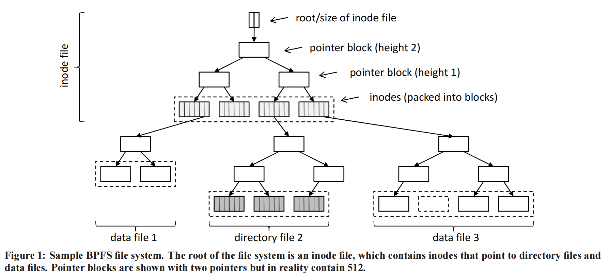
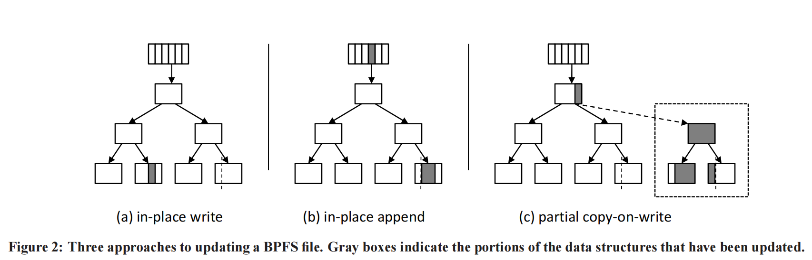

# BPFS

## 摘要

现代计算机系统是围绕着通过一个缓慢的、基于块的接口访问持久存储的假设构建的。然而，新的可字节寻址的持久内存技术，如相变内存（PCM），提供了对持久存储的快速、细粒度的访问。

在本文中，我们提出了一个围绕持久的、可字节寻址内存的属性而设计的文件系统和硬件体系结构。我们的文件系统BPFS使用了一种称为**短路阴影分页的新技术**来为持久存储提供原子的、细粒度的更新。因此，BPFS提供了强大的可靠性保证，并提供了比传统文件系统更好的性能，即使两者都运行在可字节寻址的持久内存之上。我们的硬件架构加强了BPFS所需的原子性和排序保证，同时仍然提供了L1和L2缓存的性能优势。

由于这些内存技术还没有广泛使用，我们将DRAM上的BPFS与RAM磁盘和传统磁盘上的NTFS进行评估。然后，我们使用微架构模拟来估计BPFS在PCM上的性能。尽管提供了强大的安全性和一致性保证，但DRAM上的BPFS的速度通常是RAM磁盘上的NTFS的两倍，比磁盘上的NTFS快4-10倍。我们还表明，PCM上的BPFS应该比传统的基于磁盘的文件系统要快得多。

## INTRODUCTION

几十年来，计算机系统一直面临着易失性和非易失性存储之间的权衡。所有持久数据最终必须存储在非易失性介质上，如磁盘或flash，但由于这些设备只支持慢的、批量数据传输，持久数据必须临时缓冲在快速的、可字节寻址的DRAM中。不幸的是，仅驻留在易失性内存中的数据可能在崩溃或电源故障时丢失，这意味着现有存储系统在平衡这两种存储介质的使用时经常牺牲耐用性、一致性或性能。

然而，新的可字节寻址持久存储技术（BPRAM）消除了易失性存储和非易失性存储之间的许多传统区别。特别是，相变存储器和忆阻器等技术可以像DRAM一样进行字节寻址，像磁盘和闪存一样持久，对于典型的文件系统I/O，比磁盘或闪存快四个数量级。BPRAM可以与DRAM并排放置在内存总线上，可供普通CPU load和store。

本文通过关注存储的主要抽象之一：文件系统来研究BPRAM的好处。**我们已经为BPRAM实现了一个新的文件系统，称为BPFS**，它的执行速度比为传统的、基于块的存储设备（如磁盘或闪存）设计的现有文件系统快5倍，即使这些文件系统是在RAM磁盘上运行的。此外，与现有系统相比，BPFS提供了强大的安全性和一致性保证；具体来说，它保证了文件系统写入在刷新缓存的时间内持久，**并且每个文件系统操作都是按原子和程序顺序（一致性）执行的**。

BPFS通过使用一种称为短路阴影分页的新技术，提供了这些保证。在传统的影子分页文件系统中，如ZFS [23]和WAFL [7]，对文件系统的更新会触发从修改位置到文件系统树根的级联写入复制操作；当文件系统的根更新时，则提交已更改。**短路阴影分页允许BPFS在细粒度上使用写时复制，在文件系统树的任何级别上原子地提交小的更改**。实际上，BPFS通常可以完全避免复制，在不牺牲可靠性的情况下原地编写更新。

**短路影子页通过本文提出的两个简单的硬件原语而变得可能：原子8字节写和epoch barriers**。原子写入允许BPFS通过向BPRAM写入一个值来提交更改，这样电源故障和崩溃就不能创建损坏的文件系统映像。Epoch障碍允许BPFS在BPRAM写操作之间声明排序约束，同时仍然使用L1和L2缓存以提高性能（即不用clflush？）。

BPFS的存储方法在几个重要方面不同于传统的文件系统。首先，BPFS 不对文件系统数据使用 DRAM 缓冲区缓存，这会释放 DRAM 以用于其他目的。虽然直接访问 BPRAM 比访问 DRAM 缓冲区缓存慢，但 CPU 预取和缓存隐藏了大部分成本。其次，**BPFS针对小的、随机的写入进行了优化，而不是批量数据传输**。在大量数据上摊销存储传输的成本曾经是有利的，那么对BPRAM执行基于块的写入可能会通过通过内存总线传输不需要的流量来阻碍性能；因此，**BPFS在传统的基于磁盘的文件系统写入千字节的地方只写入几字节的数据**。最后，BPFS极大地减少了尚未持久的数据的漏洞窗口。以前的文件系统通常在将数据刷新到磁盘之前缓冲数据5-30秒，而写入BPFS的数据可以在刷新CPU数据缓存的时间内持久。在某种意义上，使用BPRAM来存储文件允许我们用CPU的数据缓存来代替DRAM缓冲区缓存。

在我们的评估中，我们关注于最有前途的BPRAM技术，称为相变存储器（PCM）。由于DDR兼容的PCM还不可用，我们评估了DRAM上的BPFS，并将其与磁盘上的NTFS和RAM磁盘上的NTFS进行了比较。我们运行了微架构模拟，用模拟的PCM来验证我们提出的硬件特性，并使用这些结果来预测BPFS在PCM上运行时的性能。即使有保守的估计，BPFS在RAM磁盘上也优于NTFS，同时提供了强大的可靠性保证。

在下一节中，我们将讨论我们在此工作中所遵循的高级设计原则。然后，我们将详细介绍BPFS和我们为支持它而设计的硬件的细节。最后，我们将评估这些系统在DRAM和PCM上的性能。

## 设计原则

我们的工作有两个主要目标。首先，我们希望为BPRAM设计体系结构支持，使操作系统和应用程序能够轻松地利用快速、字节可寻址、非易失性内存的好处。其次，我们想设计一个文件系统，通过利用BPRAM的独特特性来提高性能和可靠性。

在本节中，我们将详细讨论指导这项工作的三个设计原则：

- BPRAM应该直接暴露于CPU，而不是隐藏在I/O控制器后面。
- 硬件应提供顺序和原子性原语，以支持软件的可靠性保证。
- 短路阴影分页应该用来为BPRAM提供快速和一致的更新。

> 前两点都是说未来的PM应该怎么被使用，硬件应该支持什么（建议硬件支持顺序、崩溃的原子性）
>

### 将BPRAM直接暴露到CPU

持久存储传统上驻留在总线控制器和存储控制器后面。由于读取或写取的延迟主要由对设备的访问决定，因此该体系结构的开销不会对性能产生重大影响。即使是最快的NAND闪存ssd也有几十微秒的延迟，这使得总线访问的成本相形见绌(微不足道)。

相比之下，相变存储器等技术的访问延迟为数百纳秒[1,9]，仅比DRAM慢2-5倍；因此，将BPRAM存储技术保持在I/O总线后面会浪费存储介质的性能优势。此外，**I/O总线通过强制执行基于块的访问来阻止我们使用字节寻址性**。甚至PCI-express总线也主要是为批量数据传输而设计的，而不是高带宽的随机访问I/O。

因此，我们建议将BPRAM直接放置在内存总线上，与DRAM并排放置。64位物理地址空间将分为易失性和非易失性存储器，因此CPU可以直接使用公共负载和存储来处理BPRAM。这种体系结构保持了较低的访问延迟，并允许我们利用BPRAM的字节寻址性，如果BPRAM被放置在I/O总线上或被视为DRAM背后的内存层次结构的另一个级别，这将是不可能的。此外，使BPRAM可寻址允许我们使用缓存层次结构来提高对持久内存的写的性能。

在内存总线上放置BPRAM有**三个缺点**。首先，到BPRAM的流量可能会干扰易失性内存访问，损害整体系统性能；然而，我们的微架构模拟表明，这不是一个问题。其次，系统中可用的BPRAM数量受到BPRAM密度和机器中自由内存插槽数量的限制。然而，由于DRAM和PCM在同一技术节点[1,9]上具有相似的容量，我们预计在45 nm节点上将有32 GB的PCM DIMMs，这与第一代ssd的大小相当。第三，在**内存总线上放置持久性存储可能会使其更容易受到杂散写操作的影响**。然而，以前对Rio文件缓存的工作表明，即使没有内存保护，通过杂散写的损坏也很少见；约1.5%的崩溃导致Rio的损坏，而磁盘[4]的比例为1.1%。

请注意，我们并不建议用BPRAM完全替换DRAM。由于BPRAM仍然比DRAM慢2-5倍，而且由于相变内存单元在大约10^8次写入后就会耗尽，所以最好将DRAM用于易失性和频繁访问的数据，如堆栈和堆栈。

### 在硬件中强制执行顺序和原子性

为了提供安全性和一致性，文件系统必须说明何时以及以什么顺序使写入持久。然而，为易失性内存设计的现有缓存层次结构和内存控制器可能会对写进行重新排序以提高性能，而大多数现有架构（包括x86）没有提供防止这种重新排序的机制。尽管像mfenne这样的操作确保每个CPU都具有一致的内存全局视图，但它们不会对主内存的顺序施加任何限制。人们可以通过将BPRAM视为未缓存的内存或显式地刷新适当的缓存行来强制排序约束，但这些方法在性能方面代价高昂。

相反，我们提出了一种让软件向硬件声明排序约束的机制。在我们的建议中，软件可以发布特殊的写障碍，划定一组称为epoch的写，硬件将保证每个epoch都按顺序写回主内存，即使单个写在一个时代内被重新排序。**这种方法将顺序与持久性解耦**；以前的方法通过简单地刷新脏缓冲区来强制排序，而我们的方法允许我们在将脏数据留在缓存中同时强制排序。我们的建议需要相对简单的硬件修改，并提供了一个强大的原语，我们可以构建高效、可靠的软件。

除了排序的限制之外，文件系统通常还必须应对简单但难以捉摸的基本语的缺乏：故障原子性，或针对电源故障写入持久存储的原子性。与排序问题一样，现有的系统仅为易失性内存设计；有许多机制用于对其他线程或核心增强原子性，**但没有一个用于对电源故障增强原子性**。因此，如果对持久内存的写入因电源故障而中断，则内存可能会处于中间状态，从而违反一致性。一些日志文件系统在事务记录上使用校验和来实现原子性[17];但是，使用BPRAM，我们可以直接在硬件中提供简单的原子写入基元。正如我们稍后将要讨论的那样，实现失效原子性需要在电容器中具有低至300纳焦耳的能量[9]。请注意，除非另有说明，否则本文中对原子性的引用将专门指**失效原子性**。

根据我们的经验，这种处理原子性和排序的方法是软件和硬件之间的一个有用的劳动分工。在原子性的情况下，硬件实现非常简单，并且它极大地简化了在BPFS中强制执行一致性的任务。对于排序，epoch障碍允许软件在自然的抽象级别上声明排序约束，并且这些信息足以让硬件缓存对持久数据的写入。事实上，我们相信这些原语将在BPFS之外的更多软件应用程序中得到应用。

### 使用短路影子页

大多数存储系统通过使用两种技术之一来确保可靠性：预写日志记录或阴影分页[13]。使用预写log（或日志）[6]，存储系统在更新主存储位置之前将要执行的操作写入单独的位置（通常作为顺序文件）。因此，许多写入操作会完成两次：一次到日志，一次到最终位置。这种方法的好处是，对日志的第一次写入可以快速完成，而不会覆盖旧数据。**但是，代价是许多写入必须执行两次。事实上，对所有文件系统数据使用这种技术的成本是如此之大，以至于大多数文件系统在默认情况下只记录元数据**。

相比之下，阴影分页[7,23]使用写时复制来执行所有更新，以便在将更新后的数据写入持久存储时保留原始数据。数据通常存储在树中，当新数据通过写入复制进行写入时，**父块也必须通过写入复制进行更新。当更新传播到树的顶部时，对树的根的一次写入将将所有更新提交到“实时”存储**。不幸的是，数据到树的根目录的“沸腾”会导致大量的复制开销；因此，更新很少被提交并通过批量提交，以摊销副本的成本。

总之，许多可靠的存储系统使用了两种技术中的一种：对日志的快速更新，并注意许多写入完成两次，或者必须批量复制更新（Cow）以摊销成本。基于磁盘的文件系统通常更喜欢日志记录，而不是影子分页，因为影子分页副本的成本超过了日志记录的成本。

然而，在BPRAM中，**字节寻址性和快速的随机写使得阴影分页成为文件系统设计的一种有吸引力的方法**。事实上，BPFS通过实现了一种我们称为短路阴影分页（SCSP）的新技术，超越了传统的阴影分页系统。SCSP允许BPFS在文件系统树中的任何位置提交更新，从而避免了将副本传播到文件系统的根目录的开销。BPFS通常可以执行小更新，不执行任何拷贝，即使拷贝是大写必要的，他们可以限制在一个小子树的文件系统，只复制那些部分的旧数据不会改变的更新。SCSP是通过硬件中原子写的可用性而实现的，而它是通过利用我们的可感知epoch的CPU缓存而更加快速的。

## BPFS设计与实现

在本节中，我们将介绍 BPFS（一种用于 BPRAM 的新文档系统）的设计和实现。BPFS旨在利用BPRAM的独特功能，以实现高性能和强大的安全性和一致性保证。具体而言，BPFS 保证所有系统调用都以原子方式和进程顺序反应到 BPRAM。它还保证了 BPRAM 中文件系统映像的一致性，并且允许在缓存的内容刷新到持久性存储后立即使数据持久化。

在BPFS中，所有的文件系统数据和元数据都存储在持久性内存中的**树状结构**中。使用短路阴影分页强制执行一致性，这意味着更新可以在地提交或使用本地化的写时复制。在任何一种情况下，都通过在树的适当点执行原子写入将更新提交到文件系统。我们还使用硬件提供的排序原语，通过在文件系统状态的每个原子“提交”之前和之后标记epoch边界，从而确保提交操作只有在它所依赖的写操作持久之后才会写入BPRAM。

### 文件系统布局

BPFS的持久数据结构被组织成一个**固定大小块**的简单树。虽然可以在BPRAM中存储更复杂的数据结构（例如，可变的块大小或指向给定数据块的多个指针），但这种方法有两个重要的优点。首先，因为从根到任何给定节点只有一条路径，我们可以用一个原子指针写来更新树的任意部分（甚至是多个文件或目录）；这种机制是在BPFS中执行强一致性保证的关键。其次，因为这个树中的所有块的大小都相同的，所以分配和释放都很简单。

BPFS的数据结构受到 WAFL [7]的启发，由三种文件组成，每一种文件都由相同的树状数据结构表示。**inode文件**是一个包含固定大小inode数组的单一文件，每个元素数组唯一地表示文件系统中的一个文件或目录。inode文件的根表示整个文件系统的根目录，这个根指针存储在持久内存中已知的位置。Inodes包含文件元数据，包括根指针和关联文件的大小。**inode文件中的条目只有被有效的目录条目引用时才被认为是有效的**。**目录文件**包含一个目录条目数组，其中每个元素包括一个**编号（inumber即，在inode文件中的一个inode的索引）和相应的文件的名称**。只有当目录条目包含非零编号时，它们才被认为有效。**数据文件**只包含用户数据。

文件系统的整体结构如图1所示。文件系统的上半部分是inode文件，虚线框显示了该文件的“数据”，它由一个inode数组组成。每个inode都指向一个目录文件或一个数据文件；图1显示了三个这样的文件，它们的数据也存储在一个树状结构中。为了清晰起见，该图中还省略了其他文件。

我们的三种文件（即数据文件、目录文件和inode文件）中的每一种都由相同的基本数据结构表示：一个完全由4 KB块组成的树。树的叶子代表文件的数据（即用户数据、目录条目或内部节点），每棵树的内部节点包含512个指向树的下一层的64位指针。在图1中，每个文件的叶子都显示在一个虚线框中；按顺序排列，这个虚线框中的块表示文件的内容。（为了简单起见，这个图只显示了每个块的两个指针。）每个文件都有一个根指针和一个文件大小存储在一个inode中，或者在inode文件的情况下，存储在一个已知的位置中。由于这个数据结构对于所有类型的文件都是相同的，因此本节的其余部分将讨论对于任何类型的文件的这个数据结构的一般特性。

每个树数据结构的高度由树的根指针的低bit位表示，**它允许BPFS通过记住从根指针中获得的跳数来确定给定的块是内部（指针）块还是叶（数据）块。例如，对于高度为0的树，根指针直接指向一个数据块，该数据块最多可以包含多达4 KB的文件数据**。对于高度为1的树，根指针指向一个包含512个指针的内部块，每个指针指向一个4 KB的数据块，总共为2 MB。高度为3的树可以存储1 GB的数据，高度为5的树可以存储256 TB的数据。请注意，任何给定的树的高度都是一致的：如果一个树的高度为3，那么所有的文件数据都将从根指针向下跳三次；没有文件数据存储在内部节点。此外，由于根指针及其高度存储在一个64位值中，它们可以原子更新。

为了简化将数据写入文件中间的任务，我们在树的任何级别上使用一个**空指针来表示该指针所跨越的文件的整个范围的零数据**。例如，如果一个文件的根指针是一个高度为5的空指针，那么它表示一个空的（即为零）256tb的文件。空指针也可以出现在内部节点上，因此对这个256 TB文件结尾的写入不会导致我们写入256 TB的零；相反，它将导致5个指针链指向一个数据块，内部节点的其余部分有空指针。因此，这种文件表示可以实现对大型稀疏文件的紧凑表示。

我们还存储了每个文件的大小以及每个根指针。对于inode文件，此文件大小存储在一个众所周知的位置；**对于所有其他文件，它存储在文件的inode中，放在文件的根指针旁边**。文件的大小可以大于也可以小于树本身所表示的数据量。如果它较大，则假定文件的尾部为零，如果它较小，那么树中在文件末尾以外的任何数据都将被忽略，并且可能包含垃圾。

### 持久化数据更新

**短路影子页**由三种不同的更新持久性数据的方法组成：**就地更新、就地附加和部分写入复制**。这三种技术都使用BPRAM的字节寻址性以及我们的原子写原语来提供对文件系统数据的快速更新，同时仍然保持一致性。这种方法与现有的基于磁盘的文件系统有明显的不同，后者无法对持久存储执行细粒度的写操作。

我们的三种方法如图2所示，它描述了一个包含四个数据块的单个文件。文件的根目录和文件大小存储在每个图的顶部显示的一个inode块中，它被假定为是一个更大的文件系统的一部分。虚线表示文件大小变量对应的文件的结束。

- 就地更新：小于64bit的直接原子更新。
- 就地附加：直接就地添加数据，通过原子修改文件的大小实现崩溃一致性。
- 部分COW：从叶子往跟方向copy，直到能通过单个指针实现原子修改来提交本次更新。

### 易失（内存）数据结构

首先，我们在DRAM中存储一个BPRAM块的**空闲列表**以及一个释放和分配的inumbers列表。**这些数据结构在每次引导时都从文件系统元数据初始化**；但是，由于此扫描是在BPRAM而不是磁盘上执行的，因此可以在几秒内完成，即使在中等完整的文件系统上也是如此。我们避免将这些数据结构存储在BPRAM中，因为很难在保证原子性地更新这些全局列表的同时时，对文件系统提交小的更改。请注意，此初始化过程不同于诸如fsck等传统的文件系统检查器，因为此过程的目的是为了加载元数据，而不是为了检查和修复文件系统的一致性。

> 其实只要inode的free list，通过offset来得到inumber即可

第二个易失数据结构是正在进行拷写操作分配的块以及将要被释放的块的列表。例如，在执行写入时，**我们将跟踪任何新分配的块，以及在操作成功时需要释放的任何块**。当操作完成后，我们将遍历已释放的列表或已分配的列表（取决于操作的成功程度），并将这些块添加到全局空闲列表中。因为提交是原子的，所以这些数据永远不需要存储在持久的内存中或重新构建。

第三，保存储了来自用户打开的每个目录的目录条目的缓存。（在Windows中，此任务由每个单独的文件系统负责。）缓存中的每个目录条目都同时存储在一个列表和一个哈希表中，这样我们就可以支持快速、按序的目录list以及快速的单个名称查找。对目录的任何更新也会立即反映到持久性内存中。

由于这些数据结构只在易失性内存中找到，我们不需要使用原子写来更新它们；相反，它们与只使用传统锁的文件系统更新是同步的。相反，请注意，BPFS的原子操作并不排除传统锁定的需要；例如，在没有锁的情况下，如果线程A开始一个大的写时复制操作，然后线程B对其中一个旧页面执行8字节的写入，当线程A提交时写入可能会丢失，即使两个写入的范围也不重叠。

### 文件系统操作

打开
关闭
等常见操作

### 多处理器（多核）操作

首先，在单个文件系统操作期间，可以在多个cpu上安排一个线程。如果线程在系统调用中被抢占，**BPFS必须确保在同一CPU上重新调度**，这将保证在系统调用中生成的所有epoch都按照它们生成的顺序提交。

### 局限性

BPFS的一个限制是，**写时间不会相对于写本身进行原子性的更新**，因为我们的技术将要求所有的写操作都要使用写时的复制来传播到inode本身（开销很大）。
尽管将这些操作分解为两个独立的原子操作（一个是更新文件数据，另一个是更新写时间）并不理想，**但我们认为这在性能方面是一个合理的权衡**。

**我们目前的原型还不支持与内存映射的文件**。然而，我们认为，通过将数据映射到DRAM并偶尔将其刷新到PCM（正如当前基于磁盘的文件系统一样），或者通过将PCM页面直接映射到应用程序的地址空间，可以直接支持这个特性。在后一种情况下，在写入内存映射文件时，不会提供原子性和顺序保证，但是可以在不捕获内核的情况下访问文件的数据。需要进行磨损调整，以确保恶意程序不会耗尽PCM设备；我们将在下一节中进一步讨论这些问题。

## 硬件支持

为了支持论文提出的一些新特性，而提及写平衡、顺序和原子性实现方面的注意点。

## 测试

我们的评估回答了以下问题：

- BPFS的性能是否比为磁盘设计的文件系统更好？
- 我们提出的硬件修改的性能好处是什么？
- 由PCM支持的BPFS是否比使用DRAM缓冲区缓存加上磁盘的系统表现得更好？

## 更多文献

WAFL：
HITZ, D., LAU, J., AND MALCOLM, M. File system design
for an NFS file server appliance. In USENIX Winter
Technical Conference (1994).