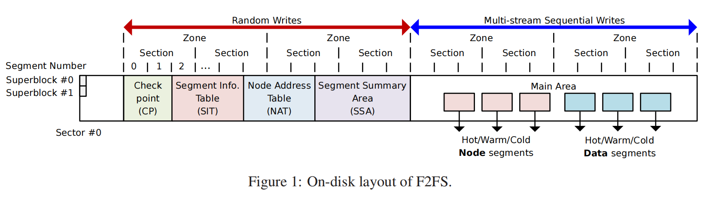
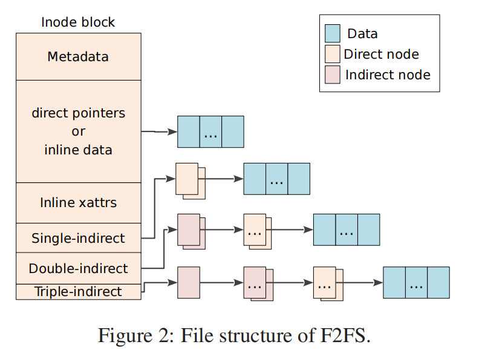
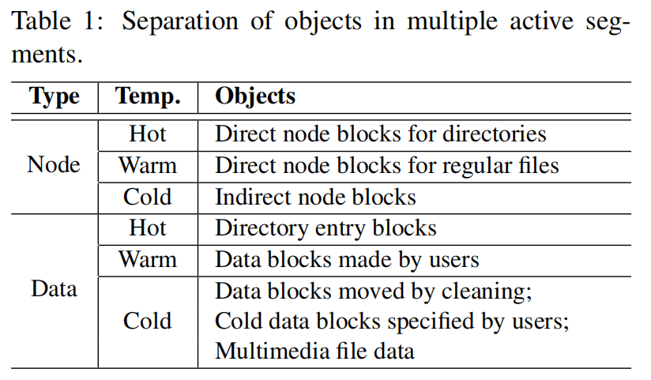

# F2FS

F2FS是一个Linux文件系统，被设计用来在现代闪存设备上表现良好。**该文件系统建立在附加日志记录上**，其关键设计决策考虑了闪存的特点。本文介绍了F2FS的主要设计思想、数据结构、算法和由此产生的性能。

实验结果突出了F2FS的理想性能；在一个最先进的移动系统上，它在合成工作负载下比EXT4高出3.1×（iozone）和2×（SQLite）。它将几个实际工作负载的运行时间减少了高达40%。在服务器系统上，F2FS的性能比EXT4性能高达2.5×（SATA SSD）和1.8×（PCIe SSD）。

## 引言

NAND闪存已被广泛应用于智能手机、平板电脑和MP3播放器等各种移动设备上。此外，服务器系统开始使用闪存设备作为其主要存储器。尽管闪存使用广泛，但它也有一些限制，比如在写前擦除，需要按顺序写入擦除块，以及每个擦除块的写入周期。

在早期，许多消费类电子设备直接利用了放在一个平台上的“裸”NAND闪存。然而，随着存储需求的增长，使用通过**专用控制器连接多个闪存芯片的“解决方案”越来越普遍**。运行在控制器上的固件，通常称为FTL（闪存转换层），解决了NAND闪存的限制，并提供了一个通用的块设备抽象。这种闪存解决方案的实例包括eMMC（嵌入式多媒体卡）、UFS（通用闪存）和SSD（固态驱动器）。通常，这些现代闪存设备显示的访问延迟比硬盘设备(HDD)低得多。在随机I/O方面，ssd的性能比hdd要好几个数量级。

然而，在闪存设备的一定使用条件下，NAND闪存介质的特性。例如，Min等人。[21]观察到，**频繁的随机写入到SSD会导致底层媒体的内部碎片化，并降低持续的SSD性能**。研究表明，随机写模式相当常见，对于移动设备上资源受限的flash解决方案来说更费力。Kim等人[12]量化说，脸书移动app发出为150%，webbench注册的随机写的次数比顺序写的次数多70%。此外，**超过80%的总i/o是随机的，超过70%的随机写入是由脸书和推特[8]等应用程序通过fsync触发的**。这种特定的I/O模式来自于SQLite [2]在这些应用程序中的主要使用。**除非仔细处理，否则在现代工作负载中频繁的随机写入和刷新操作会严重增加闪存设备的I/O延迟，并降低设备的生命周期**。

通过日志结构化文件系统（LFS）方法[27]和/或写时复制策略，可以减少随机写入的有害影响。例如，人们可能会预期，像BTRFS [26]和NILFS2 [15]这样的文件系统会在NAND闪存ssd上表现良好；**不幸的是，它们没有考虑到闪存设备的特性，而且在性能和设备寿命方面不可避免地是次优的**。我们认为，传统的hdd文件系统设计策略——尽管是有益的——没有充分利用和优化NAND闪存媒体的使用。

在本文中，我们提出了一种针对现代闪存设备优化的新文件系统F2FS的设计和实现。据我们所知，F2FS是第一个公开和广泛可用的文件系统，从头开始设计，通过**通用块接口**优化闪存设备的性能和寿命。本文描述了其设计和实现。

> F2FS自3.8版本以来就已在Linux内核中可用，并已在商业产品中被采用。

以下是F2FS设计的主要考虑事项：

- 对Flash友好的磁盘布局（第2.1节）。F2FS采用三个可配置单元：段segment、section和区域zone。它从多个单独分区zones的分段单元中分配存储块。它以section单元进行“清洗”(垃圾回收)。**引入这些单元是为了与底层FTL的操作单元对齐，以避免不必要的（但代价昂贵的）数据复制**。（可以参考）
- 具有成本效益index结构（第2.2节）。LFS将数据和索引块写入新分配的可用空间。如果叶数据块被更新（并写入某个地方），它的直接索引块也应该被更新。一旦写入了直接索引块，又应该更新它的间接索引块。这种递归更新导致了一系列的写操作，从而创建了“流浪树”问题[4]。为了解决这一问题，我们提出了一种新的索引表，称为节点地址表（node address table）。
- 多头logging（第2.4节）。设计了一种有效的基于logging时间（即块分配时间）的**冷热数据分离方案**。它同时运行多个活动日志段segments，并根据预期的更新频率**附加数据和元数据来分离日志段**。由于闪存设备利用**媒体并行性**，多个活动段可以同时运行，而无需进行频繁的管理操作，这使得多个日志记录（相对于单段日志记录）导致的性能下降不重要。（即并发管理开销占比很小）。
- 自适应log（第2.6节）。F2FS基本上建立在仅附加日志记录上，以便将随机写入转换为顺序写入。然而，在高存储利用率时，它将日志策略更改为线程日志threaded logging[23]，以避免长时间的写延迟。本质上，线程日志记录将新数据写入脏段的空闲空间，而无需前台清理。这种策略在现代flash设备上很有效，但在hdd上可能不行。
- 具有前滚恢复的fsync加速（第2.7节）。F2FS通过最小化所需的元数据写入和使用有效的前滚机制恢复同步数据，**优化小同步写**，以减少fsync请求的延迟。

[23] Y. Oh, E. Kim, J. Choi, D. Lee, and S. H. Noh. Optimizations of LFS with slack space recycling and lazy indirect block update. In Proceedings of the Annual Haifa Experimental Systems Conference, page 2, 2010.

简而言之，F2FS建立在LFS的概念之上，但与最初的LFS方案明显偏离，但有了新的设计考虑。我们已经将F2FS作为一个Linux文件系统实现，并将其与两个进行了比较: 最先进的Linux文件系统-EXT4和BTRFS。我们还评估了NILFS2，Linux中LFS的替代实现。我们的评估考虑了两个一般分类的目标系统：移动系统和服务器系统。在服务器系统的情况下，我们研究了在SATA SSD和PCIe SSD上的文件系统。我们在这项工作中获得和提出的结果突出了F2FS的整体理想的性能特征。

在本文的其余部分中，第2节首先描述了F2FS的设计和实现。第3节提供了性能结果和讨论。我们在第4节中描述了相关的工作，并在第5节中进行了总结。

## F2FS的设计与实现

### disk上布局

F2FS的磁盘上数据结构被精心布局，以匹配底层NAND闪存的组织和管理方式。如图1所示，F2FS将整个卷划分为固定大小的segments。segments是F2FS中的一个基本管理单元，用于确定初始文件系统元数据布局。

一个section由连续的segments组成，而一个zone由一系列的sections组成。这些单元在logging和清洁过程中很重要，这将在第2.4和2.5节中进一步讨论。

F2FS将整个卷分为六个区域：

- Superblock (SB)：具有F2FS的基本分区信息和默认参数，在格式时给出，不可更改。
- Checkpoint (CP)：保持文件系统状态、有效NAT/SIT集的位图（见下文）、孤儿inode列表和当前活动段的摘要条目。成功的“检查点包”应在给定时间点存储一致的F2FS状态——突然断电事件后的恢复点（第2.7节）。CP区域跨两个segments（#0和#1）存储两个检查点包：一个用于最后一个稳定版本，另一个用于中间（过时）版本。
- 段信息表Segment Information Table（SIT）：包含每个segment信息，如有效块的数量和“Main”区域中所有块有效性的位图（见下文）。检索SIT信息以选择**受害者段**，并在清理过程中识别其中的有效块（第2.5节）。
- Node Address Table (NAT) ：是一个块地址表，用于定位存储在主区域中的所有“节点块”。
- Segment Summary Area (SSA): 存储表示主区域中所有块的**所有者信息的摘要条目**，例如父节点inode编号及其节点/数据偏移量。在清理期间, SSA条目会在迁移有效块之前标识父节点块。
- Main Area 填充了4KB的块。每个块都被分配和类型化为node或data。node块包含**数据块的inode或数据块的索引**，**而data块则包含目录数据或用户文件数据**。请注意，某个节不会同时存储数据和节点块。

鉴于上述磁盘上的数据结构，让我们来说明如何执行文件查找操作。假设一个文件“/dir/file”，F2FS执行以下步骤：

(1)通过读取一个block得到root inode，该块的位置是从NAT获取的；(2)在根节点块中，从其数据块中搜索名为dir的目录条目，得到其inode编号；(3) 通过NAT将检索到的inode编号转换为物理位置；(4)通过读取对应的块获取名字为dir的inode；(5)在dir节点中识别名字为file的目录项，最后重复步骤(3)和(4)获取文件。实际数据可以从主区域检索，并通过相应的文件结构获取索引。

### File Structure

最初的LFS引入了inode map来将inode编号转换为磁盘上的inode位置。**相比之下，F2FS利用“node”结构来扩展inode映射来定位更多的索引块**。每个节点块都有一个唯一的标识号，“node ID”。通过使用节点ID作为索引，NAT服务于所有node块的物理位置。节点块代表三种类型之一： inode节点、direct节点和indirect节点。inode块包含文件的元数据，如文件名、inode编号、文件大小、atime和dtime。直接节点块包含数据的块地址，而间接节点块具有定位另一个节点块的节点id。

如图2所示，F2FS使用基于指针的文件索引与直接和间接节点块进行索引来消除更新传播（即，“漫游树”问题[27]）。在传统的LFS设计中，如果一个叶数据被更新，它的直接和间接指针块将被递归更新。**然而，F2FS只更新了一个直接节点块及其NAT条目，有效地解决了流浪树的问题**。例如，当一个4KB的数据被附加到一个8MB到4GB的文件中时，LFS会递归地更新两个指针块，而F2FS只更新一个直接节点块（不考虑缓存效果）。对于大于4GB的文件，LFS会再更新一个指针块（总共三个），而F2FS仍然只更新一个。

inode块包含指向文件**多个数据块的直接指针、两个单间接指针、两个双间接指针和一个三间接指针**。F2FS支持内联数据和内联扩展属性，这些属性可以在**inode块本身中嵌入小型数据或扩展属性**。内联减少了空间要求，并提高了I/O性能。请注意，许多系统都有较小的文件和少量的扩展属性。默认情况下，如果文件大小小于3,692字节，则F2FS将激活数据内联。F2FS在一个inode块中保留200个字节，用于存储扩展的属性。

### 目录结构

在F2FS中，一个4KB的目录条目（“dentry”）块由一个位图和两个成对的slot和name数组组成。位图告诉每个插槽是否有效。一个插槽携带一个哈希值、inode号、文件名的长度和文件类型(例如，普通文件、目录和符号链接），一个目录文件构建了**多层次的哈希表**来有效地管理大量的数据项。

当F2FS在一个目录中查找一个给定的文件名时，**它首先计算该文件名的哈希值**。然后，它逐步遍历所构造的哈希表，从级别0到inode中记录的最大分配level。在每个级别中，它会扫描两个或四个数据项块中的一个桶，从而导致O（log（dentries个数））复杂性。为了更快地查找数据条目，它会依次比较位图、哈希值和文件名。

当首选大目录时（例如，在服务器环境中），用户可以配置F2FS，以最初为许多数据项分配空间。使用较大的哈希表，F2FS可以更快地到达目标dentry。

### Multi-head logging

与LFS有一个较大的日志区域不同，F2FS维护了**6个主要的日志区域**，以最大限度地提高冷热数据分离的效果。F2FS**静态地定义了**节点和数据块的温度——热、温和冷三个级别，如表1所示

直接节点块被认为比间接节点块更热，因为它们被更新得更频繁。间接节点块包含节点id，并且仅在添加或删除专用节点块时才被写入。目录的直接节点块和数据块被认为是热门的，因为与常规文件的块相比，它们有明显不同的写模式。满足以下三种条件之一的数据块被认为是冷的：

- 通过清理而移动的数据块（请参见第2.5节）。由于它们在很长一段时间内仍然有效，我们预计在不久的将来仍会保持有效。
- 用户“冷”标记的数据块。F2FS支持为此目的的扩展属性操作。
- 多媒体文件数据。它们可能显示一次写和只读模式。F2FS通过将文件的扩展名与已注册的文件扩展名相匹配来标识它们。

默认情况下，F2FS激活6个打开的写入日志。如果认为这样做可以在给定的存储设备和平台上进行调整，则用户可以在挂载时将写流的数量调整为2个或4个，以产生更好的结果。如果使用了6个测井，则每个测井段直接对应于表1中列出的温度水平。在四个日志的情况下，F2FS结合了每个节点和数据类型中的冷日志和热日志。只有两个日志，F2FS将一个为节点分配，另一个用于数据类型。第3.2.3节研究了日志记录头的数量如何影响数据分离的有效性。（年龄的划分比较简单）

F2FS引入了可配置的区域，以与FTL兼容，以减轻垃圾收集（GC）开销。FTL算法根据数据和“日志闪存块”[24]之间的关联性，主要分为三组（块联想、集合联想和完全联想）。一旦一个数据闪存块被分配来存储初始数据，日志闪存块就会尽可能多地吸收数据更新，就像EXT4 [18]中的日志一样。日志闪存块可专门用于单个数据闪存块（块关联）[13]，用于所有数据闪存块（完全关联）[17]，或用于一组连续数据闪存块（集关联）[24]。现代ftl采用完全关联或集关联的方法，以能够正确地处理随机写。请注意，F2FS使用多头日志并行写入节点和数据块，关联FTL将分离的块（在文件系统级别）混合到同一个闪存块中。为**了避免这种错位，F2FS将活动日志映射到不同的区域zone，以便在FTL中分离它们**。该策略有望对集合关联的ftl有效。多头测井也与最近提出的“多流”接口[10]自然匹配。

### 清理

清理是一个回收分散的和无效的块的过程，并确保自由段的进一步日志记录。因为一旦底层存储容量被填满，清洁就会不断发生，因此限制与清洁相关的成本对于F2FS（以及一般的任何LFS）的持续性能非常重要。在F2FS中，清洗工作以一个section的单位来完成。

F2FS以前景和背景两种不同的方式进行清洁。**只有当没有足够的空闲部分时，才会触发前景清理**，而内核线程会定期醒来，在后台进行清理。清洗过程包括三个步骤：

(1)**受害者选择**。清理过程首先开始在所有非空sections中识别受害者section。在LFS清洗过程中，有两种众所周知的受害者选择策略——贪婪[11,27]和成本效益[11,27]。贪心策略选择具有有效块数最少的部分。直观地说，此策略控制迁移有效块的开销。**F2FS采用贪婪策略进行前景清洗**，以最小化对应用程序可见的延迟。此外，**F2FS保留了一个小的未使用容量（默认情况下为存储空间的5%）**，以便清理过程在高存储利用率水平下有足够的操作空间。第3.2.4节研究了使用率水平对清洁成本的影响。

另一方面，在F2FS的后台清洗过程中实施了**成本效益政策**。此策略不仅根据受害者section的利用率，而且还根据其“年龄”来选择受害者section。F2FS通过section中segments的平均年龄来推断section的年龄，然后可以从SIT中记录的最后一次修改时间中得到。通过成本效益政策，F2FS获得了另一个分离冷热数据的机会。

(2) **有效的块标识和迁移**。在选择了一个受害者section后，F2FS必须快速识别该section中的有效块。为此，F2FS在SIT中保持每个段的有效位图。一旦通过扫描位图识别出所有有效的块，F2FS就会从SSA信息中检索包含其索引的父节点块。如果块有效，F2FS将它们迁移到其他空闲日志。

对于后台清理，F2FS不会发出实际的I/Os来迁移有效的块。相反，F2FS将这些块加载到页面缓存中，并将它们标记为脏块。然后，F2FS只将它们留在页面缓存中，以便内核工作线程稍后将它们刷新到存储中。这种延迟迁移不仅减轻了对前景I/O活动的性能影响，而且还允许合并小写操作。**在进行正常的I/O或前景清理时，背景清理不会启动**。

(3)清洗后的过程。在迁移所有有效块之后，受害者部分被注册为候选，成为一个新的免费部分（在F2FS中称为“预免费”部分）。在创建一个检查点后，该部分最终成为一个自由部分，需要重新分配。我们这样做是因为，如果在检查指向之前重用了一个预释放的部分，那么当发生意外断电时，文件系统可能会丢失前一个检查点所引用的数据。

### 自适应日志记录

最初的LFS引入了两种日志记录策略，正常日志记录和线程日志记录。在正常的日志记录中，块被写入干净的段，生成严格顺序写。即使用户提交了许多随机写请求，只要存在足够的空闲日志记录空间，这个过程就会将它们转换为顺序写。然而，当自由空间缩小到零时，该策略开始遭受较高的清洁费用，导致性能严重下降（在恶劣条件下量化为超过90%，见第3.2.5节）。另一方面，线程日志记录将块写入现有脏段中的孔（无效、过时的空间）。此策略不需要清理操作，但会触发随机写入，并可能导致降低性能。

F2FS根据文件系统状态实现了策略和它们之间的动态切换。**具体来说，如果有超过k个干净部分，其中k是一个预定义的阈值，则启动正常日志记录。否则，将激活线程日志记录。默认情况下设置为总部分的5%，可以配置。**

当有分散的孔时，线程日志记录很可能会导致不需要的随机写入。然而，**这种随机写入通常比在本地更新文件系统中显示出更好的空间局部性**，因为一个脏段中的所有孔都首先被填充，然后F2FS在其他脏段中搜索更多的孔。Lee等人[16]证明了闪存设备具有较强的空间局部性的随机写入性能。F2FS优雅地放弃了正常的日志记录，并转向了线程日志记录，以获得更高的持续性能，如第3.2.5节所示。

### 检查点和恢复

F2FS实现检查点，为突然的电源故障或系统崩溃提供一致的恢复点。当需要在同步、计算和前台清理等事件中保持一致状态时，F2FS触发以下检查点过程：(1)刷新页面缓存中的所有脏node和dentry块；(2)暂停普通的写入活动，包括创建、取消链接和mkdir；(3)文件系统元数据NAT、SIT和SSA被写入磁盘上的专用区域；(4)最后，F2FS将由以下信息组成的检查点包写入CP区域：

- header和footer分别写在包的开头和结尾。F2FS在标头和页脚中维护一个在创建检查点时增加的版本号。版本号区分在安装期间两个记录的包之间的最新稳定包；
- NAT和SIT位图表示包含当前包的NAT和SIT块的集合；
- NAT和SIT journal：包含少量的最近修改了NAT和SIT的条目，以避免频繁的NAT和SIT更新；
- **活动段的摘要块**由内存SSA块组成，这些块将来将被刷新到SSA区域；
- **孤儿块保留** “孤儿信息”信息。如果inode在关闭之前被删除（例如，当两个进程打开一个公共文件而一个进程删除它时可能会发生这种情况），它应该注册为孤儿inode，以便F2FS可以在突然关机后恢复它。

#### 回滚恢复

在突然关闭电源后，F2FS将回滚到最新的一致检查点。为了在创建新包时至少保持一个稳定的检查点包，F2FS维护两个检查点包。**如果检查点包在页头和页脚中有相同的内容**，F2FS认为它有效。否则，它将被删除。

同样地，F2FS还管理两组NAT和SIT块，通过每个检查点包中的NAT和SIT位图来区分。当它在检查点期间写入更新的NAT或SIT块时，F2FS会将它们交替地写入这两个集中的一个，然后标记位图以指向它的新集。

**如果有少量的NAT或SIT条目被频繁更新，那么F2FS将写入许多4kb大小的NAT或SIT块。为了减轻这种开销，F2FS在检查点包中实现了一个NAT和SIT日志**。这种技术减少了i/o的数量，相应地，也减少了检查点延迟。

在装载时的恢复过程中，F2FS通过检查页眉和页脚来搜索有效的检查点包。如果两个检查点包都有效，那么F2FS将通过比较它们的版本号来选择最新的一个。**一旦选择了最新的有效检查点包，它将检查是否存在孤儿inode块。如果是这样，它将截断它们引用的所有数据块，最后也释放孤节点**。然后，在完成前滚恢复过程成功后，F2FS使用其位图引用的一致的NAT和SIT块启动文件系统服务，如下所述。

#### 前滚恢复

数据库（如SQLite）等应用程序经常将小数据写入文件，并进行fsync操作，以保证持久性。支持fsync的一种新方法是使用回滚模型触发检查指向和恢复数据。但是，这种方法会导致较差的性能，因为检查点涉及写入与数据库文件无关的所有节点和数据条目块。

F2FS实现了一种有效的前滚恢复机制来提高fsync性能。关键思想是只编写数据块及其直接节点块，不包括其他节点或F2FS元数据块。为了在回滚到稳定检查点后有选择地找到数据块，F2FS保留了直接节点块中的一个特殊标志。

F2FS执行如下所述的前滚恢复。如果我们将最后一个稳定检查点的日志位置表示为N，(1) F2FS收集位于N+n中具有特殊标记的直接节点块，这个构建它们的节点信息列表。n为自上次检查点以来更新的块数。(2)通过使用列表中的节点信息，**它将最近写入的节点块（名为N-n）加载到页面缓存中**。(3)然后，比较N-n和N+n之间的数据索引。(4)如果它检测到不同的数据索引，那么它将用存储在N+n块中的新索引刷新已缓存的节点块，并最终将它们标记为dirty。完成前滚恢复后，F2FS执行检查点，将整个内存中的更改存储到磁盘。

