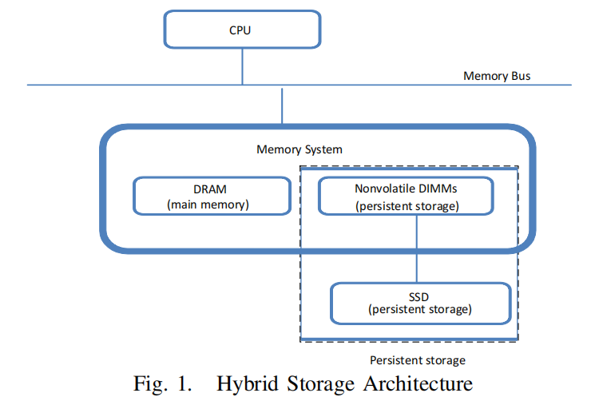
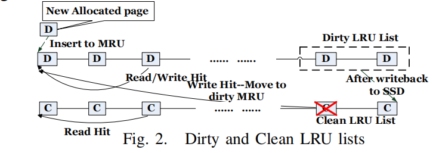
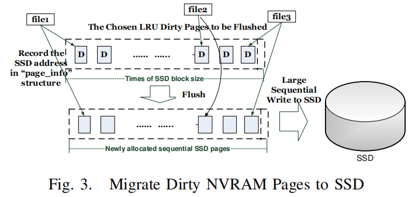
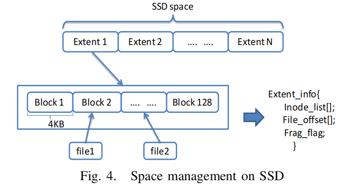
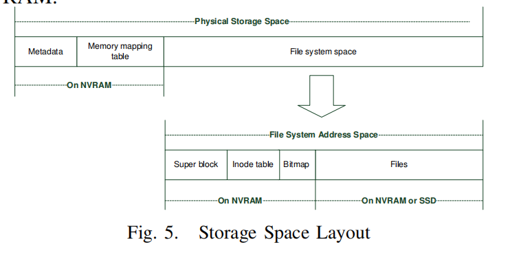

# NVMFS

本文设计了一个由非易失性内存（NVRAM）和nand闪存SSD组成的存储系统。我们提出了一个文件系统NVMFS来利用这些设备的独特特性，从而简化和加速了文件系统的操作。我们使用性能更高的NVRAM作为数据的缓存和永久空间。热数据可以永久存储在NVRAM上，而不需要回写到SSD，而相对冷的数据可以由NVRAM与SSD上的另一个副本临时缓存。我们还通过在刷新到SSD之前重新组织NVRAM上的写操作来减少SSD的擦除开销。

我们已经在一个Linux内核中实现了一个原型NVMFS，并与一些现代文件系统如ext3、btrfs和NILFS2进行了比较。我们还与另一个混合文件系统Conquest进行了比较，它最初是为NVRAM和HDD设计的。实验结果表明，与其他文件系统相比，当segment清理不活动时，NVMFS平均提高了98.9%的IO吞吐量，而在高磁盘利用率（超过85%）下，NVMFS平均提高了19.6%的吞吐量。我们还表明，我们的文件系统可以减少擦除操作和开销。

## INTRODUCTION

固态驱动器（ssd）已广泛应用于计算机系统中。SSD是一种纯电子设备，没有机械部件，因此可以提供更低的访问延迟，更低的功耗，无噪声和抗冲击性。然而，ssd也有两个严重的问题：有限的使用寿命和相对较差的随机写性能。在ssd中，最小的写单元是一个页面（如4KB），并且只能异地执行，因为在写入新数据之前必须擦除数据块。随机写入会导致ssd的内部碎片化，从而导致更高的昂贵的擦除操作频率[7]，[9]。**除了性能下降之外，ssd的寿命还可以通过随机写入而大大降低**。

[7] L. Bouganim, B. T. J´onsson, and P. Bonnet, “uflip: Understanding flash
io patterns,” in CIDR, 2009.
[9] F. Chen, D. A. Koufaty, and X. Zhang, “Understanding intrinsic characteristics and system implications of flash memory based solid state
drives,” in SIGMETRICS, 2009.

闪存现在被用于其他环境，例如设计非易失性DIMMs [1]，[6]。这些设计结合传统DRAM，闪存，智能系统控制器，和一个超级电容器电源提供一个高度可靠的内存子系统运行的延迟和耐力最快的内存，同时也有闪存的持久性（DRAM数据将自动备份到闪存电源故障）。这些非易失性dimm的可用性可以简化和增强文件系统设计，这是本文将探讨的一个主题。

在本文中，我们考虑了一个由非易失性dimm（如NVRAM）和SSD组成的存储系统。我们期望NVRAM和SSD的组合将提供更高的NVRAM性能，同时在一个系统中提供更高的SSD容量。我们提出了一个在一个系统中同时使用NVRAM和SSD的文件系统NVMFS。我们的文件系统利用这些设备的独特特性来简化和加快文件系统的操作。

在本文提出的文件系统中，我们同时使用**缓存和迁移**来改进文件系统的操作。当迁移数据时，数据的地址通常被更新以反映新的位置。而在缓存中，数据的永久位置保持不变，而数据留在性能更高的内存中。在采用迁移的系统中，数据位置通常会在数据从一个位置移动到另一个位置时进行更新，以反映其当前位置。当需要将干净的数据移动到较慢的设备时，不能像缓存系统那样简单地丢弃数据（因为数据始终驻留在缓存系统中**较慢的设备**中），而必须复制到较慢的设备中，并且必须更新元数据以反映数据的新位置。否则，设备的容量不能作为系统的容量报告给较高层。

在我们的系统中，我们同时使用这两种技术，利用NVRAM的非易失性，有效地减少了许多必要的操作。我们使用性能更高的NVRAM作为数据的缓存和永久空间。热数据和元数据可以在不太热时永久驻留在NVRAM中，但最近访问的数据可以同时缓存在NVRAM中。这种灵活性使我们能够消除在单独使用任何一种技术的系统中所需要的许多数据操作。

为了实现我们上面描述的这种灵活性，即数据可以缓存或永久存储在NVRAM上，**我们为文件系统中的数据块使用了两个潜在的地址**。具体情况将在后面的第三节中进行描述。

本文的主要贡献如下：

- 本文提出了一种新的文件系统-NVMFS，它集成了非易失性dimm（如NVRAM）和一个商用SSD作为存储基础设施。
- NVMFS分别权衡了NVRAM和SSD的优缺点。在我们的设计中，我们利用SSD的更大容量来保存大部分文件数据，同时吸收NVRAM上的随机写入。
- NVMFS在NVRAM上分发元数据和相对较热的文件数据，同时将其他文件数据存储在SSD上。与普通的缓存或迁移方案不同，我们的设计可以在**NVRAM上永久存储热数据**，同时也可以临时缓存最近访问的数据。
- 我们发现，与一些现有的文件系统相比，在段清理不活动时，NVMFS的IO吞吐量平均提高了98.9%，而在段清理被激活时，IO吞吐量平均提高了19.6%。
- 我们还表明，在SSD上的擦除操作和擦除开销都被有效地减少了。

本文的其余部分组织如下：我们将在第二节中讨论相关的工作。在第三节中，我们提供了我们提出的文件系统的设计和实现细节，然后在第四节中进行评估。第五节总结了本论文。

## 相关工作

许多项目以前已经建立了基于非易失性存储器设备[16]、[23]、[26]的混合存储系统。PFFS [23]建议在闪存设备上存储文件数据的同时，使用NVRAM作为存储文件系统元数据。FRASH [16]在多个可字节寻址的nvram上包含内存数据和文件系统的磁盘结构。与这些工作相比，我们的文件系统在NVRAM和SSD上探索了不同的写策略。我们在NVRAM上进行更新，在SSD上不进行覆盖。

Rio[11]和Conquest[26]在存储系统中使用电池支持的RAM来提高性能或提供保护。Rio使用电池支持的内存，并避免将脏数据刷新到磁盘。Conquest使用非易失性内存来存储文件系统的元数据和小文件。WSP [22] 建议使用失败时刷新技术，该技术利用系统的剩余能量，在出现电源故障时将寄存器和缓存刷新到 NVRAM。 我们在这里的工作探索了非易失性 DIMM，以提供高度可靠的 NVRAM，它以最快的 DRAM 的延迟和耐用性运行，同时还具有闪存的持久性。

当前的ssd实现了类似于在ssd上的日志结构化操作的文件系统的[24]，以适应ssd的擦除和写操作。**垃圾收集和由这些操作产生的写入放大具有重要意义**，因为ssd的生命周期是由程序/擦除周期数[15]决定的。最近提出了几种技术来提高ssd的寿命，例如[10]，[14]。**SFS [8]最近的工作建议在文件块级别收集数据热度统计数据，并相应地对数据进行分组。我们在这里的工作利用NVRAM首先减少到SSD的写入，其次将类似的页面分组到一个写入SSD的块中，以提高垃圾收集效率**。

最近的几项研究研究了存储系统[12]中不同设备管理空间的问题。这些研究考虑了将工作负载模式与设备特征相匹配，并研究了在使用ssd和磁盘的混合系统中，存储系统组织的影响。我们的混合存储系统采用了NVRAM和SSD。另一组研究工作提出了不同的算法来管理SSD 的缓冲区或缓存，[19]，[25]。**它们都打算暂时缓冲缓存上的写入，并减少对SSD的写入**。我们的工作与它们不同，因为我们的文件系统可以将数据永久存储在NVRAM上，从而进一步减少对SSD的写入。

我们的工作可以减少GC（垃圾收集）期间的擦除开销，这有利于各种FTL方案。

## 设计与实现

NVMFS通过只在SSD上执行大的顺序写入，在NVRAM上的吸收小随机IO，从而提高了SSD的随机写入性能。为了减少SSD的擦除操作的开销，**NVMFS将具有相似更新可能性的数据分组到相同的SSD块中**。我们的设计的好处在于三个方面：(1)减少对SSD的写流量；(2)将文件系统级别的随机写入转换为SSD级别的顺序写入；(3)将具有相似更新可能性的数据分组到相同的SSD块中。

### Hybrid Storage Architecture

在NVMFS中，内存系统由传统的DRAM和非易失性DIMM两部分组成。图1显示了我们系统的硬件架构。我们利用附加到内存总线上的非易失性dimm，并通过虚拟地址作为NVRAM进行访问。NVRAM的所有页面映射信息都将存储在NVRAM中的一个固定位置。我们将在后面的第三节-E节中详细介绍这一点。值得注意的是，我们在文件系统中绕过了页面缓存，因为CPU可以直接访问NVRAM，这可以提供与基于DRAM的页面缓存相同的性能。为了访问SSD上的文件数据，我们使用逻辑块地址（LBAs），它将由SSD上的FTL将其转换为物理块地址（PBAs）。**因此，NVMFS在文件系统级别上有两种类型的数据地址——NVRAM的虚拟地址和SSD的逻辑块地址**。在我们的设计中，我们可以分别在NVRAM和SSD上存储两个有效的热数据版本。每当数据变得脏时，我们就在NVRAM上保存最新的数据，并使SSD上的相应版本无效。我们将在第三节-E节中介绍我们如何管理我们的文件系统的数据地址。

### 数据分发和写入重组

NVMFS的关键设计依赖于两个方面：(a)如何在NVRAM和SSD两种设备之间分配文件系统数据；(b)如何在写入SSD之前对数据进行分组和重新组织，这样我们总是可以在SSD上执行大的顺序写入。

文件系统元数据很小并且会经常更新，因此将它们存储在 NVRAM 上是很自然的。为了有效地分发文档数据，**我们跟踪干净和脏文件数据的热度。我们实现了两个 LRU（最近最少使用）列表——脏和干净的 LRU 列表，它们作为元数据存储在 NVRAM 上**。考虑到 SSD 昂贵的写入操作，我们更喜欢在 NVRAM 上存储更多的脏数据，期望它们能够吸收更多的更新/写入操作。当 NVRAM 空间不足时，我们从干净的 LRU 列表中替换文档数据。但是，我们也不想损害干净数据的局部性。我们通过动态调整脏和干净 LRU 列表的长度来平衡这一点。干净和脏 LRU 列表中的页面总数是固定的，等于 NVRAM 页面的数量。

图2显示了干净和肮脏的LRU列表以及相关的操作。在写入新的文件数据时，我们在NVRAM上分配空间并将它们标记为脏LRU，然后插入脏LRU列表的MRU（最近使用的）位置。对脏数据的读/写操作，将其位置更新到脏LRU列表中的MRU。对于干净数据，读操作将其位置更新到干净LRU列表的MRU，而写操作将相应的NVRAM页面从干净的LRU列表迁移到脏LRU列表的MRU。

> 区分脏数据 和 干净数据 的cache

与现有的页面缓存结构不同，我们的文件系统可以在短时间内将脏数据刷新到已备份的辅助存储器（如ssd），而我们的文件系统可以将脏数据永久存储在NVRAM上。NVMFS总是保留指向最新数据版本的指针。**我们可以根据工作负载动态地选择何时和哪些数据刷新到SSD**。每当脏LRU列表中的NVRAM页面达到高界（即80%的脏LRU列表已满）时，我们就开始将脏数据刷新到SSD。这个过程将持续下去，直到脏LRU列表中的NVRAM页面达到下限（即脏的LRU列表50%已满）。刷新作业由后台内核线程执行。

如图 3 所示，**脏污的 NVRAM 页面在迁移到 SSD 后将变得干净，并将插入到干净 LRU 列表的 LRU（最少使用） 位置**。我们可以促进后续的读/写请求，因为我们在NVRAM上仍然有有效的数据版本。此外，我们可以通过仅反映它们在SSD上的位置来轻松替换NVRAM上的这些数据。在我们的文档系统中，文档 inode 始终指向适当的数据版本。例如，如果文档数据在 NVRAM 和 SSD 上分别具有两个有效版本，则 inode 将指向 NVRAM 上的数据。我们有另一个称为 “页面信息” 的数据结构，它记录了SSD上另一个有效数据版本的位置。需要注意的是，即使我们丢失了此 “页面信息” 结构，我们也不会丢失文档系统的一致性，因为文档inode始终保留适当有效数据版本的位置。我们将在第 III-D 节中讨论文档系统一致性。

> 单独的页面信息表，可以参考，用来解耦合（抽象出一个支持NVM和SSD的单独层）
> 感觉没必要区分脏/clean的数据页，简单将冷的数据淘汰，如果是脏再写回即可。

### Non-overwrite on SSD

我们在NVRAM和SSD上使用了不同的写入策略。**我们对NVRAM进行就地更新**，对SSD进行非覆盖，这利用了设备的特性。**SSD的空间被管理为512KB的范围**，**这也是将数据从NVRAM迁移到SSD的最小刷新单元**。SSD上的每个扩展区包含128个正常的4KB块，这也是我们的文件系统的块大小。当脏数据被刷新到SSD时，我们将它们组织成很大的数据块（即512KB），并在SSD上分配相应数量的数据块。因此，对小的IO请求的随机写入被转换为大的写入请求（即512KB）。

为了便于在SSD上分配区段，我们需要定期清理SSD内的内部碎片。在回收过程中，我们可以将几个部分有效的SSD范围集成到一个有效的SSD范围中，并释放剩余的空间。**这确保了我们总是可以在SSD上有可用的空闲区段进行分配，这类似于日志结构化文件系统的段清理过程**。值得注意的是，SSD的FTL组件仍然在管理着SSD的内部垃圾收集。如前所述，我们总是以512KB为单位的顺序写入SSD，因此在FTL处的块擦除程序有望从我们的设计中获益。我们将在第IV-C节中展示NVMFS是如何影响它的。

图4显示了SSD的空间组织。给定逻辑块数，很容易得到其范围内的索引和偏移量。**为了方便范围回收，我们需要在一个候选范围内保留每个块的一些信息，例如，每个有效块所属的inode和文件偏移量**。我们还保留一个标志，以指示这个范围是否碎片化。**这些信息作为元数据保存在NVRAM上的一个固定空间中。**在我们当前的设计中，为了调用回收，必须满足两个条件：(a)SSD的碎片比率超过了一个可配置的阈值（理想的范围使用/实际范围使用）；(b)空闲SSD扩展的数量小于一个可配置的阈值。第一个条件确保在回收后，当空闲范围不够时，我们确实得到一些空闲空间。

### 文件系统一致性

文件系统的一致性一直是文件系统设计中的一个重要问题。在本节中，我们将描述与我们设计的数据迁移和段清理过程相关的一致性问题。

如第III-B节所述，每当脏LRU列表达到上限（即80%的脏LRU列表已满）时，NVMFS将调用刷新过程。**刷新过程每轮从dirty LRU列表的末尾选择512KB数据**，并准备一个新的SSD范围（512KB），然后将数据组合为对SSD的一个写入请求，最后更新相应的元数据。元数据更新涉及将刷新的NVRAM页面插入干净的LRU列表中，并在上一节中提到的“页面信息”结构中记录新的数据位置（在SSD上）。需要注意的是，inode（未更改）仍然指向NVRAM上的有效数据，直到它们从干净的LRU列表中替换。如果将数据刷新到 SSD 时系统崩溃，inode 仍会指向 NVRAM 上的有效数据版本。我们只需删除以前的操作并重新启动迁移即可。如果系统在数据刷新后但在我们更新元数据之前崩溃，NVMFS仍然是一致的，因为inode指向NVRAM上的有效数据版本。SSD上已刷新的数据将在分段清理期间回收。如果系统在元数据更新过程中崩溃，LRU列表和“页面信息”结构可能会变得不一致，NVMFS将重置它们。为了重建 LRU 列表，NVRAM 会扫描inode，如果该节点指向 NVRAM 页面，我们将其插入到脏的 LRU 列表中，同时保持干净的 LRU 列表为空。

分段清理是另一个容易出现不一致的点。清理过程每轮选择一个候选范围（512KB），并将有效块（4KB）迁移到NVRAM，然后更新内部节点以指向新的数据位置，最终释放SSD上的空间。如果系统在数据迁移过程中崩溃，NVMFS插管仍然指向SSD上的有效数据。**如果系统在节点更新期间崩溃，NVMFS通过采用类似于其他日志结构化文件系统的事务机制（节点更新和在SSD上释放空间是一个事务）来保持一致性**。

> 不太好，感觉还得按照file的逻辑概念，将同一个file的数据块整合在一起，提高文件后续读的连续性。

### File System Layout

NVMFS的空间布局如图5所示。**元数据和内存映射表存储在NVRAM上**。元数据包含NVRAM和SSD的大小、页面映射表的大小等信息。**内存映射表用于在安装文件系统时构建一些内存中的数据结构，并在运行时由内存管理模块进行维护。对内存映射表的所有更新将立即刷新到NVRAM**。

文件系统的元数据包括超级块、inode表和块位图，它们存储在NVRAM上，而文件数据则根据其使用模式存储在NVRAM或SSD上。块位图指示相应的NVRAM或SSD块是空闲的还是使用的。在NVMFS中，我们总是将热文件数据放在NVRAM上，将冷文件数据放在SSD上。在我们当前的实现中，NVRAM地址的虚拟内存空间的总大小为247字节（范围：ffff 0000000000000-ffff 7 fffffffffff），这在原始的Linux内核中是未使用的。我们修改了Linux内核，以使操作系统意识到两种类型的内存设备的存在——连接到内存总线上的DRAM和NVRAM。我们还添加了一组函数来分配/释放NVRAM的内存空间。这个实现利用了[27]中以前的工作。

在 NVMFS 中，目录文档存储为普通文档。为了寻址 inode 表，我们将指向 inode 表起始地址的指针存储在超级块中。在 inode 表中，我们为每个 inode 使用一个 128 字节的固定大小条目，**通过它的 inode 编号和 inode 表的起始地址可以简单地获取文档的元数据**。 **inode 将存储几条信息，包括 NVRAM 的块数、SSD 的块数、块指针数组等。块指针数组类似于 EXT2 中使用的直接/间接块指针**。不同之处在于我们总是在 NVRAM 上分配间接块，因此即使文档很大需要检索间接块，也可以快速索引请求的文档数据。块地址为 64 位，NVRAM 地址与 SSD 块地址不同。要构建我们的文档系统，我们可以使用类似 `mount -t
NVMFS -o init=4G /dev/sdb1 /mnt/NVMFS` 的命令。在示例中，我们附加了 4GB 非易失性 DIMM 作为 NVRAM，并告诉 NVMFS SSD 设备的路径，最后将其挂载到指定的挂载点。

> 问题是，如果有多个NVM设备，那该怎么挂载呢。看看传统混合的SSD-disk怎么挂载的

