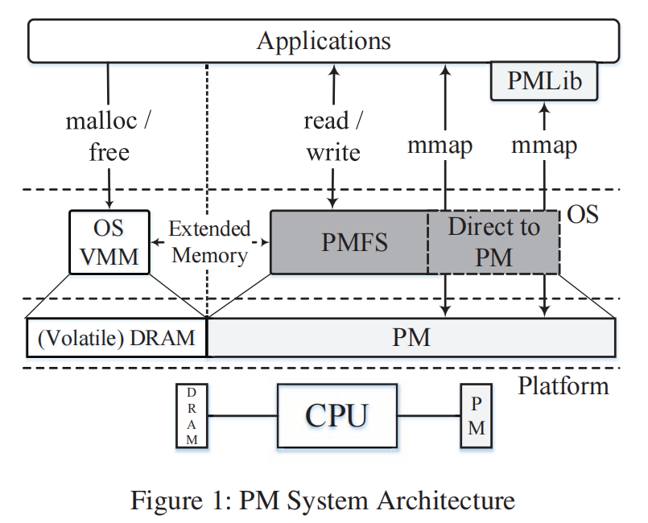
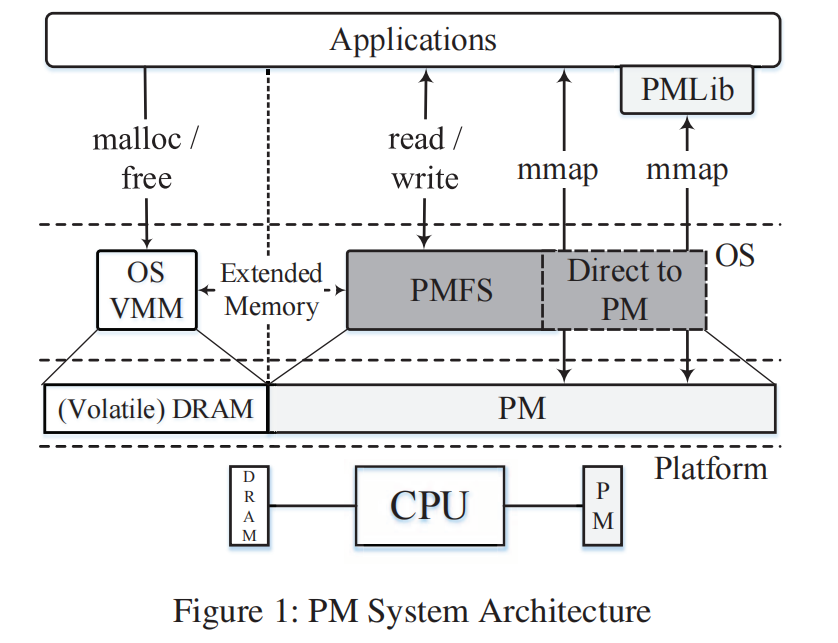
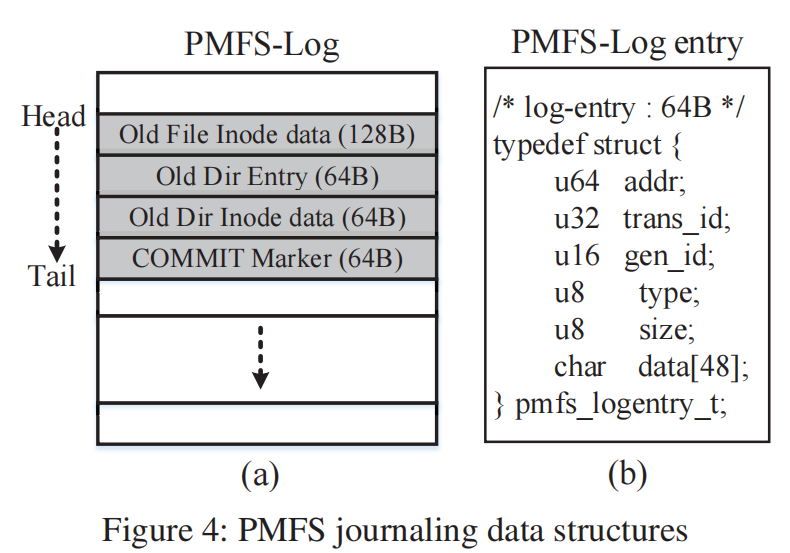
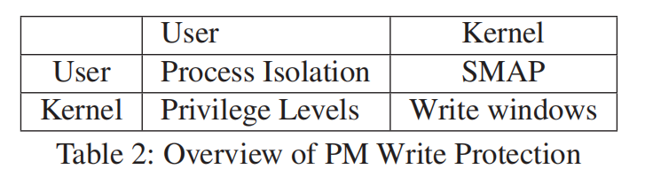

# PMFS

我们实现了PMFS，这是一个轻量级的POSIX文件系统，它利用PM的字节寻址能力，以避免面向块的存储的开销，并允许应用程序直接通过PM（使用**内存映射的I/O**）进行访问。PMFS利用处理器的分页和内存排序特性进行优化，如细粒度日志记录（用于一致性）和透明的大页面支持（用于更快的内存映射I/O）。为了提供强大的一致性保证，PMFS只需要一个简单的硬件原语，它提供了软件可执行的持久性和对PM的商店订购的保证。最后，PMFS使用处理器的现有特性来**保护PM免受杂散写(stray writes)操作的影响**，从而提高了可靠性。

并针对顺序和持久性的问题，提出pm_wbarrier，以保证从cache中flush的数据被持久化到PM。

## 简介

近年来，NAND闪存帮助降低了存储和内存[30]之间历史上的高性能差距。随着存储速度的加快，其趋势是使它更靠近CPU。例如，非易失性 DIMM (NVDIMM) 将存储直接连接到可扩展内存 (DDR) 接口[15、38]。 NVDIMM 因其在高额定 IOPS 下提供低延迟可预测性能的能力而越来越受欢迎 [29, 38] 但是，尽管连接到 CPU，由于 NAND [36] 的固有属性，基于 NAND 的大容量 NVDIMM 仍然作为块设备 [38] 在一个单独的地址空间。

然而，由于新兴的非易失性存储器技术适合作为大容量、字节寻址的存储类内存使用，这种情况似乎可能在不久的将来发生改变。表1显示了其中一些技术的每个设备的特性。我们将这种内存称为持久性内存（PM）。

PM对系统架构、系统软件、库和应用程序[26,27,36,40]都有影响。在本文中，我们解决了系统软件支持的挑战，使应用程序高效访问PM。

传统上，操作系统将易失性存储器（例如，使用虚拟内存管理器或VMM）和存储（例如，使用文件系统和块驱动程序）分开。由于PM既是字节寻址的（如易失性存储）又和持久的（如存储），系统软件可以通过几种方式管理PM，例如：

(1)扩展VMM以管理PM；(2)实现PM的块设备，配合现有文件系统（如ext4)；(3)实现一个为PM优化的文件系统，而不经过块层。

PMFS采用了实现为PM优化的POSIX兼容文件系统的策略。图1显示了建议的PM系统体系结构的高级概述，其中PMFS作为管理PM的系统软件层。

图2显示了这两种方法的高级比较。**PMFS利用PM的字节寻址性，使用原子就地更新、cacheline粒度日志记录（细粒度日志记录）和写入时复制（CoW）的组合来优化一致性。**

## 设计目标

1. 为可字节寻址的存储进行优化
2. 允许通过应用程序对PM进行有效的访问。
3. 保护PM以防止杂乱写。PMFS使用处理器中的写保护控制特性实现了一个原型的低开销写保护方案

### Optimizations for memory-mapped I/O

PMFS中的分配是基于页面的，支持所有处理器页面大小（4KB、2MB、1GB），以启用透明的大页面支持[18]。默认情况下，分配器使用4个KB页面作为数据文件的b树的元数据（内部）节点，但是数据（叶）节点可以是4KB、2MB或1GB。

在许多方面，PMFS分配器类似于OS虚拟内存分配器，除了一致性和持久性保证（3.2）。因此，经过充分研究的内存管理问题，如由于支持多种分配大小而导致的碎片化，适用于PMFS。**在当前的实现中，PMFS分配器只合并相邻的页面，以避免很大的碎片化**。我们计划在未来探索更多的策略。

### 一致性

现代文件系统和数据库使用以下三种技术之一来支持一致性：复制-写入（CoW）[2,27]、日志记录（或日志记录）[4]和日志结构化更新[30,37]。

CoW文件系统和日志结构文件系统分别以块或段粒度执行CoW或日志记录。块或段的大小通常为4KB或更大。这些CoW和日志结构的文件系统通常伴随着大的写放大，特别是对于元数据一致性，通常只需要小的元数据更新。日志记录，特别是使用PM，可以以更细的粒度记录元数据更新。

（log-structure写放大的原因可能是因为，需要后台进行垃圾回收，搬迁数据造成的写放大）

基于这项研究，我们发现，与CoW（有或没有原子就地位置更新）和日志结构文件系统相比，以cacheline或64字节粒度进行Journaling（称为细粒度日志）对元数据更新的开销最少。

然而，日志有一个缺点，**所有更新必须写入两次；一次到日志，然后到文件系统**。对于大于CoW文件系统的块大小或日志结构文件系统的段大小的更新，由于这种双复制开销和相关的写入放大，日志记录变得不那么可取。**因此，在PMFS中，我们使用原子就地更新和对（通常很小的）元数据更新的细粒度journal记录，而CoW用于文件数据更新**。我们展示了（4.2.3），与BPFS相比，PMFS在元数据一致性方面的开销要低得多。BPFS是一个pm优化的文件系统，对元数据和数据一致性[27]使用CoW和原子就地更新。

undo vs redo：日志记录有两种类型：1）redo 和2）undo。在redo日志记录中，在将数据写入文件系统之前，将log要写入的新数据并使其持久。只有在事务成功提交时，此新数据才会被写入文件系统。在undo日志记录中，首先记录旧数据（在文件系统中）并使其持久。在事务过程中，新数据直接（就地）写入文件系统。如果事务失败，则将使用撤销日志中的旧数据回滚对文件系统的任何修改。重做和撤销都有利弊有弊。**在PMFS中undo日志要求事务中的每个日志项都有一个pm wbarrier，而redo日志只要求每个事务有两个pm wbarrier，无论日志条目的数量如何**。另一方面，redo日志的执行起来更加复杂。由于在事务期间新数据只写入重做日志，因此作为事务一部分完成的所有读取必须首先搜索重做日志以获取最新副本。因此，重做日志会对事务中的所有读取操作产生额外的开销，**因此对重做日志记录的粒度施加实际限制——日志记录粒度越细，搜索重做日志的开销就越大**。

撤销日志记录更容易实现，并且允许对共享数据结构进行细粒度的日志记录（例如，inode表）。在PMFS中，我们使用撤消日志记录具有上述优点和简单性。然而，我们意识到撤销并不总是比重做好。**例如，如果事务创建了大量日志条目，但只修改了少量数据结构，那么重做可能比撤消执行得更好。我们计划在未来分析重做和撤销日志记录的各自好处**。

如上所述，在 PMFS 中，原始数据在修改文档系统元数据之前写入并提交到 PMFS-Log（图 4），从而遵循撤消语义。如果在事务中途发生故障，PMFS 将在下一次装载时通过读取 PMFS-Log 并从未提交的事务中撤消对文档系统的更改来恢复。为了最大限度地减少日记开销，**PMFS 利用处理器功能尽可能使用原子就地更新，有时完全避免日志记录**。对于元数据的就地更新不充分的操作，PMFS 会回退到使用细粒度日志记录。

总之，PMFS使用了一种混合的方法来实现一致性，**即在原子就地更新、细粒度日志记录和CoW之间进行切换**。我们现在将更详细地描述原子的就地更新和细粒度的日志记录。

**原子就地更新**：正如以前的工作所建议的那样，PM提供了一个独特的机会来使用原子位置更新，以避免更昂贵的日志记录或CoW [27]。然而，与以前的工作相比，PMFS利用了16字节和64字节原子更新的额外处理器特性，避免了在更多情况下的log。PMFS以以下方式使用各种原子更新选项：

- 8字节的原子更新：处理器本机支持8字节的原子写入。PMFS使用8字节的原子写入操作来更新inode在文件读取时的访问时间。
- 16字节原子更新：处理器还支持使用cmpxchg16b指令（带有锁的前缀）[17]的16字节原子写入。PMFS在一些地方使用16字节的本地原子更新，例如对inode大小的原子更新和附加到文件时的修改时间。
- 64字节（粗线）原子更新：如果受限事务内存（RTM）可用[20]，处理器还支持原子粗线（64字节）写。要原子写入单个坐标线，PMFS使用XBEGIN启动RTM事务，修改cacheline，并使用XEND结束RTM事务，此时坐标线对系统的其他部分原子可见。在随后的clflush上，修改后的粗线被原子地写回PM，因为处理器缓存和内存硬件至少以粗线粒度移动数据。PMFS在系统调用中使用粗线原子性来修改许多inode字段（例如，在删除一个inode时）。注意，如果RTM不存在，PMFS只会回到使用细粒度日志记录。

> 64字节和16字节有问题，不适合AEP

**元数据一致性的journal**：PMFS使用撤消日志记录和细粒度日志记录。主要的日志记录数据结构是一个被称为PMFSLog的固定大小的环形缓冲区（图4(a)）。头指针和尾指针分别标记活动记录数据的滑动窗口的开始和结束。对于每个需要日志记录的原子文件系统操作，PMFS都会启动一个具有唯一id（转换id）的新事务。

PMFS-Log 由一个 64 字节日志条目数组组成，其中每个日志条目描述对文档系统元数据的更新。日志条目由标头和数据部分组成，如图 4（b） 所示。2 字节 gen id 是一个特殊字段。要使 PMFS-Log 中的日志条目被**恢复代码**视为有效，**日志条目中的 gen id 字段必须与 PMFS-Log 元数据中的类似 gen id 字段匹配。PMFS-Log 的 gen id 字段在每次日志环绕后和每次 PMFS 恢复后都会递增，从而自动使所有过时的日志条目失效。**

为了能够在PMFS-Log中识别有效的条目，必须保持两个要求之一：PMFS必须将条目原子地附加到PMFS-Log，或者恢复代码必须能够检测部分写入的日志条目。一种可能的解决方案是使用两个pm障碍操作：将日志条目附加到PMFS-Log并使其持久，在日志条目中原子设置一个有效位。其他方法包括在日志条目头使用校验和[35]或者RAWL [40]，它将日志数据转换为64位单词的流，每个单词中都有一个保留的撕裂（有效）位。**然而，所有这些方法需要额外的序列化操作（双屏障）或计算（校验和，卷卷位RAWL）都有很高的开销**。在PMFS中，我们将日志条目的大小固定为一个单个（对齐的）cacheline（64字节），并利用处理器缓存层次结构中的架构保证，写入同一粗线的数据永远不会重新排序。例如，如果A和B是两个独立的8字节写入，并且按该顺序排列，那么A将始终不迟于B完成。PMFS使用日志条目头中的gen id字段作为有效标志段。在将日志项写入PMFS-Log时，gen id是最后写入，然后日志项进行持久。为了确保此方案工作，我们指示编译器不要对日志条目重新排序。

[35] V. Prabhakaran, L. N. Bairavasundaram, N. Agrawal, H. S.Gunawi, A. C. Arpaci-Dusseau, and R. H. Arpaci-Dusseau. IRON File Systems. In Proceedings of the Twentieth ACM Symposium on Operating Systems Principles, SOSP ’05,pages 206–220, 2005.
[40] H. Volos, A. J. Tack, and M. M. Swift. Mnemosyne: Lightweight Persistent Memory. In Proceedings of the Sixteenth International Conference on Architectural Support for Programming Languages and Operating Systems, ASPLOS XVI, pages 91–104, 2011.

在原子操作（或事务）开始时，PMFS通过原子增加尾部来为操作分配所需的最大日志条目数量。当事务即将修改任何元数据时，它首先通过将一个或多个日志条目添加到PMFSLog中并使它们持久，然后就地写入新值。对事务中的所有元数据更新，都将重复此过程。在完成所有元数据更新之后，通过首先刷新PM中的所有脏元数据数据线，然后使用一个pm_barrier使它们持久，来提交事务。最后，**我们在事务中附加一个特殊的提交日志条目，并使其持久，以表明事务已经完成**。

如前所述，由于journal的双重复制，大型文件数据更新的日志开销可能会高。因此，PMFS使用了一种**混合方法**，**在元数据更新的细粒度日志journal和数据更新的CoW之间进行切换**。例如，**在使用write系统调用进行多块文件数据更新时，PMFS使用CoW准备好包含新数据的页面，然后使用日志记录更新元数据**。

在当前的实现中，PMFS只保证数据在相关的元数据实现之前变得持久。此保证与ext3/ext4在有序数据模式下提供的保证相同。我们计划在未来探索更强的一致性保证。

然而，CoW的一个悬而未决的问题是它用于大页面；例如，一个1GB的文件数据节点的CoW，即使它要写几百兆字节，也会导致显著的写放大。由于这个问题也发生在OS虚拟内存管理中，我们计划在未来探索最著名的做法（例如，将CoW的大页面分解为常规的4KB页面）。

### Write Protection

由于软件可以将PM作为常规内存进行访问，因此我们必须担心由于不相关软件中的错误而导致的对PM的永久损坏。

表2简要概述了PM写保护（来自散写）如何在假定的处理器体系结构中工作。行名指的是映射PM的地址空间，列名指的是杂散写发生时的特权级别。这里不包括进程内（例如，多个线程之间）的保护，但将在未来进行探索。

