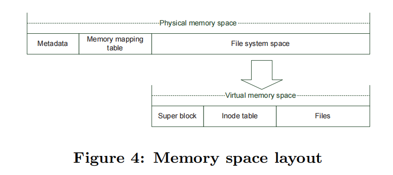
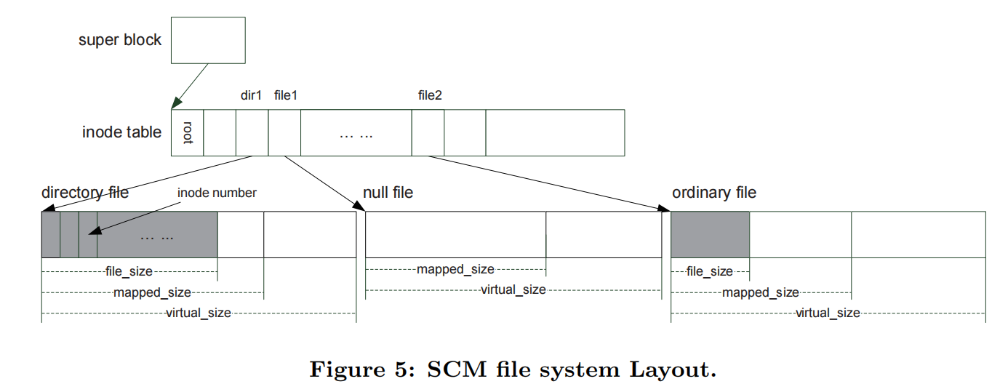

# SCMFS

本文提出了一种在虚拟地址空间上实现的新文件系统SCMFS。在SCMFS中，我们利用操作系统中现有的内存管理模块来进行块管理，并保持每个文件的空间始终连续。SCMFS的简单性不仅使它易于实现，而且提高了性能。

## 引言

在本文中，我们关注那些可以直接连接到内存总线和字节可寻址的非易失性存储器。这种非易失性存储器可以用于计算机系统的主存，也可以用于文件的持久存储。很有前途的非易失性存储器技术包括相变存储器（PCM）[21]、忆阻器[24]，并提供与DRAM相当的低延迟，并且比传统磁盘快几个数量级。

非易失性存储器技术的出现为研究人员带来了许多新的机遇。新出现的非易失性存储器可以连接到内存总线上，从而减少了访问持久性存储器的延迟。这些设备还使处理器能够通过内存加载/存储指令来访问持久存储，从而为存储持久数据提供了更简单、更快的技术。然而，与磁盘驱动器相比，这些设备的写生命周期通常更短得多。在如何减少写操作和在这些设备[19,28,15,14]上实现磨损水平方面，人们已经做了大量的工作。由于SCM的写入持久性通常是100-1000X+顺序的NAND闪存，预计寿命问题问题更小。在本文中，我们研究了SCM设备的特性应该如何影响文档系统的设计。SCM 设备具有非常低的访问延迟，这比现有的其他持久性存储设备要好得多，我们认为它们直接连接到内存总线（如图 1 所示）。

要将SCM作为持久性存储设备，最直接的方法是使用RamDisk来模拟SCM设备上的磁盘设备。然后就可以使用一个常规的文件系统，如Ext2Fs、Ext3Fs等。传统的文件系统假设底层存储设备是I/O bus附加的块设备，而不是为内存设备设计的。**在这种方法中，文件系统通过通用的块层和模拟的块I/O操作来访问存储设备。**由仿真和通用块层所造成的开销是不必要的，因为专门为内存设备设计的文件系统可以直接建立在内存访问接口之上。在传统的存储层次结构中，额外的开销是可以忽略的，因为访问存储设备的延迟远远高于访问内存的开销。当存储设备直接连接到存储总线并且可以以内存速度访问时，这些开销会大大影响性能，因此有必要在可能的时候注意避免这种开销。此外，当存储设备连接到内存总线时，存储设备和主内存都将共享系统资源，如内存总线的带宽、CPU缓存和TLB。在这种情况下，文件系统的开销将影响整个系统的性能，而SCM的文件系统应该考虑这些因素。在我们的文件系统中，我们将消除层次结构中不必要的开销。

在本文中，我们提出了一种专门为单片机设计的新的文件系统——SCMFS。考虑到兼容性，这个文件系统导出与常规文件系统相同的接口，以便所有现有的应用程序都能在它上工作。在这个文件系统中，我们的目标是最小化文件系统操作的CPU开销。**我们在虚拟内存空间上构建文件系统，并利用内存管理单元（MMU）将文件系统地址映射到SCM上的物理地址。物理地址空间和虚拟地址空间的布局都非常简单。我们还保持SCMFS中每个文件的空间连续，以简化在文件系统中处理读/写请求的过程**。我们将通过基于多个基准测试的结果表明，SCMFS的简单性使其易于实现并提高性能。本文主要讨论了在单个处理器上构建一个文件系统。我们的方法可以通过分布式共享内存扩展到更大的多处理器系统。

## 背景及相关工作

许多文件系统已经为闪存设备（[1,26]）设计了。BPFS [7]是一种为非易失性字节可寻址存储器设计的文件系统，它使用阴影分页技术来提供快速和一致的更新。它还需要进行体系结构增强，以提供新的接口来强制执行灵活的写顺序级别。我们的文件系统旨在简化设计，消除不必要的开销，以提高性能。由于BPFS没有内核级实现，因此我们没有将其性能与BPFS进行比较。DFS[10]是与我们的文件系统最相似的文件系统。DFS在设备驱动程序和固件中集成了块管理的功能，以简化文件系统，并使文件在一个巨大的地址空间中保持连续。它专为通过FusionIo 且基于 PCIe 的固态硬盘设备而设计，并依赖于硬件中的特定功能。

许多项目以前已经在非易失性存储器设备上建立了存储系统。Rio[6]和Conquest[9]在存储系统中使用电池支持的RAM来提高性能或提供保护。Rio使用电池支持的RAM来存储文件缓存，以避免刷新脏数据，而Conquest则使用它来存储文件系统的元数据和小文件。在eNVy存储系统[27]中，闪存被连接到存储器总线上，以实现非易失性存储器设备。为了使这个设备的字节可寻址，他们设计了一个具有电池支持的RAM缓冲区的特殊控制器。我们的工作假设非易失性内存对于数据和元数据都足够大，并专注于利用系统中的内存管理基础设施。在[25]中描述了一种实现非易失性存储器上数据一致性的数据结构级方法。

已经提出了加快内存访问操作、减少写操作和在PCM设备上的磨损水平的解决方案。其中一些解决方案提高了PCM设备的寿命或性能。其中一些设备使用DRAM设备作为层次结构中的PCM的高速缓存。[20]在内存控制器上提出了一个页面放置策略，以实现PCM-DRAM混合内存系统。[15,16,22,28]已经提出了几种保护PCM设备免受正常应用程序甚至恶意攻击的磨损均衡方案。由于我们的工作集中在文件系统层，所有的硬件技术都可以与我们的文件系统集成，以提供更好的性能或更强的保护。

已经提出了基于重复数据删除的方法，以在设备级[5,8,18]上减少对ssd的写入，并在重复数据删除文件系统[4]中使用ssd。

## SCMFS

### 设计

在这项工作中，我们的目标是为SCM设备设计一个文件系统。对于传统的持久性存储设备，I/O延迟所带来的开销远远高于文件系统层本身。因此，存储系统的性能通常取决于设备的特性和I/O调度器的性能。但是，在存储设备直接连接到内存总线的情况下，存储设备将与主内存共享一些关键的系统资源。它们将共享内存总线的带宽、CPU缓存和指令和数据的tlb。我们认为，降低文件系统的复杂度可以降低存储系统中的CPU开销，从而提高整体性能。我们的设计是为了尽量减少在这样的系统中执行文件系统请求所需的操作数量。

#### Reuse Memory Management

为了简化这些数据结构，我们设计了一个文件系统，**使每个文件中的逻辑地址空间都是连续的。为了实现这一点，我们在虚拟地址空间上构建文件系统，该空间可以大于SCM的物理地址空间。我们可以使用页面映射来保持文件中的所有块具有连续的逻辑地址**。在SCMFS中，由于每个文档内部的连续性，我们不需要复杂的数据结构来跟踪逻辑地址空间，只需存储每个文档的起始地址和大小即可。此机制大大简化了读/写请求的过程。若要获取请求数据的位置，唯一的计算方法是将偏移量添加到文档的起始地址。数据的实际物理位置可通过页面映射数据结构获得，同样利用系统基础结构。

#### File System Layout

图4显示了SCMFS中的虚拟内存空间和物理内存空间的布局。物理内存空间中的“元数据”包含了存储器的信息，如物理SCM的大小、映射表的大小等。物理内存的第二部分是内存映射表。文件系统在挂载时需要这些信息来构建一些内存中的数据结构，这些数据结构在运行时主要由内存管理模块进行维护。对这些数据结构的任何修改都将立即被刷新回该区域。由于映射信息对文件系统的一致性非常重要，因此将通过使用第3.6节中描述的过程“clflush缓存范围”，立即刷新对该区域的所有更新。其余的物理空间被映射到虚拟内存空间中，并用于存储整个文件系统。

SCM文件系统的结构如图5所示。 在SCM文件系统中，目录文件存储为普通文件，只是其内容是inode号列表。除了普通的文件和目录文件之外，在SCMFS中，还有一种附加类型的文件，即null文件，它将在3.3中进行描述。在超级块中还有一个指向inode表的开始地址的指针。在inode表中，我们对每个inode使用固定大小的条目，即256字节，通过文件的inode编号和inode表的起始地址获得文件的元数据。

### 空间预分配

在常规的文件系统中，数据块是按需分配的。该空间只有在需要时才被分配给文件，一旦任何文件被删除，为它分配的空间将立即被释放。频繁的分配和释放可以调用许多内存管理功能，并可能降低性能。为了避免这种情况，我们采用了一种空间预分配机制，在该机制中，我们将在文件系统中创建并始终维护一定数量的空文件。这些空文件没有名称，没有数据，但是已经分配了一些物理空间。**当我们需要创建一个新文件时，我们总是尝试先找到一个空文件。当一个文件缩小时，我们将不会取消分配未使用的空间。当我们需要删除一个现有的文件时，我们不会去分配它的空间，而是将它标记为一个空文件。**通过空间预分配机制，我们可以显著减少分配和释放操作的数量，并有望提高文件系统的性能。

每个文件未使用但映射的空间将保留给以后的数据分配，并可能提高进一步写入性能的性能。然而，这些空间也很可能被浪费掉。**为了回收这些“浪费”的空间，我们使用了一个后台过程。此方法非常类似于基于flash的文件系统的垃圾收集机制。当SCM的利用率达到可编程阈值时，这个后台线程将释放文件中未使用但已映射的空格，并且它总是首先选择冷文件**。
