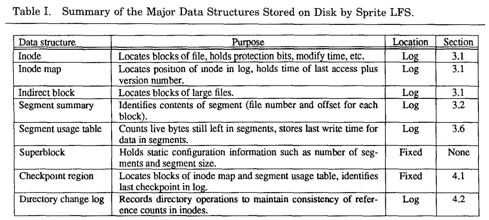
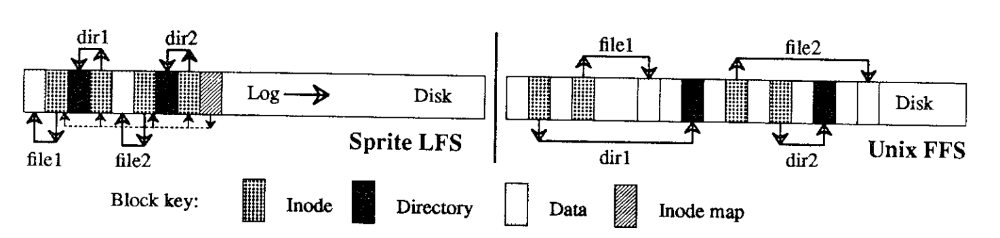
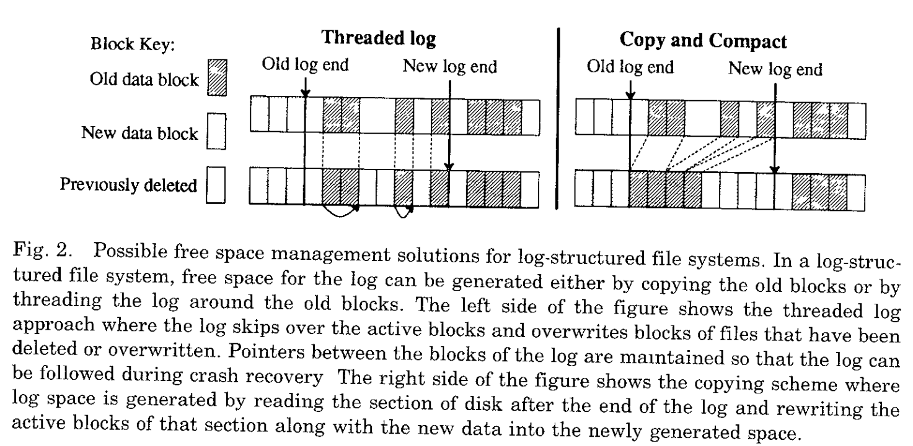
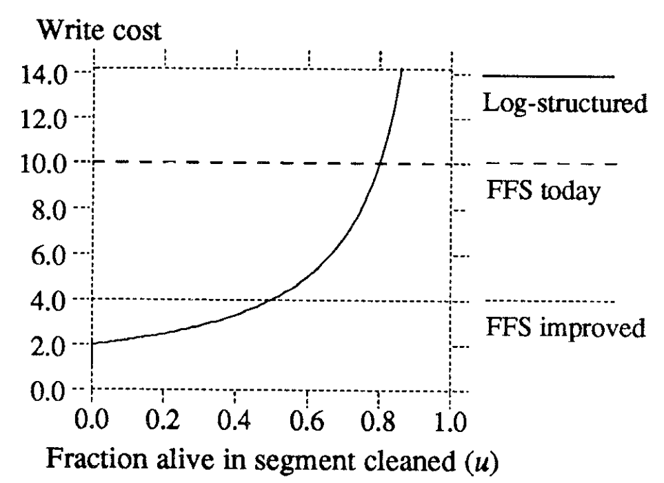
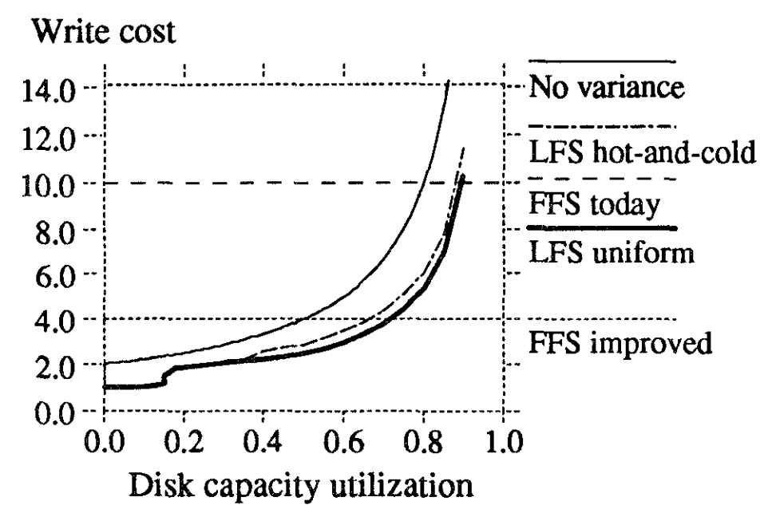
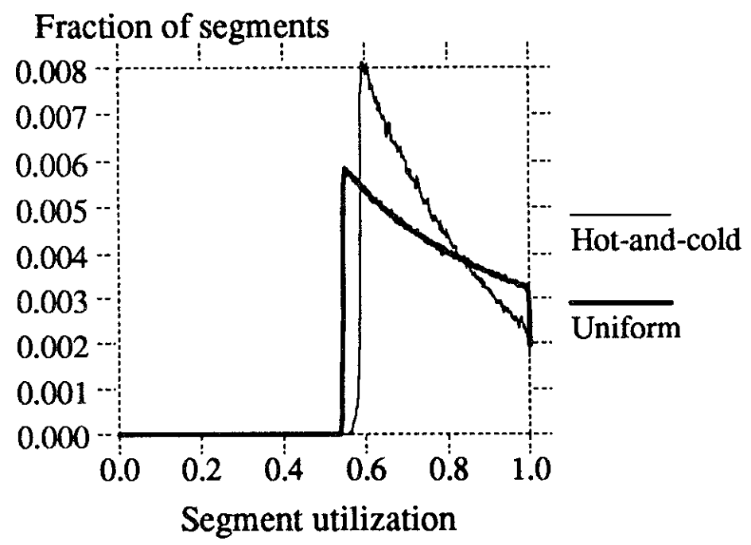
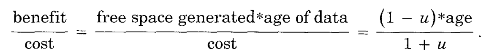
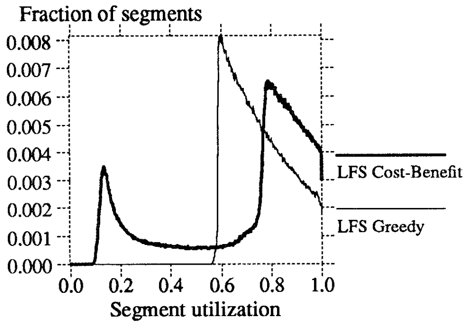
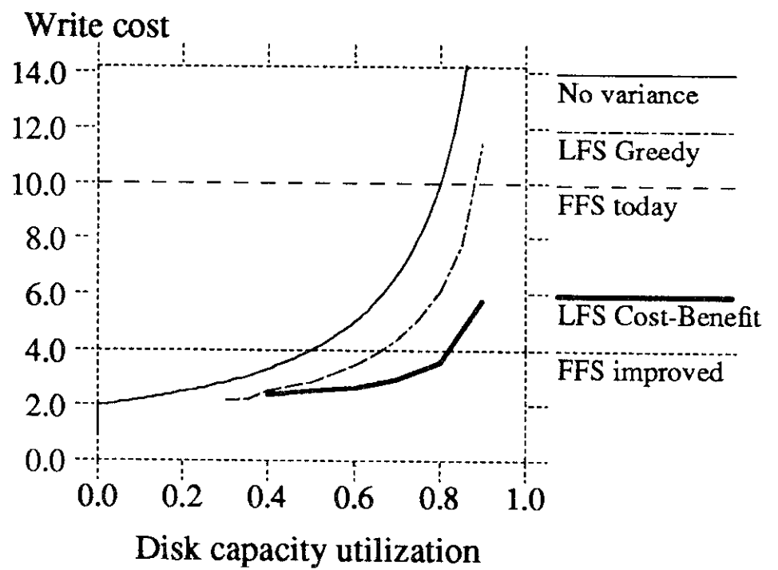

# The design and implementation of a log-structured file system

一种日志结构化文件系统的设计与实现

本文提出了一种新的磁盘存储管理技术，称为日志结构化文件系统，日志结构化文件系统以类似日志结构的顺序写入磁盘，从而加快了文件写入和崩溃恢复。**日志是磁盘上唯一的结构**；它包含索引信息，以便能够有效地从日志中读取文件。为了在磁盘上保持大的自由区域以快速写入，我们将日志分割成段，并使用段清理器压缩来自严重碎片的段的实时信息。我们提出了一系列的模拟，证明了一个基于成本和效益的简单清洁策略的效率。我们已经实现了一个名为Sprite LFS的原型日志结构文件系统；对于小文件写入，它比当前的Unix文件系统高出一个数量级，同时在读取和大写方面匹配或超过Unix性能。即使包含了清理开销，Sprite LFS也可以使用70%的磁盘带宽进行写入，而Unix文件系统通常只能使用5-10%。

## 介绍

在过去的十年里，CPU速度急剧提高，而磁盘访问时间只是缓慢提高。这一趋势很可能在未来继续下去，并将导致越来越多的应用程序成为磁盘绑定的应用程序。为了减少这个问题的影响，我们设计了一个新的磁盘存储器管理技术，称为日志结构文件系统，它使用磁盘的效率比当前文件系统高一个数量级。

日志结构化的文件系统基于这样一个假设：**文件缓存在主存中，增加内存大小将使缓存在满足读取请求[18]方面越来越有效。因此，磁盘流量将会被写操作所主导**。日志结构化的文件系统以一个称为日志的顺序结构将所有新信息写入磁盘。这种方法通过消除了几乎所有的搜索结果，显著地提高了写性能。日志的顺序性质还允许更快的崩溃恢复：当前的Unix文件系统通常必须在崩溃后扫描整个磁盘以恢复一致性，但是日志结构的文件系统只需要检查日志的最新部分。

日志记录的概念并不新鲜，而且最近的一些文件系统已经将日志作为一个辅助结构，以加速写入和崩溃恢复[8,9]。然而，这些其他系统只使用日志来进行临时存储；信息的永久家园是在磁盘上的一个传统的随机访问存储结构中。相反，日志结构的文件系统将数据永久存储在日志中：磁盘上没有其他结构。日志包含索引信息，以便能够以与当前文件系统相当的效率读回文件。

为了使日志结构的文件系统有效地运行，它必须确保总是有大量的可用空间用于写入新数据。这是设计日志结构化文件系统中最困难的挑战。在本文中，我们提出了一个基于大片段的解决方案，其中段清理过程通过压缩来自严重碎片段的实时数据，不断地再生空段。**我们使用了一个模拟器来探索不同的清理策略，并发现了一个基于成本和效益的简单但有效的算法：它将较老的、更缓慢变化的数据从较年轻的快速变化的数据中分离出来，并在清理过程中以不同的方式处理它们**。

我们已经构建了一个名为Sprite LFS的原型日志结构化文件系统，它现在作为Sprite network操作系统[17]的一部分正在生产中使用。基准测试程序表明，对于小文件，Sprite LFS的原始写入速度比Unix大一个数量级以上。即使对于其他工作负载，比如包括读取和大文件访问的工作负载，Sprite LFS在所有情况下至少和Unix一样快，除了一个（文件在随机写入后按顺序读取）。我们还测量了在生产系统中清洗的长期开销。总的来说，Sprite LFS允许磁盘大约65-75%的原始带宽用于写入新数据（其余的用于清理）。**相比之下，Unix系统只能利用磁盘的5-10%的原始带宽来写入新数据；其余的时间都花在寻找上**。

本文的其余部分分为六个部分。第二节回顾了20世纪90年代为计算机设计文件系统时遇到的问题。第3节讨论了日志结构文件系统的设计方案，并推导了Sprite LFS的结构，特别关注了清洗机制。第4节介绍了Sprite LFS的崩溃恢复系统。第5节使用基准程序和清洁开销的长期测量来评估Sprite LFS。第6节将Sprite LFS与其他文件系统进行了比较，第7节得出了结论。

## 90年代的文件系统的设计

文件系统设计由两种一般力量控制：技术——提供一组基本的构建块，工作负载——决定一组必须有效执行的操作。本节总结了正在进行的技术更改，并描述了它们对文件系统设计的影响。它还描述了影响Sprite LFS设计的工作负载，并显示了当前的文件系统如何无法处理工作负载和技术变化。

### 技术

技术的三个组成部分对于文件系统设计特别重要：处理器、磁盘和主存。**处理器**之所以重要，是因为它们的速度正以几乎指数级的速度增长，而且这种改进似乎有可能持续到20世纪90年代的大部分时间。这也给计算机系统的所有其他元素施加了压力，以使得系统不会变得不平衡。

**磁盘**技术也在迅速改进，但这些改进主要是在成本和容量方面，而不是在性能方面。磁盘性能有两个组成部分：传输带宽和访问时间。尽管这两个因素都在改善，但改进的速度比CPU的速度要慢得多。使用磁盘阵列和并行头磁盘[19]可以大大提高磁盘传输带宽，但访问时间似乎没有重大的改进（它是由难以改进的机械运动决定的）。如果一个应用程序导致了一系列由搜索分隔的小磁盘传输，那么该应用程序不太可能在未来十年内经历太大的加速，即使使用了更快的处理器。

技术的第三个组成部分是**主内存**，它的大小正在以指数级的速度增长。现代文件系统缓存最近在主存中使用的文件数据，而较大的主存使较大的文件缓存成为可能。这对文件系统行为有两个影响。首先，较大的文件缓存通过吸收更大比例的读取请求[2,18]来改变呈现给磁盘的工作负载。为了安全起见，大多数写入请求最终必须反映在磁盘上，因此磁盘流量（和磁盘性能）将越来越由写入操作所主导。

大型文件缓存的第二个影响是，**它们可以作为写缓冲区，在写入磁盘之前可以收集大量修改的块**。缓冲可以使更有效地写入块成为可能，例如，通过将它们全部写入一个单一的顺序传输中。当然，写缓冲器的缺点是会增加崩溃期间丢失的数据量。对于本文，我们将假设崩溃是罕见的，并且损失几秒或几分钟的工作时间的数据是可以接受的；对于需要更好的崩溃恢复的应用程序，非易失性RAM可用于写缓冲区

### 负载

几种不同的文件系统工作负载在计算机应用程序中很常见。在办公室和工程环境中，文件系统设计需要有效处理的工作负载是最困难的任务之一。办公室和工程应用程序往往以对小文件的访问所主导；一些研究测量的平均文件大小只有几个千字节[2,10,18,231。小文件通常会导致小的随机磁盘1/O，这些文件的创建和删除时间通常主要是对文件系统“元数据”（用于定位文件的属性和块的数据结构）的更新。

由对大型文件的顺序访问是主导的工作负载，比如在超级计算环境中发现的工作负载，也会带来有趣的问题，但对文件系统软件来不是。有许多技术可以确保这些文件按顺序排列在磁盘上，因此1/0的性能往往受到1/0和内存子系统中的带宽的限制，而不是文件分配策略。在设计一个日志结构的文件系统时，我们决定关注小文件访问的效率，并将其留给硬件设计者来提高大文件访问的带宽。幸运的是，在Sprite LFS中使用的技术对于大文件和小文件都很有效。

### 现有文件系统中存在的问题

当前的文件系统存在两个普遍的问题，这使它们难以应对20世纪90年代的技术和工作负载。**首先，它们以一种导致过多小访问的方式在磁盘周围传播信息**。例如，伯克利Unix快速文件系统（Unix FFS）[12] 在磁盘上顺序排列每个文件时非常有效，但它在物理上分离了不同的文件。此外，文件的属性（“inode”）与文件的内容分开的，包含文件名称的目录条目也是如此。**在Unix FFS中创建一个新文件至少需要5个单独的磁盘1/O**，每个磁盘之前都有一个查找：对文件属性的两种不同访问，以及对文件数据、目录数据和目录属性的一次访问。当在这样的系统中编写小文件时，只有不到5%的磁盘潜在带宽用于新数据；其余的时间都花在寻找上。

当前文件系统的第二个问题是，**它们倾向于同步写入**：应用程序必须等待写入完成，而不是在后台处理写入时继续执行写入。例如，即使Unix FFS异步写入文件数据块，文件系统元数据结构也是同步写入的。对于具有许多小文件的工作负载，磁盘流量主要由同步元数据写入所主导。同步写入将应用程序的性能与磁盘的性能结合起来，并使应用程序很难从更快的CPUS中获益。它们还破坏了文档缓存作为写入缓冲区的潜在用途。不幸的是，像NFS这样的网络文档系统[21]引入了额外的同步行为，而它以前并不存在。这简化了崩溃恢复，但降低了写入性能

在本文中，我们使用伯克利Unix快速文件系统（Unix FFS）作为当前文件系统设计的一个例子，并将其与日志结构的文件系统进行比较。之所以使用Unix FFS设计，是因为它在文献中有很好的记录，并在几个流行的Unix操作系统中使用。本节中提出的问题并不是Unix FFS所独有的，而且可以在大多数其他文件系统中找到。

## 日志结构文件系统

日志结构化文件系统的基本思想是通过在文件缓存中缓冲一系列文件系统更改，然后在单个磁盘写操作中将所有更改依次写入磁盘，从而提高写入性能。在写入操作中写入磁盘的信息包括文件数据块、属性、索引块、目录以及用于管理文件系统的几乎所有其他信息。对于包含许多小文件的工作负载，日志结构化文件系统将传统文件系统的许多小的同步随机写入转换为大型异步顺序传输，可以利用近100%的原始磁盘带宽。

尽管日志结构化文件系统的基本思想很简单，但要实现日志记录方法的潜在好处，还必须解决两个关键问题。第一个问题是如何从日志中检索信息；这是下面第3.1节的主题。第二个问题是如何管理磁盘上的可用空间，从而使大量的可用空间始终可用于写入新数据。这是一个更加困难的问题；这是第3.2-3.6节的主题。表一包含了Sprite LFS用于解决上述问题的磁盘上数据结构的摘要；这些数据结构将在本文的后面部分中详细讨论。

### 文件位置和读取

尽管术语“日志结构化”可能表明，需要进行顺序扫描才能从日志中检索信息，但在Sprite LFS中，情况并非如此。我们的目标是匹配或超过Unix FFS的读取性能。为了实现这一目标，Sprite LFS在日志中输出索引结构，以允许随机访问检索。Sprite LFS使用的基本结构与Unix FFS中使用的基本结构相同；对于每个文件，都存在一个称为inode的数据结构，它包含文件的属性（类型、所有者、权限等）。加上文件前10个块的磁盘地址；对于大于10个块的文件，inode还包含一个或多个间接块的磁盘地址，每个间接块包含更多数据或间接块的地址。**一旦找到文件的inode，在Sprite LFS和Unix FFS中读取文件所需的磁盘数量是相同的**。

在Unix FFS中，每个inode都位于磁盘上的固定位置;给定文档的标识号，简单的计算就会得到文档 inode 的磁盘地址。相比之下，精灵LFS不会将inode放在固定位置;它们被写入日志。精灵 LFS 使用称为 **inode 映射**的数据结构来维护每个 inode 的当前位置。给定文档的标识号，通过 inode 映射索引以确定 inode 的磁盘地址。inode map被划分为写入日志的块; **每个磁盘上的固定检查点区域标识所有 inode 映射块的位置**。幸运的是，inode映射足够紧凑，可以将活动部分缓存在主内存中：inode映射查找很少需要磁盘访问。

> 对于每个数据结构，该表指示 Sprite LFS 中的数据结构所服务的目的。该表还指示数据结构是存储在日志中还是存储在磁盘上的固定位置，以及在论文中详细讨论数据结构的位置。Inodes、间接块和超级块类似于具有相同名称的 Unix FFS 数据结构。 请注意，Sprite LFS 既不包含位图也不包含空闲列表。

图1显示了在不同的目录中创建两个新文件后，在Sprite LFS和Unix FFS中可能会出现的磁盘布局。**虽然这两种布局具有相同的逻辑结构，但日志结构的文件系统产生了更紧凑的安排**。因此，Sprite LFS的写性能要远远好于Unix FFS，而其读取性能也同样好。

> 图1。在Sprite LFS和Unix FFS之间的比较。此示例显示了在创建两个名为dirl/filel和dir2/file2的单块文件时由Sprite LFS和Unix FFS 吸入的修改后的磁盘块。每个系统必须为file1和flle2编写新的数据块和inode，并为包含的目录编写新的数据块和inode。Unix FFS对新信息需要10个非顺序写入（新文件的inode每个都写入两次，以方便从崩溃中恢复），而Sprite LFS在一次大写操作中执行操作。读取这两个系统中的文件将需要相同数量的磁盘访问。Sprite LFS还编写了新的inode映射块来记录新的inode位置。

### 自由空间管理：segment

日志结构化文件系统最困难的设计问题是可用空间的管理。其目标是为编写新数据维护大量的自由范围。最初，所有的可用空间都在磁盘上的一个范围内，但当日志到达磁盘的末端时，可用空间将被分割成许多与被删除或覆盖的文件相对应的小范围。

从这一点上开始，文件系统有两个选择：线程和复制。这些都如图2所示。第一种选择是将实时数据保留在原地，并通过自由区段插入日志。不幸的是，线程会导致空闲空间变得严重分散，因此不可能进行大的连续写入，而日志结构的文件系统会不比传统文件系统快。第二种选择是将实时数据从日志中复制出来，以便留下大量的空闲范围供写入。**对于本文，我们将假设实时数据以压缩的形式写入日志的头部；它也可以移动到另一个日志结构的文件系统来形成日志的层次结构，或者它可以移动到一些完全不同的文件系统或存档**。复制的缺点是它的成本，特别是对于长寿文件；在最简单的情况下，日志在磁盘上每次循环工作时，实时数据被复制回日志中，所有的长寿文件都必须在磁盘上的日志中复制。

> 日志结构化文件系统可能的空闲空间管理解决方案，在日志结构化文件系统中，可以通过复制旧块或在旧块周围线程日志来生成日志的空闲空间。图的左侧显示了线程日志方法，其中日志跳过活动块，并覆盖已被删除或覆盖的文件块。修改日志的块之间的指针，以便在崩溃恢复期间可以跟踪日志。图的右侧显示了日志空间是通过读取磁盘的一部分后，重写该部分的活动块以及新数据到新生成的空间。

Sprite LFS使用了线程和复制的组合。磁盘被划分为很大的固定大小的范围，称为段。任何给定的段总是从头到尾按顺序写入，必须在段中复制所有实时数据才能重写段。但是，日志是按逐段线程排列的；如果系统可以将长期存在的数据一起收集到段中，这样就可以跳过这些段，这样就不必重复复制数据了。段大小的选择足够大，使得读写整个段的传输时间远远大于寻找段开始的成本。这允许全段操作几乎在磁盘的全部带宽下运行，而不管访问的是哪个段。**Sprite LFS目前使用512kb或1MB**。

### 段的清洗机构

将实时数据复制到段中的过程称为段清理。在Sprite LFS中，这是一个简单的三步过程：将许多段读入内存，识别实时数据，并将实时数据写回少量的干净段。此操作完成后，读取的段被标记为干净，它们可以用于新数据或额外的清理。

作为段清理的一部分，必须能够识别每个段的哪些块是活动的，以便再次写入它们。**还必须能够识别每个块所属的文件和块在文件中的位置；此信息需要更新文件的inode以指向块的新位置**。**Sprite LFS通过将一个分段摘要块作为每个分段的一部分来解决了这两个问题**。摘要块标识在段中写入的每个信息片段；例如，对于每个文件数据块，摘要块包含该块的文件号和块号。当需要多个日志写入来填充段时，段可以包含多个段摘要块。（当文件缓存中缓冲的脏块数量不足以填充段时，就会发生部分段写入）。**分段摘要块在编写过程中造成的开销很少，而且它们在崩溃恢复（见第4节）和清理期间都很有用**。

Sprite LFS还使用分段摘要信息来区分活动块和那些已被覆盖或删除的块。一旦知道了一个块的标识，就可以通过检查文件的inode或间接块来确定其活性，以查看适当的块指针是否仍然引用了这个块。有，那么块就是活的；如果没有，那么这个块就死了。Sprite LFS通过在每个文件的inode映射条目中**保留一个版本号**来稍微优化这个检查；当文件被删除或截断到长度为零时，版本号就会增加(通过版本号判断改inode是否被删除)，版本号与inode号结合起来就会形成文件内容的唯一标识符（uid）。段摘要块为段中的每个块记录此uid；如果块的uid与清理段时当前存储在inode映射中的uid不匹配，则可以立即丢弃该块，而不检查文件的inode。

这种清理方法意味着在Sprite中没有空闲块链表或位图。除了节省内存和磁盘空间外，消除这些数据结构还简化了崩溃恢复。如果这些数据结构存在，需要其他代码来对这些结构的更改进行log并在崩溃后恢复一致性。

### segment的清洁策略

鉴于上述基本机制，必须解决四个政策问题：

(1)何时执行？一些可能的选择是在低优先级的后台连续运行，或仅在晚上运行，或仅在磁盘空间几乎耗尽时运行。
(2)一次应该清理多少个部分？段清理提供了重新组织磁盘上数据的机会；一次清理的段越多，重新排列的机会就越多。
(3)应清理哪些路段？一个显而易见的选择是最分散的选择，但这并不是最好的选择。
(4)在写入活动块时，应如何分组？一种可能性是尝试增强未来读取的局部性，例如，通过将同一目录中的文件分组到单个输出段中。**另一种可能性是根据最后一次修改时间对这些块进行排序，并将年龄相似的块分组成新的片段；我们称这种方法为年龄排序**。

到目前为止，在我们的工作中，我们还没有有条不紊地处理上述前两项政策（很简单的处理）。当清理段的数量低于阈值（通常是几十个段）时，Sprite LFS开始清理段。它一次清理几十个段，直到清理段的数量超过另一个阈值（通常是50-100个清理段）。**Sprite LFS的整体性能似乎对阈值的确切选择并不是非常敏感**。相比之下，第三个和第四个策略决策至关重要：根据我们的经验，它们是决定日志结构化文件系统性能的主要因素。第3节的其余部分将讨论我们对要清理哪些段以及如何对实时数据进行分组的分析。

我们使用一个叫做写成本（write cost）的术语来比较清洁策略。**写入成本是每个字节的新数据写入磁盘繁忙的平均时间，包括所有清理开销**。写入成本表示为如果没有清理开销，并且数据可以在其全带宽下写入，而没有查找时间或旋转延迟时所需时间的倍数。1.0的写代价是完美的：这将意味着新的数据可以在整个磁盘带宽下写入，并且没有清理开销。写入成本为10意味着实际上只有磁盘最大带宽的十分之一用于写入新数据；其余的磁盘时间用在查找、旋转延迟或清理上。

> SSD的话，不用管查找和旋转延迟，只用测量，写放大（还要计算读的数据，读也有开销，，）

**对于具有大段的日志结构文件系统，查找和旋转延迟对于写入和清理都可以忽略不计，因此写入成本是移动到磁盘的字节总数除以表示新数据的字节数**。这个成本是由已清理的段中的利用率（数据的一部分）决定的。在稳定状态下，清理器必须为每个写入的新数据段生成一个干净段。为此，它完整地读取N个段，并写出 N \* u 段的有效数据（其中u是段的利用率和 O < u < 1）。这就为新数据创建了N*（1-u）段的连续自由空间（即回收出来的空间）。因此

在上面的公式中，**我们做了一个保守的假设，即分段必须完整读取，以恢复活动块**；在实际中，只用读取有效的块，效率会更快，特别是如果利用率很低（我们没有在Sprite LFS中尝试过）。如果一个要清理的段没有活动块（u = O），那么它根本不需要被读取，写入成本是1.0。

图3显示了写成本作为u的函数。作为参考，在小文件工作负载上的Unix FFS最多利用5-10%的磁盘带宽，写入成本为10-20（具体测量请参见5.1节中的输出[16]和图8）。通过日志记录、延迟写入和磁盘请求排序，这可能可以提高25%左右的带宽[24]或写入成本为4。图3表明，清理的段利用率必须小于 0.8，以便日志结构文件系统才能优于当前的Unix FFS；利用率必须小于0.5才能优于改进的Unix FFS。

> 写成本作为一个关于u的函数。在日志结构的文件系统，写成本很大程度上取决于被清洁segment的利用率，更多的有效数据位于清理的段，更多的磁盘带宽被用于清理而不可用于编写新数据。图中还显示了两个参考点：“FFS today”，代表当前的Unix FFS；“FFS改进”，这是我们对改进的Unix FFS可能的最佳性能的估计。**Unix FFS的写成本对使用中的磁盘空间量并不敏感**。

在一个日志结构的文件系统以低成本实现高性能的关键是迫使磁盘进入**双峰段分布**，即大部分段几乎满，少数是空或几乎空，和清洁工几乎总是可以使用空段。这允许一个较高的整体磁盘容量利用率，但提供了一个较低的写成本。下面的部分描述了我们如何在Sprite LFS中实现这种双峰分布。

### 仿真结果

我们构建了一个简单的文件系统模拟器，以便我们能够在受控条件下分析不同的清洗策略。模拟器的模型并没有反映实际的文件系统使用模式（它的模型比实际情况要严格得多），但它帮助我们理解了随机访问模式和局部性的影响，这两者都可以用来降低清理成本。模拟器将文件系统建模为固定数量的4k字节文件，选择这些数量来产生特定的总体磁盘容量利用率。在每一步中，模拟器使用两种伪随机访问模式之一，用新数据覆盖其中一个文件：

- Uniform：每个文件在每个步骤中被选中的可能性相同。
- Hot-and-cold: 文件分为两组。 一组包含 10% 的文件； 它之所以被称为热，是因为它的文件 90% 的时间都被选中。 另一组称为冷； 它包含 90% 的文件，但只有 10% 的时间它们被选中。 在组内，每个文件都同样可能被选中。 这种访问模式模拟了一种简单的局部性形式

> 初始模拟结果。图3复制了标记为“FFS today”和“FFS改进”的曲线进行比较，标记为“No variance”的曲线显示了如果所有段总是具有完全相同的利用率将发生的写入代价。“LFS统一”曲线表示一个具有统一访问模式和贪婪清理略策的log结构化文件系统：**贪心策略即清理者选择使用最少的段**。“LFS冷热”曲线表示具有文件访问位置的log结构化文件系统。它使用贪婪的清洁策略，清洁者还按年龄对实时数据进行排序，然后再再次写入数据。x轴是总体磁盘容量利用率，这并不一定与被清理的段的利用率相同。

在这种方法中，总体磁盘容量利用率是恒定的，并且没有建模读取流量。模拟器运行到所有干净段都耗尽，然后模拟清洁器的操作，直到干净段的阈值数再次可用。在每次运行中，模拟器被允许运行，直到写入成本稳定，所有冷启动方差都被删除。

图4将两组模拟的结果叠加到图3的曲线上。在“LFS统一”模拟中，使用了统一的访问模式。清洁器使用了一个简单的贪婪策略，其中它总是选择使用最少利用率的段来进行清理。在写入有效数据时，清洁工没有试图重新组织数据：**实时块的写入顺序与它们出现在被清理的段中的顺序相同**（对于统一的访问模式，没有理由期望重组带来任何改进）。

> 即uniform负载的情况下，重组是没有优化效果的

即使使用统一的随机访问模式，段利用率的差异也允许大大降低比从总体磁盘容量利用率和公式(1)预测的写成本。例如，在总体磁盘容量利用率为75%时，被清理的段的平均利用率只有55%。在20%下的总体磁盘容量利用率，写成本降至2.0以下；这意味着一些清理的段根本没有活动块，因此不需要读取。

如上文所述，“LFS冷热”曲线显示了在访问模式中存在局部性时的写入成本，如上所述。这条曲线的清洗策略与“LFS统一”的相同，只是有效块在把它们再写出来之前是按年龄排序的。**这意味着长寿命（冷）数据倾向于与短寿命（热）数据分离在不同的段中**；我们认为这种方法将导致期望的段利用的双峰分布。

图4显示了令人惊讶的结果，局部性和“更好的”分组比没有局部性的系统性能更差！我们尝试改变局部性的程度（例如，95%的访问到5%的数据），并发现随着局部性的增加，性能越来越差。图5显示了产生这个非直观结果的原因。在贪婪策略下，直到一个段成为所有段中使用最少的段才会被清理。因此，每个段的利用率最终会下降到清洁阈值，包括冷段。不幸的是，在较冷的部分，利用率下降非常缓慢，所以这些部分往往会在清洁点上方停留很长时间。**图5显示，在有局部性的模拟中，比在没有局部性的模拟中，有更多的片段聚集在清洗点周围。总体结果是，冷段往往会在长时间内占用大量的自由块**。

在研究了这些数据后，我们意识到热段和冷段必须被清洁工不同地对待。**冷段中的自由空间比热段中的自由空间更有价值，因为一旦冷段被清洗干净，它将需要很长时间才能重新积累不可用的自由空间**。换句话说，一旦系统从含有冷数据的片段中回收免费块，它将在冷数据破碎之前“保留”它们很长时间，并“将它们带回来”。**相比之下，清理热段则不太有利，因为数据可能会很快死亡，空闲空间会迅速重新积累**；系统可能会延迟清理一段时间，让更多的块在当前段死亡。一个段的自由空间的值是基于该段中数据的稳定性。不幸的是，如果不知道未来的访问模式，就无法预测其稳定性。**这里使用一个假设：一个段中的数据越老，它可能保持不变的时间就越长，稳定性可以通过数据的年龄来估计**。

> 通俗来说，热段不需要被频繁清理，因为它们很可能在后续的写中变得无效。
> 而冷段中的空闲空间更有价值，一旦将冷数据重新整合到一个新的段，那么这个段会在很长一段时间都保持很高的利用率，可谓是一劳永逸。

为了验证这一理论，我们模拟了一种新的选择要清理的线段的策略。该政策根据清洗段的效益和清洗段的成本，并对每个段进行评级，并选择效益与成本之比最高的段。这个**收益有两个组成部分**：**将被回收的空闲空间的量和该空间可能保持自由的时间量**。空闲空间的量只有1-u，其中u是该段的利用率。我们使用该段中所有块的最近修改时间（即最年轻的块的年龄）来估计空间可能保持空闲的时间。**清洁的收益是通过将这两个组件相乘而形成的space-time产物**。清理段的成本为1+u（读取段的成本为一个单位，u是写回的有效数据）。结合所有这些因素，我们就会得到

我们称这一政策为成本效益策略；它允许冷段以比热段高得多的利用率被清洗。

我们在冷热访问模式下重新运行了模拟，并采用了成本效益政策和对实时数据进行了年龄排序。从图6中可以看出，成本效益政策产生了我们所希望的各部分的双峰分布。**清洗策略以约75%的利用率清洗冷段，而热段直到约15%的利用率后才进行清洗**。由于90%的写入操作是针对热文件的，所以大多数被清理的段都是热的。图7显示，与贪婪策略相比，成本效益策略降低了高达50%的写成本，**并且即使在相对较高的磁盘容量利用率下，日志结构化文件系统的性能也优于可能最好的Unix FFS**。我们模拟了许多其他程度和种类的局部性，发现随着地域性的增加，成本效益政策会变得更好。

> 具有成本效益策略的段利用率分布图。此图显示了从总体磁盘容量利用率为75%的冷热访问模式模拟中得到的段利用率的分布。“LFS成本效益”曲线显示了当使用成本效益策略选择要清理的分段时发生的分段分布，**并在重写之前按年龄进行分组**。由于这种双峰段分布，大多数被清理的段的利用率约为15%。为了进行比较，贪婪方法选择策略所产生的分布见图5中复制的“LFS贪婪”曲线。

> 写成本，包括成本效益高的策略。该图比较了贪婪策略和冷热访问模式的成本效益策略的写成本。成本效益策略明显优于g-reedy策略，特别是对于在60%以上的磁盘容量利用率。

仿真实验说服了我们在Sprite LFS中实现了成本效益方法。我们将在第5.2节中看到，Sprite LFS中实际文件系统的行为甚至比图7中预测的要好。

### 段使用情况表

为了支持成本效益清理策略，Sprite LFS维护了一个名为段使用表的数据结构。**对于每个段，该表记录段中的有效字节数以及段中任何块的最近修改时间**。段清理器在选择要清理的段时使用这两个值。这些值最初在写入段时设置，当删除文件或覆盖块时，有效字节数会减少。如果计数降为零，那么分段可以重复使用，无需清洗。段使用情况表的块被写入日志，并且块的地址存储在检查点区域中（详细信息请参见第4节）。

为了按年龄对活动块进行排序，分段摘要信息记录了写入该分段的最年轻块的年龄。目前，Sprite LFS不保留文件中每个块的修改时间；它为整个文件保留一个修改过的时间。**对于未全部修改的文件，此估计将是不正确的。我们计划修改分段摘要信息，以包括对每个块的修改时间**。

## 故障恢复

当发生系统崩溃时，在磁盘上执行的最后几个操作可能使其处于不一致的状态（例如，新文件的写入可能没有写入包含该文件的目录）；在重新启动期间，操作系统必须检查这些操作，以纠正任何不一致。在没有日志的传统Unix文件系统中，系统无法确定最后进行更改的位置，因此它必须扫描磁盘上的所有元数据结构以恢复一致性。这些扫描的成本已经很高了（在典型配置中需要几十分钟），而且随着存储系统的扩展，成本也会越来越高。

在一个具有日志结构的文件系统中，最后一次磁盘操作的位置很容易确定：它们位于日志的末尾。因此，它应该可以在崩溃后快速恢复。日志的这种好处是众所周知的，并已被用于在数据库系统、[6]和其他文件系统中[3,8,91。与许多其他日志记录系统一样，Sprite LFS使用双管齐下的方法进行恢复：检查点——定义文件系统的一致状态，先前滚动（前滚）——用于恢复自上次检查点以来写入的信息。

### 检查点

检查点是日志中所有文件系统结构都一致且完整的位置。Sprite LFS使用一个两阶段的进程来创建一个检查点。首先，它将所有修改后的信息写入日志，包括**文件数据块、间接块、inode映射表和段使用表的块**。其次，它将一个检查点区域（checkpoint region）写入到磁盘上的一个特殊的固定位置。检查点区域包含**inode映射和段使用表中所有块的地址，再加上当前时间和指向已写入的最后一个段的指针**。

在重新启动期间，Sprite LFS会读取检查点区域，并使用该信息来初始化其主内存数据结构。**为了在检查点操作期间的崩溃，实际上有两个检查点区域**，检查点操作在它们之间交替。检查点时间位于检查点区域的最后一个块中，因此如果检查点失败，时间将不会更新。**在重新启动期间，系统会读取两个检查点区域，并使用最近时间的检查点区域**。

Sprite LFS定期以及文件系统卸载或系统关闭时执行检查点。检查点之间的长时间间隔减少了编写检查点的开销，但增加了恢复期间向前滚动所需的时间；较短的检查点间隔可以了恢复时间，但增加了正常操作的成本。Sprite LFS目前使用30秒的检查点间隔，这可能太短了。定期检查点的另一种替代方法是在将给定数量的新数据写入日志后执行检查点；**这将设置恢复时间的限制，同时在文件系统没有以最大吞吐量运行时减少检查点开销**。

### 前滚

原则上，如果只需读取最新的检查点区域，并在该检查点之后丢弃日志中的任何数据，那么在崩溃后重新启动都是安全的。这将导致即时恢复，但自上次检查点以来编写的任何数据都将丢失。为了恢复尽可能多的信息，Sprite LFS扫描在最后一个检查点之后写入的日志段。此操作称为前滚操作。

> 类似 redo log

在前滚期间，Sprite LFS使用**段汇总块中的信息**来恢复最近写入的文件数据。当一个摘要块指示存在一个新的inode时，Sprite LFS将更新从检查点读取的inode映射，**以便inode映射引用inode的新副本。这将自动将文件的新数据块合并到已恢复的文件系统中**。如果发现了没有文件inode新副本的文件的数据块，则前滚代码假设磁盘上文件的新版本不完整，并忽略新的数据块。

前滚代码还可以调整从检查点读取的**段使用表**中的利用率。**自检查点以来写入的段的利用率将为零**；必须调整它们，以反映前滚后留下的实时数据。对旧段的使用也必须进行调整，以反映文件的删除和覆盖（这两者都可以通过日志中存在新的inode来识别）。

前滚过程中的最后一个问题是如何恢复目录条目和索引节点之间的一致性。每个inode包含一个引用该inode的目录条目的计数；当计数降为零时，文件将被删除。**不幸的是，当inode以新的引用计数写入日志，而包含相应目录条目的块尚未写入时，可能会发生崩溃，反之亦然**。

为了恢复目录和内部节点之间的一致性，Sprite LFS会在每个目录更改的log中输出一个特殊的记录。该记录包括操作代码（创建、链接、重命名或取消链接）、目录条目的位置（目录的i-number和目录中的位置）、目录条目的内容（名称和i-number），以及（目录）条目中命名的inode的新**引用计数**。**这些记录统称为目录操作日志**；**Sprite LFS保证每个目录操作日志条目都出现在日志中相应的目录块或inode之前**。

在前滚过程中，目录操作日志用于确保目录条目和inode之间的一致性：如果出现了日志条目，但inode和目录块没有同时写入，**则前滚会更新目录和/或inode以完成操作**。前滚操作可以导致条目从目录中添加/删除，和更新inode上的引用计数。恢复程序将更改过的目录、inode、inode映射和段使用表块附加到日志中，并写入一个新的检查点区域以包含它们。唯一无法完成的操作是创建一个新文件，但它的inode没有被写入；在这种情况下，目录条目将被删除。除了其他功能之外，目录日志还**使提供原子重命名操作变得很容易**。

目录操作日志和检查点之间的交互在Sprite LFS中引入了额外的同步问题。特别是，**每个检查点必须表示目录操作日志与日志中的inode和目录块一致的状态。这需要额外的同步，以防止在写入检查点时修改目录**。

> 查看f2fs，看它是怎么进行log-structure管理的，n2trf是纯log-structure文件系统

## 测试

我们在1989年底开始实施雪碧LFS，到1990年中期，它作为雪碧网络操作系统的一部分开始运行。自1990年秋季以来，它已被用于管理5个不同的磁盘分区，大约有30个用户用于日常计算。本文中描述的所有特性都已在Sprite LFS中实现，但尚未在生产系统中安装向前滚动。生产磁盘使用较短的检查点间隔（30秒），并在重新启动时在最后一次检查点后丢弃所有信息。

当我们开始这个项目时，我们担心日志结构的文件系统可能比传统的文件系统要复杂得多。然而，在现实中，雪碧LFS并不比Unix FFS [12]更复杂：雪碧LFS对于段清理器有额外的复杂性，但这可以通过消除Unix FFS所需的位图和布局策略来补偿；此外，精灵LFS中的检查指向和前滚代码并不比扫描Unix FFS磁盘以恢复一致性的fsck代码[131]更复杂。像事件[91或Cedar [81这样的日志记录文件系统可能比Unix FFS或Sprite LFS要复杂一些，因为它们同时包括日志记录和布局代码。

在日常使用中，Sprite LFS与Sprite FFS的文件系统没有太大的不同。原因是正在使用的机器速度不够快，无法达到当前的工作负载磁盘上限。例如，在修改后的Andrew基准测试[16]上，使用第5.1节中提供的配置，Sprite LFS仅比SunOS快20%。大部分的加速是归因于删除了Sprite LFS中的同步写入。即使使用了Unix FFS的同步写入，基准测试的CPU利用率超过80%，这限制了磁盘存储功能的变化可能导致的加速。

### 微观基准

我们使用了一组小型基准测试程序来衡量Sprite LFS的最佳情况性能，并将其与SunOS 4.0.3进行了比较，后者的文件系统基于Unix FFS。基准测试是合成的，因此它们不代表现实的工作负载，但它们说明了这两个文件系统的优缺点。用于两个系统的机器是Sun-4\260（8.7整数规格），具有32兆内存，Sun SCS13 HBA和Wren IV磁盘（1.3M字节/查看最大传输带宽，17.5毫秒平均寻道时间）。对于LFS和SunOS，该磁盘都格式化了一个拥有大约300兆可用存储空间的文件系统。SunOS使用8千字节的块大小，而Sprite LFS使用4千字节的块大小和1兆字节的段大小。在每种情况下，系统都运行多用户，但在测试期间处于静止状态。对于Sprite LFS，在基准运行期间没有发生清洁，因此测量代表最佳护理性能；清洁开销的测量请参见下面第5.2节。

## 思考

悬而未决的问题时，如何选择将要被垃圾回收的段，通常是有一个gc list，但是合适将segment加入gc链呢，需要一个阈值，阈值太大，则可能gc链太长，gc时需要排序处理的元素就越多；阈值太小，则可能gc链中的segment个数达不到gc的要求。

解决方法，通过利用率，将不同segment进行分桶，每次从利用率最低的桶获取。感觉不太行。
得通过综合指标，无效数据*年龄，来分桶。利用率和年龄的权重得测量一下（指数形式）

> 还得测量写放大曲线，不能单看segment的利用率分布，良好的分布可能是通过比较大的写放大来实现的

更多参考：

- https://www.slidestalk.com/u231/file_system_computer
- https://blog.csdn.net/Peng154/article/details/78720571
