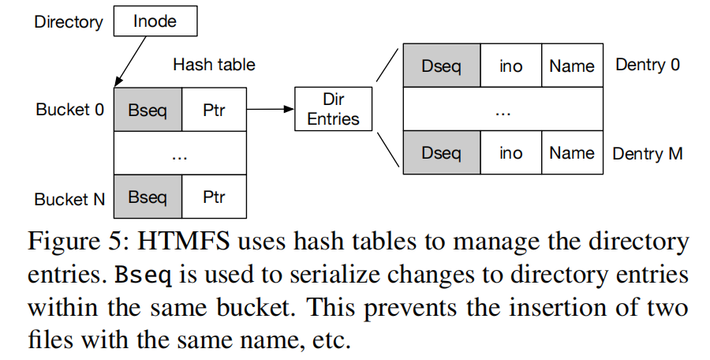
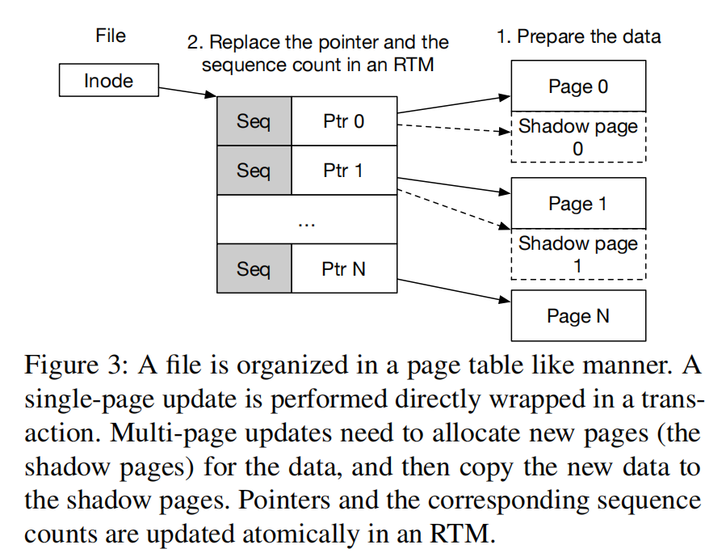
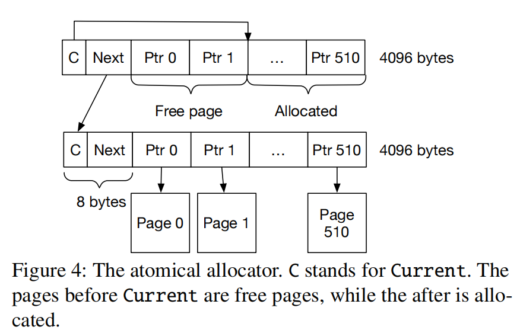

# HTMFS

在持久性内存文件系统中，硬件处理性内存可以免费提供强一致性

文件系统设计通常是**性能和一致性之间的权衡**。一种常见的做法是为了获得更好的性能而牺牲数据一致性，就好像不能同时实现高性能和强一致性一样。

在本文中，我们重新讨论了权衡，并提出了HOP，**一种轻量级的软硬件协作机制**，以提出利用硬件事务内存（HTM）在持久内存（PM）文件系统中实现高性能和强一致性的可行性。HOP的关键思想是选择在文件系统接口上可见的更新，并将它们扭曲成HTM。**HOP采用了一种类似于fs感知的乐观并发控制（OCC）的机制来克服HTM的容量限制，并利用协作锁作为回退来保证进展**。我们应用HOP来构建HTMFS，一个具有很强一致性的**用户空间PM文件系统**。在评估中，与最先进的PM文件系统相比，HTMFS提出了高达8.4×的性能改进，这表明在高性能的持久性内存中可以实现很强的一致性。

- 乐观并发控制(OCC)
- 协作锁（保证进展，防止饿死）
- 用户态文件系统

## Introduction

文件系统是许多存储服务的关键基石，如键值存储、持久存储数据的数据库和应用程序。在早期，**文件系统是为性能和松散的一致性保证而设计的**。例如，FFS [^47] 依赖于文件系统的干净unmount，以避免一致性问题。在崩溃或电源短缺的情况下，文件系统用户必须调用并等待冗长的文件系统一致性检查器，即fsck，它将检测一致性问题并试图恢复，但没有保证[26]。（掉电问题）

很多应用需要花很多努力提供强一致性。...

强一致性包括两个方面: 1）顺序一致性，通常通过inode锁；2）原子性。不过看到部分更新

> 例如，ZoFS [^16]不提供数据修改的原子性。假设一个作者在写作中途崩溃；在系统恢复后，读者可以读取部分更新的值。

然而，现有的PM文件系统仍然需要复杂和昂贵的机制，如journaling记录[6,10]和阴影分页(shadow paging)[7,64]，以实现强大的崩溃一致性。日志记录有双重写的问题，而阴影分页需要将更改传播到**原子更新**，因此它只适合专用的数据结构。写放大与它所使用的数据结构和它所写的模式有关。

以前的方法受限于CPU的原子性写入单元大小。

## 背景和动机

然而，强烈的一致性并不是免费的。Ext4使用数据日志为数据提供原子更新，因此存在如表1所示的双写问题。NOVA可以使用CoW（写时复制）方法来原子地更新数据。然而，在我们的评估部分中，CoW可能会使NOVA的性能降低60%以上。

基于这些变化，提出了几种PM文件系统，以更好地利用PM特性，以获得更好的性能。这些文件系统在PM带来的新场景中重新审视现有的崩溃一致性机制，而不是探索文件系统中根本不同的（和更有效的）崩溃一致性机制。唯一的区别是利用原子指令来提供到单个缓存行的小更新。BPFS [^13]将整个文件系统组织成一个树状结构，并通过阴影分页和原子指令提供了强大的一致性。PMFS [^18]引入了细粒度的日志记录，并结合了原子指令和可选的阴影分页，以实现数据的一致性。NOVA [^80]是一个为PM设计的日志结构化文件系统，它结合了所有的原子指令、阴影分页和日志记录，以获得很强的一致性。SoupFS [17]是对PM上的软更新技术的重新审视，并没有提供强大的一致性保证。SoupFS [^17]是对PM上的软更新技术的重新审视，并没有提供强大的一致性保证。

传统的文件系统，如Ext4和XFS，引入了直接访问模式（DAX）来绕过数据路径中的页面缓存，优化了它们在PM上运行时的性能。但是，这并不会改变这些文件系统的崩溃一致性级别。

PM的字节可寻址性和持久性也激发了一些**用户空间文件系统**，例如，Aerie [^74]、Strata [^42]、SplitFS [^37]、ZoFS [^16]和Libnvmmio [^11]。Strata和Libnvmmio使用日志来保证一致性。SplitFS依赖于底层的Ext4来进行元数据处理。ZoFS采用软更新的方法来保护数据修改，因此只提供微弱的一致性。它首先更新适当的数据，然后修改文件的大小以完成操作。但是，如果系统在更改文件大小之前崩溃，则下一个读取操作可能会读取部分更新。

虽然现有的新文件系统仍然坚持现有的崩溃一致性机制，但使性能和强一致性之间的权衡成为快速和可靠的文件系统的持久障碍。

[^74]: Haris Volos, Sanketh Nalli, Sankarlingam Panneerselvam, Venkatanathan Varadarajan, Prashant Saxena, and
Michael M. Swift. Aerie: Flexible file-system interfaces
to storage-class memory. In Proceedings of the Ninth European Conference on Computer Systems, EuroSys ’14,
pages 14:1–14:14, New York, NY, USA, 2014. ACM.
[^42]: Youngjin Kwon, Henrique Fingler, Tyler Hunt, Simon
Peter, Emmett Witchel, and Thomas Anderson. Strata:
A cross media file system. In Proceedings of the 26th
Symposium on Operating Systems Principles, pages 460–
477, 2017.
[^37]: Rohan Kadekodi, Se Kwon Lee, Sanidhya Kashyap,
Taesoo Kim, Aasheesh Kolli, and Vijay Chidambaram.
Splitfs: Reducing software overhead in file systems for
persistent memory. In Proceedings of the 27th ACM
Symposium on Operating Systems Principles, pages 494–
508, 2019.
[^11]: Jungsik Choi, Jaewan Hong, Youngjin Kwon, and Hwansoo Han. Libnvmmio: Reconstructing software IO path
with failure-atomic memory-mapped interface. In 2020
USENIX Annual Technical Conference (USENIX ATC
20), pages 1–16, 2020.

## 主要设计

目录：

按照页来管理空间，对于目录，页中划分成多个slot，哈希的方式分散不同的条目。并用序列号seq进行冲突检测。每次修改操作时需要将Seq加一。

文件:

文件的管理方式，和传统的方法类似，多级页表的方式

在分配/释放多个页的情况，使用一个临时链表存储中间状态，以便实现崩溃一致性。

## 测试

Evaluation using FxMark [52], Filebench [72], LevelDB [24], and TPC-C [15] on SQLite [70] shows that HOP outperforms state-of-the-art PM file systems,

[52] Changwoo Min, Sanidhya Kashyap, Steffen Maass, and
Taesoo Kim. Understanding manycore scalability of file
systems. In 2016 USENIX Annual Technical Conference
(USENIX ATC 16), pages 71–85, 2016.

## 参考文献

[^47]: Marshall K. McKusick, William N. Joy, Samuel J. Leffler, and Robert S. Fabry. A fast file system for unix. ACM Trans. Comput. Syst., 2(3):181–197, August 1984.
[^16]: Mingkai Dong, Heng Bu, Jifei Yi, Benchao Dong, and
Haibo Chen. Performance and protection in the zofs
user-space nvm file system. In Proceedings of the
27th ACM Symposium on Operating Systems Principles,
pages 478–493, 2019.
[^13]: Jeremy Condit, Edmund B Nightingale, Christopher
Frost, Engin Ipek, Benjamin Lee, Doug Burger, and Derrick Coetzee. Better i/o through byte-addressable, persistent memory. In Proceedings of the ACM SIGOPS
22nd symposium on Operating systems principles, pages
133–146, 2009.
[^18]: Subramanya R Dulloor, Sanjay Kumar, Anil Keshavamurthy, Philip Lantz, Dheeraj Reddy, Rajesh Sankaran,
and Jeff Jackson. System software for persistent memory. In Proceedings of the Ninth European Conference
on Computer Systems, pages 1–15, 2014.
[^80]: Jian Xu and Steven Swanson. NOVA: A log-structured
file system for hybrid volatile/non-volatile main memories. In 14th USENIX Conference on File and Storage
Technologies (FAST 16), pages 323–338, 2016.
[^17]: Mingkai Dong and Haibo Chen. Soft updates made
simple and fast on non-volatile memory. In Proceedings of the 2017 USENIX Conference on Usenix Annual
Technical Conference, USENIX ATC ’17, page 719–731.
USENIX Association, 2017.

ext4

