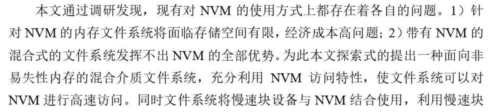
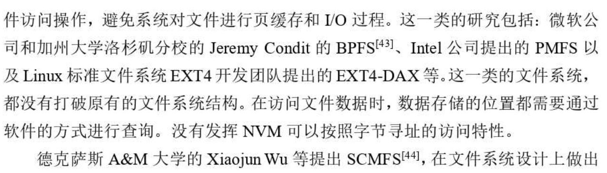
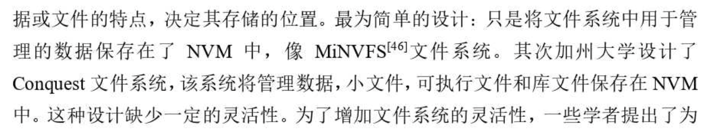
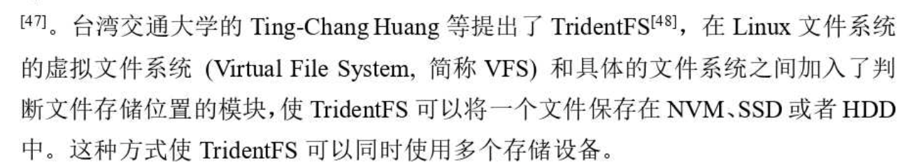

# Readme

- [1. NVM 文件系统](#1-nvm-文件系统)
  - [1.1. NOVA（fast16）](#11-novafast16)
- [2. 混合文件系统](#2-混合文件系统)
  - [2.1. 面向非易失性内存和块设备混合介质的文件系统设计与实现](#21-面向非易失性内存和块设备混合介质的文件系统设计与实现)
  - [2.2. HasFS(2019)](#22-hasfs2019)
  - [TridentFS（2014）](#tridentfs2014)
- [传统文件系统](#传统文件系统)
  - [Stabilizing and boosting I/O performance for file systems with journaling on NVMe SSD（2019）](#stabilizing-and-boosting-io-performance-for-file-systems-with-journaling-on-nvme-ssd2019)
- [3. 参考文献](#3-参考文献)

文 件 原 子 性 更 新 机 制:

常见的原子性更新机制包括 日志(journal)、写时复制、日志结构(logGstructure)等.

## 1. NVM 文件系统

### 1.1. NOVA（fast16）

一致性方式：log-structure
用journal保证元数据操作的崩溃一致性

见翻译

## 2. 混合文件系统

### 2.1. 面向非易失性内存和块设备混合介质的文件系统设计与实现

> 硕士论文

当系统中同时存在非易失性内存和块存储设备时，如何管理多种存储介质并且在不同的介质中存放文件数据，以发挥。。。特性，是具有思考价值的问题

用块存储设备扩充文件系统的存储容量

混合文件系统：

> TridentFS: a hybrid file system for non-volatile RAM, flash memory and magnetic disk

### 2.2. HasFS(2019)

<https://link.springer.com/article/10.1007/s10586-019-03023-y>

journal 是文件系统广泛使用的一种一致性机制。我们观察到周期性磁盘同步和日志的开销很高。新兴的非易失性存储器 (NVM) 可以潜在地用于减少这些开销。在本文中，我们提出了存储文件系统 (HasFS) 的混合架构，这是一种为 DRAM-NVM-DISK 架构设计的文件系统。 HasFS 用 NVM 扩展了主存，并将 NVM 视为持久页面缓存，以消除脏数据的周期性磁盘同步开销。然后我们设计了一种基于混合内存架构的高效一致性机制，以低开销提供强（元数据和数据）一致性保证。

许多基于 NVM 的文件系统使用 NVM 作为持久存储。 它们是小型存储系统的绝佳选择，例如用于个人计算机和小型存储集群的存储系统。 然而，由于容量小、成本高，NVM 尚不能作为大规模存储系统的持久存储介质。 例如，NVM 和磁盘的容量仍然存在很大差距 [16]（NVM ≈ 256 GB，磁盘 > 1 TB）。 相反，大型系统的一种实用方法是将 NVM 视为缓存和/或缓冲区。 考虑到不同存储介质的特点，我们仍然使用磁盘作为持久存储，并利用 NVM 来解决传统 DRAM-DISK 文件系统的两个瓶颈。

DRAM-DISK的主要瓶颈：

1. 由于page cache的定期频繁地将数据同步到disk
2. 用于保证崩溃一致性的journal高开销（本文不仅将NVM用于journal，还用于持久性page cache）

在 DRAM-DISK 架构中，文件系统（或操作系统）必须定期将脏页从 DRAM 同步到磁盘，以防止数据丢失，因为 DRAM 是易失性的。 在某些情况下会触发周期性同步，例如脏页率超过阈值或同步间隔达到设定的周期。 磁盘同步开销来自两个方面：首先，**脏文件被锁定**，直到同步操作完成。 其次，它消耗了大量的磁盘带宽。

日志开销很大，尤其是在日志数据模式下，它提供了元数据和数据的一致性保证。

主要设计：

NVM用于作为持久性page cache，同时用来存储journal以保证崩溃一致性。

对于元数据，HasFS 在 NVM 日志中记录脏元数据，然后将其持久存储在磁盘上，以保护元数据的一致性。 对于数据，得益于 NVM 页面缓存，HasFS 可以简单地使用类似于写时复制（lazy copy-on-write）的方法来保护数据的一致性。 HasFS 提供类似于 EXT4 的一致性保证，具有低开销的日志数据模式。

元数据日志将由一些系统事件（例如周期性日志）和一些用户行为（例如 fsync）触发。（这么说，文件系统还是需要一个DRAM的write buffer，用于缓冲写入，不知道NOVA有没有）。

当日志过程被触发时，会在 NVM 日志中创建一个新条目，并将脏数据页复制到一个新空间（lazy copy-on-write，我们将在 4.2 节讨论数据一致性），然后 这些脏页的位置将被记录到 NVM 日志中。 NVM 日志上的元数据将在检查点时提交到磁盘，类似于传统日志。

> PS：数据仍然是先journal再写到disk，存在double write的问题。没有充分利用NVM的全部功能，只是简单地将它应用到传统的文件系统，若要充分发挥NVM的性能，只能重新设计一个文件系统。若设置一个合理文件数据索引，数据可以一直保留在NVM中，直到NVM空间不足，这样可以减少SSD的写入流量同时提高性能。（ 不过触发disk flush的频率大大降低了）

**数据一致性：**

当记录脏元数据时，HasFS 对脏数据页使用**延迟写入时复制 (LCOW)**。 LCOW 类似于 COW。 不同的是，LCOW 不会在每次更新中复制页面。 相反，它会在文件系统生成新的日志条目时复制页面。 这种机制导致 NVM 上的页面有多个版本。 HasFS 将 NVM 页面缓存上的页面分为三种类型：一致页面、过期页面和活动页面。

一致页面表示可以写回磁盘而不影响文件系统一致性的页面。 换句话说，一致性页面与 NVM 日志中的任何脏元数据无关。 HasFS 以与传统 DRAM 页面缓存中的干净页面相同的方式管理一致页面。 它们可以随时被驱逐到磁盘。 **一致的页面从最后一个检查点生成或从磁盘加载**。

**活动页面是由 LCOW 生成的新页面**，是写时复制过程中的**最新版本**。 这样的页面不能移动到另一个内存位置或磁盘。 所有读取和更新请求都将发生在活动页面上。

过期页面是由 LCOW 生成的旧页面，它们是写时复制过程中的旧（但不是最新）版本页面。 它们被锁定在 NVM 页面缓存中，无法访问（包括读写）和移动到任何地方（其他内存位置或磁盘）。

当某些事件发生时将创建journal条目，例如周期性日志记录开始和 fsync。 在 NVM 日志中创建新条目分为三个步骤： (1) 找出 NVM 中的所有脏活动页面并将其类型更改为过期。 然后我们使用 clflush 和 mfence 来保证所有过期页面在它们的元数据被记录到 NVM 日志之前被持久地写入 NVM。 这些页面的后续更新将触发 LCOW。 (2) 将脏元数据和这些过期页面的位置写入条目中。 (3) 对新条目使用 clflush 和 mfence 以确保它持久地写入 NVM 日志。

> 调用fsync或者发生page周期性同步时才在journal生成一个entry。

**Checkpointing**

当日志大小达到阈值时，HasFS 将 NVM 日志提交到磁盘。 此外，内存空间不足和系统调用等一些事件也会导致检查点。 提交日志分为三个步骤： (1) 将条目中的元数据提交到磁盘。 (2) 跟踪所有最新的过期页面，并将其页面类型设置为“一致”。 (3) 回收 NVM journal中所有过期的页面、旧的一致页面和整体。

HasFS 通过日志数据模式提供类似于 EXT4 的一致性。 在日志数据模式下，EXT4会在脏元数据和数据写入原始位置之前将它们写入日志，因此它可以在系统崩溃后恢复日志中的元数据和数据。

**写过程：**

在数据写入 I/O 中，**脏数据会缓存在 DRAM 写入缓冲区中，等待刷新到 NVM**。 缓冲区提交的条件包括以下任一条件：（1）写入缓冲区已满；（2）在 NVM 日志中创建新条目。 元数据写入 IO 始终应用于 DRAM。 当journal或检查点进程被触发时，脏元数据将被刷新到 NVM 日志或磁盘。

**读操作：**

数据读取 I/O 有两条路径：一条来自 DRAM（如果目标数据页在写缓冲区中），另一条来自 NVM（如果该页缓存在 NVM 页面缓存中）。 **我们认识到 DRAM 和 NVM 的读取性能处于同一水平，因此 HasFS 在读取操作时不会在 DRAM 上缓存页面**。 同时，这种设计可以充分利用NVM的容量优势，扩展主存容量。 元数据读取 I/O 类似于传统的基于 DRAM 的文件系统，因为元数据存储在 DRAM 中。

**Fsync**

Fsync 在传统文件系统中是一项代价高昂的操作。 原因之一是 fsync 需要将脏元数据和数据同步刷新到磁盘。 受益于 NVM 页面缓存设计，HasFS 只需要在 NVM 上持久化脏页，然后在调用 fsync 时在 NVM 日志中创建一个新条目。 **在 HasFS 中 Fsync 不会导致磁盘同步，因此它比传统文件系统效率更高**。

**实现上：**

我们在EXT4中实现了写缓冲区、NVM页面管理模块和一致性机制。 NVM页面管理模块用于管理NVM上不同类型的页面。 EXT4使用JBD2来保证崩溃的一致性，但是JBD2是为磁盘设计的，不方便直接通过修改JBD2来实现我们的设计。 为了实现一致性机制，我们丢弃了 JBD2，并在内存中实现了我们的机制。 与 EXT4 类似，HasFS 的日志周期设置为 5 秒，**DRAM 写入缓冲区的大小设置为 20 MB**。

### TridentFS（2014）

non-volatile RAM, flash memory and magnetic disk 三层混合的文件系统。

TridentFS 通过将**热数据**保存在 NVRAM 中并允许从 NVRAM 中**逐出**的数据并行分布到闪存和磁盘来实现高性能。 提出了一种数据驱逐策略来确定要从 NVRAM 中驱逐的数据。

背景问题：

1. 混合文件系统缺乏灵活性，在现有的基于 NVRAM 的混合文件系统中，对存储介质的形式或大小进行了一些假设。当NVM和DISK的空间不匹配时（NVM太小），可能会导致文件系统不可用。
2. 第二个问题是**不同类型存储之间的并行性没有得到有效利用**。 现有的基于 NVRAM 的混合文件系统支持除 NVRAM 之外的单一类型的存储，因此不同类型的存储之间的并行性问题没有得到解决。 然而，除了 NVRAM 之外，管理两种类型的存储（即闪存和磁盘）需要有效地利用这两种类型的存储之间的并行性来实现高性能。

> NVM和后端存储之间的并行性不用考虑？

为了在 NVRAM 中维护热点数据，采用驱逐策略，根据数据的**频率、新近度和大小选择**要驱逐的数据。 为了有效利用闪存和磁盘之间的并行性，从 NVRAM 中清除的数据会根据运行时存储性能分配到闪存和磁盘。 存储的数据大小和性能特征也被认为可以加快数据分布。

首先，可以在 TridentFS 中**重用不同类型的现有文件系统实现（ext4 [10]、nilfs2 [11] 和 FAT）来管理 SSD 和磁盘**。其次，它适用于小型和大型 NVRAM。此外，性能结果如下。首先，在 NVRAM 中维护热数据可以实现高达 115.3% 的性能提升。其次，提议的驱逐政策优于 LRU 政策 27%。第三，由于有效地利用了闪存和磁盘之间的并行性，所提出的数据分布算法优于 RAID-0 方法和 Conquest [7] 采用的基于大小的分布方法高达 471.6% 和 82.6%，分别。第四，考虑到存储的数据大小和性能特点，所提出的数据分布算法优于贪心算法高达15.5%。

它将热数据放置在 NVRAM 中。注意，TridentFS 中的每个文件都分为元数据和文件数据，**分别评估元数据和文件数据的热度**，以确定它们是否可以存储在 NVRAM 中。例如，在元数据访问主导文件的情况下，元数据更有可能存储在 NVRAM 中而不是文件数据中。这种热/冷数据评估的分离有助于在 NVRAM 中存储更多热数据，从而使更多 I/O 活动发生在高速 NVRAM 中。

**通过平衡闪存和磁盘的服务时间来实现快速分发**。 此外，TridentFS 根据元数据/文件数据的大小和存储的性能特征分配被驱逐的元数据/文件数据。 例如，在 TridentFS 中，由于磁盘的顺序访问性能优于其随机访问性能，因此倾向于将大数据分布到磁盘上。

空间管理上，将NVM切分成一个个1KB的block。通过free list管理。

**数据淘汰：**

具体来说，当 NVRAM 空间利用率超过预定义的阈值 TH（即高水位线）时，驱逐管理器开始执行驱逐，直到 NVRAM 空间利用率下降到另一个阈值 TL（即低水位线）以下 . 在当前实现中，TH 和 TL 分别设置为 100% 和 95%。

在选择驱逐数据（即元数据或文件数据）时考虑三个因素，即新近度、频率和大小。 TridentFS 尝试在 NVRAM 中保留最近使用、经常使用和小数据。 正如之前的研究[36, 37]所指出的，频率和新近度都是表明数据热度的重要因素。 另外，size也考虑，主要是因为驱逐大尺寸的数据有助于回收大量的NVRAM空间，可以用来容纳很多小尺寸的热点数据。

> 具体看论文描述

另外根据**服务时间**分发数据到flash/disk，以充分利用并行性。

> 服务时间：数据大小/最近的吞吐

混合文件系统：

1. WangAA,KuenningG,ReiherP,PopekG.TheConquestfilesystem:betterperformancethroughadisk/persistent- RAM hybrid design. ACM Transactions on Storage 2006; 2(3):309–348.
2. MillerEL,BrandtSA,LongDDE.HeRMES:high-performancereliableMRAM-enabledstorage.HotOS’01:Pro- ceedings of the 8th Workshop on Hot Topics in Operating Systems, IEEE, Elmau, Germany, 2001; 95–99.

## 传统文件系统

### Stabilizing and boosting I/O performance for file systems with journaling on NVMe SSD（2019）

通过 NVMe SSD 上的日志功能稳定和提高文件系统的 I/O 性能

基于NVMe SSD在journal中记录随机微写速度极快，但HDD对随机微写表现不佳，使得微写速度远低于日志。 因此，通常会完成用于刷新的写回队列。 这会导致日志功能经常冻结，并随后导致严重的性能波动。

受到众所周知的事实的启发，即 HDD 对大型顺序写入的性能比随机微写入要好得多 [37]，我们的主要思想是将多个随机微写入有效地合并到内存中的连续大型写入中。 我们设计了 MIM，一种新颖的内存加速架构，如图 7 所示，其中在内存中引入了 HTMLL 数据结构以支持微写入合并。 MIM还采用了一种新颖的flush方案，可以充分发挥合并的好处，同时防止期刊过大。 此外，检查点流程经过重新设计，以保证数据的持久性。

Ceph FileStore（NVMe & SSD）

## 3. 参考文献

清华博士后的论文：chenyoumin
<https://orcid.org/0000-0003-4171-4299>
<https://orcid.org/0000-0002-6214-5390>

参考 <https://link.springer.com/article/10.1007/s10586-019-03023-y> 的相关工作

混合文件系统：
HasFS: optimizing file system consistency mechanism on NVM-based hybrid storage architecture

NVM文件系统：

[55] M. Rosenblum and J. K. Ousterhout. The design and implementation of a log-structured file system. ACM Transactions
on Computer Systems (TOCS), 10(1):26–52, 1992.

[59] P. Sehgal, S. Basu, K. Srinivasan, and K. Voruganti. An
Empirical Study of File Systems on NVM. In Proceedings
of the 2015 IEEE Symposium on Mass Storage Systems and
Technologies (MSST’15), 2015.

[60] M. Seltzer, K. Bostic, M. K. McKusick, and C. Staelin. An
implementation of a log-structured file system for UNIX. In
Proceedings of the USENIX Winter 1993 Conference Proceedings on USENIX Winter 1993 Conference Proceedings, pages
3–3. USENIX Association, 1993.

[76] Y. Zhang and S. Swanson. A Study of Application Performance with Non-Volatile Main Memory. In Proceedings of
the 2015 IEEE Symposium on Mass Storage Systems and
Technologies (MSST’15), 2015.

[44] J. Ousterhout, A. Gopalan, A. Gupta, A. Kejriwal, C. Lee,
B. Montazeri, D. Ongaro, S. J. Park, H. Qin, M. Rosenblum,
S. Rumble, R. Stutsman, and S. Yang. The RAMCloud Storage System. ACM Trans. Comput. Syst., 33(3):7:1–7:55, Aug. 2015.

[56] S. M. Rumble, A. Kejriwal, and J. Ousterhout. Log-structured
Memory for DRAM-based Storage. In Proceedings of the
12th USENIX Conference on File and Storage Technologies,
FAST ’14, pages 1–16, Santa Clara, CA, 2014. USENIX.

[20] J. Condit, E. B. Nightingale, C. Frost, E. Ipek, B. Lee,
D. Burger, and D. Coetzee. Better I/O through byteaddressable, persistent memory. In Proceedings of the ACM
SIGOPS 22nd Symposium on Operating Systems Principles,
SOSP ’09, pages 133–146, New York, NY, USA, 2009. ACM.

[21] S. R. Dulloor, S. Kumar, A. Keshavamurthy, P. Lantz,
D. Reddy, R. Sankaran, and J. Jackson. System Software for Persistent Memory. In Proceedings of the Ninth European Conference on Computer Systems, EuroSys ’14, pages
15:1–15:15, New York, NY, USA, 2014. ACM.
[49] Persistent Memory File System. https://github.com/
linux-pmfs/pmfs.

[71] M. Wilcox. Add support for NV-DIMMs to ext4. https:
//lwn.net/Articles/613384/.

[73] X. Wu and A. L. N. Reddy. SCMFS: A File System for
Storage Class Memory. In Proceedings of 2011 International
Conference for High Performance Computing, Networking,
Storage and Analysis, SC ’11, pages 39:1–39:11, New York,
NY, USA, 2011. ACM.

[66] H. Volos, S. Nalli, S. Panneerselvam, V. Varadarajan, P. Saxena, and M. M. Swift. Aerie: Flexible File-system Interfaces
to Storage-class Memory. In Proceedings of the Ninth European Conference on Computer Systems, EuroSys ’14, pages
14:1–14:14, New York, NY, USA, 2014. ACM.

[50] Linux POSIX file system test suite. https://lwn.net/Articles/
276617/.

Sweeney, A., Doucette, D., Hu, W., Anderson, C., Nishimoto, M., Peck, G.: Scalability in the XFS file system. In: Proceedings of USENIX Annual Technical Conference (ATC), vol. 15 (1996)

日志要求写两次数据：一次到日志，一次到目标位置，为了提高性能，日志文件系统通常只写日志的元数据。最近的工作提出了反向指针[17]和从耐久性中解耦排序[16]，以减少日记的开销。

[16] V. Chidambaram, T. S. Pillai, A. C. Arpaci-Dusseau, and R. H.
Arpaci-Dusseau. Optimistic crash consistency. In Proceedings
of the Twenty-Fourth ACM Symposium on Operating Systems
Principles, SOSP ’13, pages 228–243, New York, NY, USA, 2013. ACM.

[17] V. Chidambaram, T. Sharma, A. C. Arpaci-Dusseau, and R. H.
Arpaci-Dusseau. Consistency without ordering. In Proceedings of the 10th USENIX Conference on File and Storage Technologies, FAST ’12, pages 9–9, Berkeley, CA, USA, 2012.
USENIX Association.

NVM journal：

Zhang, X., Feng, D., Hua, Y., Chen, J.: Optimizing file systems with a write-efficient journaling scheme on non-volatile memory. IEEE Trans. Comput. 68(3), 402–413 (2018)

Chen, C., Yang, J., Wei, Q., Wang, C., Xue, M.: Fine-grained metadata journaling on NVM. In: Proceedings of IEEE Conference on MASS Storage Systems and Technologies (MSST), pp. 1–13 (2016)

数据放置策略：

[69] J. Wang and Y. Hu. WOLF-A Novel Reordering Write Buffer
to Boost the Performance of Log-Structured File Systems.
In Proceedings of the 1st USENIX Conference on File and
Storage Technologies, FAST ’02, pages 47–60, Monterey, CA, 2002. USENIX.

[70] W. Wang, Y. Zhao, and R. Bunt. HyLog: A High Performance
Approach to Managing Disk Layout. In Proceedings of the
3rd USENIX Conference on File and Storage Technologies,
volume 4 of FAST ’04, pages 145–158, San Francisco, CA, 2004. USENIX.

[30] C. Lee, D. Sim, J. Hwang, and S. Cho. F2FS: A New File
System for Flash Storage. In 13th USENIX Conference on File
and Storage Technologies, FAST ’15, pages 273–286, Santa
Clara, CA, Feb. 2015. USENIX Association.
