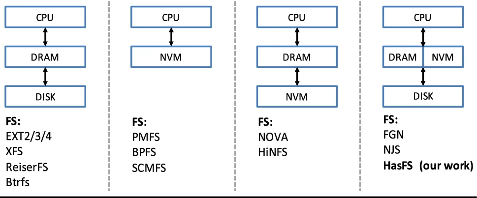

# 不同介质的文件系统

## 背景测试

1. 传统基于NVM的文件系统，没有充分利用AEP的读写特性。多个log，而且内容很小，很容易造成随机；数据索引中，每次访问还需要经过一次NVM读，小的随机读严重；没有考虑AEP同一个cacheline多次flush的问题（更多的注意点，参考NVAlloc中提到的点，尽量减少随机读、对齐减少重flush、读写对AEP进行适配（元数据clwb，数据ntstore））
2. 按page copy on write，对小数据更新不友好，在数据write方面没有充分利用AEP可字节读写的特性。AEP写带宽较低，控制写放大尤为关键。
3. 单层AEP存储，容量小，价格昂贵，不适合大规模使用，当前

log-structure在GC时会带来写放大，但这些gc的数据一方面也意味着它们是冷数据，可以直接写回SSD，减少AEP带宽消耗，为前台IO腾出更多的带宽。

DRAM缓存数据，一定程度上可以减少AEP 4KB随机访问的性能下降问题。

## 不同存储介质的文件系统

<https://link.springer.com/article/10.1007/s10586-019-03023-y>

> HasFS: optimizing file system consistency mechanism on NVM-based hybrid storage architecture

We believe that DRAM, NVM, and disk will coexist in many scenarios

已经提出了许多基于 NVRAM 的文件系统。常见的想法是将关键或热数据放在 NVRAM 中。简而言之，这些系统可以分为两类：使用 NVRAM 作为写入缓冲区和使用 NVRAM 作为存储。在 [12-15] 中，NVRAM 用于缓冲写入闪存或磁盘的数据（或元数据）。由于存储在 NVRAM 中的数据是永久性的，因此可以消除定期刷新脏数据，并且仅当 NVRAM 已满时才需要存储写入。由于存储写入量的减少，性能得到了提高。之前的几项研究没有使用 NVRAM 作为写入缓冲区，而是使用 NVRAM 作为永久存储 [16-18]。 MRAMFS [16] 和 BPFS [17] 分别提出了用于管理 MRAM 和 PCRAM 的文件系统。 MRAMFS 采用简化的元数据和在线数据压缩来有效地使用大小受限的 MRAM。 BPFS 提议对 PCRAM 中的原子和有序更新提供硬件支持。 NVRAM 还用作多个混合文件系统中的永久存储。在这些系统中，NVRAM 用于存储小数据（例如元数据）以提高性能。例如，NVMFS [6]、Conquest [7]、HeRMES [8]、PFFS [9]、MiNVFS [19] 和 FRASH [20] 将所有元数据存储在 NVRAM 中，以减少较慢的磁盘或闪存访问。由于所有元数据都被迫存储在 NVRAM 中，现有的基于 NVRAM 的文件系统无法完全消除 NVRAM 耗尽问题。最值得注意的是，在小型 NVRAM 的情况下很容易出现此问题。