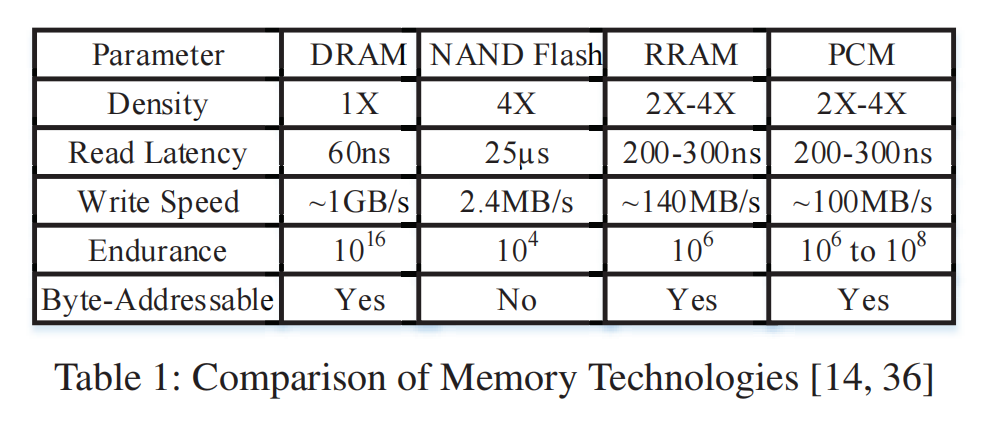
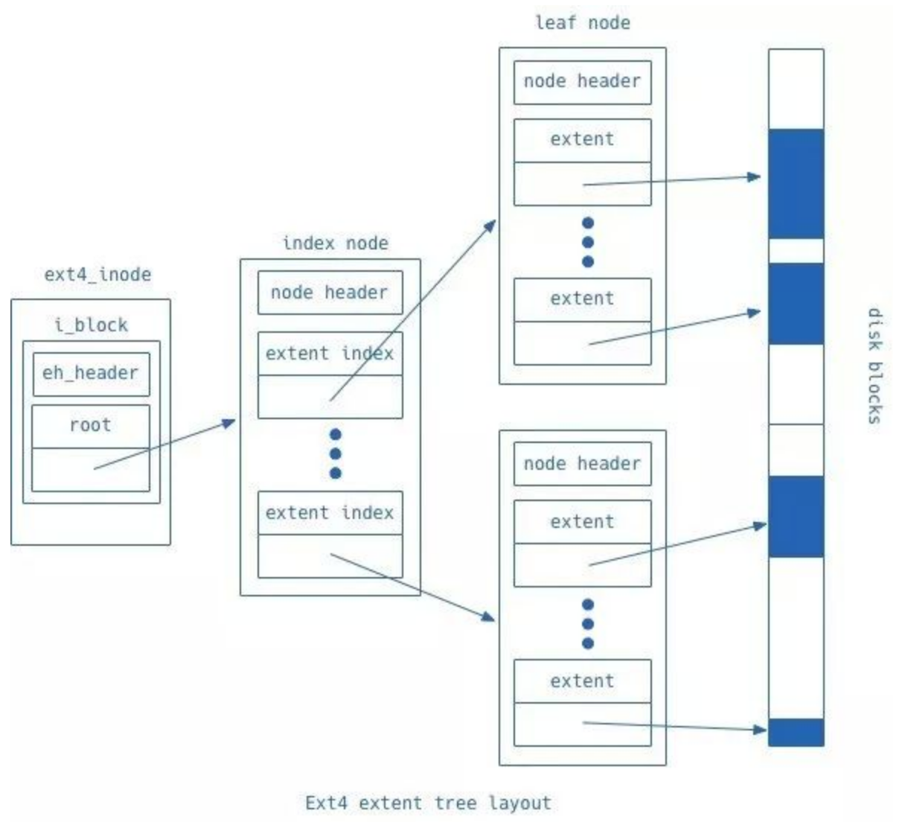
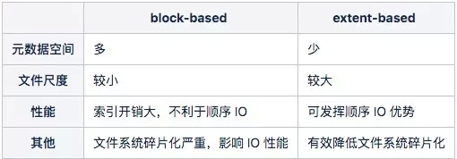

# 论文结构

- [1. 引言](#1-引言)
- [2. 背景](#2-背景)
- [存储体系结构](#存储体系结构)
  - [2.1. 价格](#21-价格)
  - [2.2. 用户态和内核态](#22-用户态和内核态)
  - [2.3. 崩溃一致性和性能之间的权衡](#23-崩溃一致性和性能之间的权衡)
  - [2.4. 写放大](#24-写放大)
  - [2.5. 混合的必要性（价格/性能/容量）](#25-混合的必要性价格性能容量)
- [背景知识](#背景知识)
  - [AEP](#aep)
- [3. 挑战](#3-挑战)
- [4. 设计点](#4-设计点)
  - [4.1. 设计目标](#41-设计目标)
  - [4.2. 负载](#42-负载)
  - [AEP特性方面](#aep特性方面)
  - [4.3. 空间管理方式](#43-空间管理方式)
  - [4.4. 索引方面](#44-索引方面)
  - [崩溃一致性技术](#崩溃一致性技术)
  - [4.5. cache](#45-cache)
- [5. 其他考虑点](#5-其他考虑点)
- [6. 实现](#6-实现)
  - [6.1. 蹦一致性上](#61-蹦一致性上)
- [7. 相关工作](#7-相关工作)

## 1. 引言

现有AEP的使用方式，是和传统SSD、HDD并列的方式，具体如何充分发挥它们的性能交给了用户来决定，用户需要花费更多的精力去决策。设计一个混合介质的文件系统，可以节约用户的使用成本。

分层：DRAM、NVM、disk，使得需要考虑三方面数据的划分：

- 元数据（大部分设计将元数据集中存放在NVM当中）
- 新写入的数据
- 读取的数据

仅仅考虑带宽、延迟、访问粒度和访问模式，并不能充分发挥AEP的潜能，还需要其他一些AEP的特性，如线程扩展性，同一地址的重复刷写等。

> 已有的工作都是基于模拟的NVM来进行实验，没有切确考虑真实NVM硬件的特性。

另外需要考虑到AEP带块并不高，与先进的SSD相比，带宽并没有很明显的优势。考虑利用设备之间的并发带宽，提高整体吞吐。比如根据当先AEP的最近吞吐情况，将一些流量强行导到SSD。

我们介绍了Strata，一个跨媒体文件系统，它利用一个存储媒体的优势来弥补另一个存储媒体的弱点

## 2. 背景

## 存储体系结构

近年来，NAND闪存帮助降低了存储和内存[30]之间历史上的高性能差距。随着存储速度的加快，其趋势是使它更靠近CPU。[^PMFS]例如，非易失性 DIMM (NVDIMM) 将存储直接连接到可扩展内存 (DDR) 接口[15、38]。 NVDIMM 因其在高额定 IOPS 下提供低延迟可预测性能的能力而越来越受欢迎 [29, 38] 但是，尽管连接到 CPU，由于 NAND [36] 的固有属性，基于 NAND 的大容量 NVDIMM 仍然作为块设备 [38] 在一个单独的地址空间。

[^PMFS]: PMFS

[15] Hybrid Memory: Bridging the Gap Between DRAM Speed and NAND Nonvolatility. http://www.micron.com/products/dram-modules/nvdimm, 2013.

### 2.1. 价格

1. 价格

### 2.2. 用户态和内核态

2. 用户态/内核态。第一个基于真实的NVM硬件和SSD的用户态文件系统

但是, 其缺陷是软件层次开销大, 无法充分利用非易失内存的优势. 具体的原因包括以下几个方面：[^shu-nvm]

- 操作系统开销：由于传统外存的延迟极高, 带宽有限, VFS 管理了一部分内存空间, 形成位于文件系统之上的缓存系统, 其将频繁访问的文件数据块、元数据块等直接放入内存, 以提升性能. 然而, 非易失内存的访问性能与 DRAM 非常接近, 因此, 在基于非易失内存的文件系统中, DRAM 缓存将不再高效. 同时, VFS 本身软件逻辑复杂, 软件开销高.**系统调用开销**。
- 非易失内存字节可寻址特性无法充分发挥。按照块来读写

[^shu-nvm]: 非易失主存的系统软件研究进展

### 2.3. 崩溃一致性和性能之间的权衡

许多现代应用程序都需要实现其文件的崩溃一致性。在过去的十年中，实现文件用户级崩溃一致性的性能成本和复杂性有所增长，但没有看到任何缓解的迹象。[^strata]
[^strata]:strata

在许多文件系统上，这些应用程序的高效崩溃一致性是困难的，而且速度很慢，因此许多应用程序为性能[^42]牺牲了正确性。

同步持久性为应用程序[38]提供了清晰的语义（例如，排序保证和崩溃恢复），但在存储设备速度较慢的假设下，它并没有被广泛使用。现代NVM存储技术允许Strata在不牺牲性能的情况下提供同步IO语义。事实上，同步语义可以加速NVM的整体IO性能。Strata会将数据写入NVM一次，而不会将其复制到DRAM缓冲区缓存中。内存复制延迟与NVM写成本[22]相当，因此消除内存复制大约有一半的写延迟。[^strata]

[^42]: Thanumalayan Sankaranarayana Pillai, Vijay Chidambaram, Ramnatthan Alagappan, Samer Al-Kiswany, Andrea C. Arpaci-Dusseau, and Remzi H. Arpaci-Dusseau. 2014. All File Systems Are Not Created Equal: On the Complexity of Crafting Crash-consistent Applications.

几十年来，计算机系统一直面临着易失性和非易失性存储之间的权衡。所有持久数据最终必须存储在非易失性介质上，如磁盘或flash，但由于这些设备只支持慢的、批量数据传输，持久数据必须临时缓冲在快速的、可字节寻址的DRAM中。不幸的是，仅驻留在易失性内存中的数据可能在崩溃或电源故障时丢失，这意味着现有存储系统在平衡这两种存储介质的使用时经常牺牲耐用性、一致性或性能[^BPFS]

BPFS利用了新的体系结构特性来提供强大的文件系统正确性保证，同时仍然受益于内存总线上的PCM的可用性。我们相信，这些架构特性的好处并不是特定于这个文件系统的——事实上，任何希望提供基于非易失性内存的保证的应用程序都需要这些特性。

### 2.4. 写放大

如5所示，许多文件系统将更新对齐到统一的块大小。

与设备级写放大一样，文件系统写放大通常是影响应用程序性能的一个主要因素，特别是对于支持高效小写的NVM设备。在NVM层使用操作日志，然后将其消化为块更新，Strata能够有效地聚合重复数据和元数据更新，显著降低文件系统的写入放大。

> 现有的文件系统并没有充分利用NVM的可字节寻址，对于数据的管理任然按照Page为单位，为了解决原子性问题，按页进行copy-on-write。对于小写任然不友好

**block 存储并不是唯一的答案**。

### 2.5. 混合的必要性（价格/性能/容量）

**现有的文件系统专门用于一种存储技术**。
现有文件系统做出适合于特定类型存储设备的权衡；没有一个文件系统适合于不同的存储介质。例如，NOVA [52]和PMFS [25]需要字节可寻址性，并将它们限制为NVM；F2FS [32]使用多头日志记录和缓冲区缓存，这在NVM上是不必要的。Strata是为了利用每个存储设备的优势和弥补弱点。相比之下，在不同的媒体上分层独立的文件系统会不必要的重复机制，如块和inode分配，并且缺乏表达层之间的api。例如，块的使用频率和碎片信息不容易在独立的文件系统中传递（5.3）。[^strata]

**文件系统写入放大**。[^strata]
如5所示，许多文件系统将更新到统一的块大小（例如，在正在使用的块位图中设置一个位将写入整个块），并且文件系统通常需要进行元数据写入来完成更新（例如，数据写入需要更新inode中的文件大小）。与设备级写放大一样，文件系统写放大通常是影响应用程序性能的一个主要因素，特别是对于支持高效小写的NVM设备。**使用NVM层的操作日志，然后进行块更新，Strata能够有效地聚合重复数据和元数据更新，显著降低文件系统的写入放大**。
（log的方式更新元数据，可以利用顺序写的性能，缺点是写放大；原地更改的方式，引入小于256B的随机写，但可以减少写放大，减轻对NVM的磨损）

> Q: 如何保证崩溃一致性，先将数据块链如，再修改大小，两个操作不能同时完成。通过log容易保证

各种介质的性能、容量和价格对比表。

- 上亚马逊查看价格
- 上intel官网查看性能延迟，容量
- SSD看三星的就行
- 还有DRAM

## 背景知识

### AEP

介绍一下AEP如何使用，clfush，fence，说明挑战点。

## 3. 挑战

**第一个挑战**是如何充分利用NVMM的高带宽和低延迟。使用NVMM引入了一种比基于磁盘的存储系统更有效的方法来保存数据。文件系统可以通过将同步写入写入NVMM来持久化同步写入，这不仅可以绕过页面缓存层，还可以从关键路径中删除磁盘访问的高延迟。然而，DRAM页面缓存仍然比NVMM具有更高的吞吐量和更低的延迟，这使得它在对磁盘层执行异步写入方面具有竞争力。

**第二个挑战**是如何协调 NVMM 的随机访问性能与磁盘和 SSD 支持的顺序访问。 在具有 NVMM 和磁盘的分层文件系统中，带宽和延迟不再是不同存储层之间的唯一区别。 与磁盘相比，NVMM 的顺序性能和随机性能之间的差距要小得多，这使得它能够吸收随机写入。 同时，**文件系统应该利用 NVMM 来最大化磁盘写入和读取的顺序性**。[^1]

## 4. 设计点

### 4.1. 设计目标

1. 快速写入。层必须支持快速、随机和小写。快速小写操作的一个重要动机是支持网络服务器应用程序，该应用程序在发出回复之前必须持久化数据。这些应用程序构成了现代云应用程序的支柱。[^strata]
2. 高效的同步行为（一致性）。今天的文件系统通过保证只响应显式的程序员操作（例如，同步、fsync、fdatasync）的持久性，从而产生了可用性和性能问题。文件系统使用各种复杂的机制（例如，延迟分配）来在设备持久性缓慢的假设下提供性能。Strata支持一个优越的、程序友好的模型，其中文件系统操作保持顺序，包括同步写，而不牺牲性能。
3. 多线程扩展性（高并发），log的并发写入
4. 管理写入放大（主要针对SSD层，减少设备磨损）。在设备和文件系统级别的写入放大对性能、磨损和QoS有一级影响。例如，包括针对EXT4和PMFS的元数据更新，或由ssd[46]中的flash翻译层引入的副本。管理写放大允许我们最小化其对性能和QoS的影响。一旦与写入快速路径解耦，管理写入放大就会变得更简单。
5. 统一接口。我们为整个底层存储层次结构中的所有设备提供了一个统一的文件系统接口。

设计要能便捷地扩展到多个SSD设备。

但还需要在易用性和安全性等方面做更多的努力，注意的是本文的大部分设计和kucofs是正交，后续工作可以借鉴kucofs的用户态-内核态的协作方式，为文件系统的易用性和安全性进行补充。

### 4.2. 负载

小写，随机写，NVM
大写，顺序写，DISK
NVM可以合并小写，然后以大块的方式写入SSD

### AEP特性方面

例如，在可缓存load和non-temporal store之间进行切换。non-temporal指令也存在部分cacheline写的性能问题，进一步阻碍了一般使用。

屏障：

编译器屏障: https://blog.51cto.com/u_14202100/5188215
处理器屏障：<https://bruceblinn.com/linuxinfo/MemoryBarriers.html>

### 4.3. 空间管理方式

log结构：

- 链式page[^NOVA]
- 环形buffer[^PMFS]

log：
log方式记录确实能减少设备的写入次数。
而且log尽量做成幂等的。方便recovery。
log需要按照cachline/256B对齐

- 校验和
- 尾部标记

许多写入操作会完成两次：一次到日志，一次到最终位置。这种方法的好处是，对日志的第一次写入可以快速完成，而不会覆盖旧数据。**但是，代价是许多写入必须执行两次。事实上，对所有文件系统数据使用这种技术的成本是如此之大，以至于大多数文件系统在默认情况下只记录元数据**。[^BPFS]

- inode结构体需要对齐。
- 考虑将元数据分离，比如inode是两百多个字节，可以把一些常用的部分分离出来，按照cacheline对齐，不常用的部分单独存放。

更多持久化log entry的方法，看PMFS。

为了能够在PMFS-Log中识别有效的条目，必须保持两个要求之一：PMFS必须将条目原子地附加到PMFS-Log，或者恢复代码必须能够检测部分写入的日志条目。一种可能的解决方案是使用两个pm障碍操作：将日志条目附加到PMFS-Log并使其持久，在日志条目中原子设置一个有效位。其他方法包括在日志条目头使用校验和[35]或者RAWL [40]，它将日志数据转换为64位单词的流，每个单词中都有一个保留的撕裂（有效）位。**然而，所有这些方法需要额外的序列化操作（双屏障）或计算（校验和，卷卷位RAWL）都有很高的开销**。在PMFS中，我们将日志条目的大小固定为一个单个（对齐的）cacheline（64字节），并利用处理器缓存层次结构中的架构保证，写入同一粗线的数据永远不会重新排序。例如，如果A和B是两个独立的8字节写入，并且按该顺序排列，那么A将始终不迟于B完成。PMFS使用日志条目头中的gen id字段作为有效标志段。在将日志项写入PMFS-Log时，gen id是最后写入，然后日志项进行持久。为了确保此方案工作，我们指示编译器不要对日志条目重新排序。

[35] V. Prabhakaran, L. N. Bairavasundaram, N. Agrawal, H. S.Gunawi, A. C. Arpaci-Dusseau, and R. H. Arpaci-Dusseau. IRON File Systems. In Proceedings of the Twentieth ACM Symposium on Operating Systems Principles, SOSP ’05,pages 206–220, 2005.
[40] H. Volos, A. J. Tack, and M. M. Swift. Mnemosyne: Lightweight Persistent Memory. In Proceedings of the Sixteenth International Conference on Architectural Support for Programming Languages and Operating Systems, ASPLOS XVI, pages 91–104, 2011.

> 思考： cache和dram之间是通过cacheline粒度交互的，写的时候，写整个cacheline，是不是就可以避免读改写了？
> 或者用一个ntstore来直接修改？

如前所述，由于journal的双重复制，大型文件数据更新的日志开销可能会高。因此，PMFS使用了一种**混合方法**，**在元数据更新的细粒度日志journal和数据更新的CoW之间进行切换**。例如，**在使用write系统调用进行多块文件数据更新时，PMFS使用CoW准备好包含新数据的页面，然后使用日志记录更新元数据**。

然而，CoW的一个悬而未决的问题是它用于大页面；例如，一个1GB的文件数据节点的CoW，即使它要写几百兆字节，也会导致显著的写放大。由于这个问题也发生在OS虚拟内存管理中，我们计划在未来探索最著名的做法（例如，将CoW的大页面分解为常规的4KB页面）。

> PM 在大数据写上进行了努力，但小写更新的写放大问题依然严重。

### 4.4. 索引方面

文件数据块的索引结构。

per-file extent trees [^extent-tree]

[^extent-tree]: Avantika Mathur, Mingming Cao, Suparna Bhattacharya, Andreas Dilger, Alex Tomas, and Laurent Vivier. 2007. The new ext4 filesystem: current status and future plans. In Proceedings of the Linux Symposium, Vol. 2. Ottawa, ON, Canada.

BPFS：使用B+树来组织
PMFS：与许多其他文件系统一样，PMFS中的元数据是使用**b树**来组织的，这是索引大量可能稀疏数据的最佳选择之一。b树用于表示inode表和inode中的数据。

block-based:( indirect block)

早期文件系统的 inode 对数据块的管理是 block-based，每次 IO 都会申请 block 进行写入，典型的 block 大小为 4KB，这就导致两个问题：

- 4KB 的数据块比较小，对于大片的写入需要频繁进行数据块申请操作，不利于发挥顺序 IO 的优势。
- inode 在基于 block 的方式下表示大文件时需要更大的元数据空间(很多indirect block)，能表示的文件大小也受到限制。

unix文件系统，inode所在块可以存放15个指针，其中前12个是直接指向数据块的，
<https://www.sans.org/blog/understanding-indirect-blocks-in-unix-file-systems/>

- 第13个指针是间接块指针。一旦文档增长到超过48K，文档系统就会抓取一个数据块并开始使用它来存储其他块指针，将inode中的第十三个块指针设置为该块的地址。块指针是 4 字节的数量，因此间接块可以存储其中的 1024 个。这意味着可以通过间接块寻址的总文档大小为**4MB**（加上inode中的直接块寻址的48K存储）。
- 一旦文档大小增长到超过 4MB + 48KB，文档系统就会开始使用双重间接块。第14个块指针指向一个数据块，该数据块包含其他间接块的地址，而其他间接块又包含构成文档内容的实际数据块的地址。这意味着我们有多达1024个间接块，而这些块又指向多达1024个数据块 - 换句话说，总共多达100万个4K块，或高达4GB的存储。
- 此时，您可能已经知道第 15 个 inode 指针是三重间接块指针。使用三级间接块，您可以为单个文档寻址高达 4TB（来自双重间接指针的 +4GB，来自间接块指针的 +4M，来自直接块指针的 +48K）。

extent-based:

在 Ext4/XFS 等更先进的文件系统设计中，inode 被设计成使用 extent-based 的方式来实现，每个 extent 不再被固定的 block 大小限制，相反它可以用来表示一段不定长的磁盘空间，如下图所示：

> 看btrfs，和ext4是怎么使用extent tree，考虑通过extent tree来优化小写的情况，并兼容冷热管理

### 崩溃一致性技术

Modern file systems and databases use one of the following three techniques to support consistency: copy-onwrite (CoW) [2, 27], journaling (or logging) [4], and log-structured updates [30, 37].
> 还可以分出第四种，某些操作，可以直接原地更新

[2] Btrfs Wiki. https://btrfs.wiki.kernel.org.
[27] J. Condit, E. B. Nightingale, C. Frost, E. Ipek, B. Lee,
D. Burger, and D. Coetzee. Better I/O Through Byteaddressable, Persistent Memory. In Proceedings of the ACM SIGOPS 22nd Symposium on Operating Systems Principles, SOSP ’09, pages 133–146, 2009.
[4] Ext4 Wiki. https://ext4.wiki.kernel.org.
[30] W. K. Josephson, L. A. Bongo, K. Li, and D. Flynn. DFS:
A File System for Virtualized Flash Storage. ACM Trans.
Storage, 6(3):14:1–14:25, Sept. 2010.
[37] M. Rosenblum and J. K. Ousterhout. The Design and Implementation of a Log-structured File System. ACM Trans.
Comput. Syst., 10(1):26–52, Feb. 1992.

基于这项研究，我们发现，与CoW（有或没有原子就地位置更新）和日志结构文件系统相比，以cacheline或64字节粒度进行Journaling（称为细粒度日志）对元数据更新的开销最少。[^PMFS]

> 然而，日志有一个缺点，**所有更新必须写入两次；一次到日志，然后到文件系统**。对于大于CoW文件系统的块大小或日志结构文件系统的段大小的更新，由于这种双复制开销和相关的写入放大，日志记录变得不那么可取。**因此，在PMFS中，我们使用原子就地更新和对（通常很小的）元数据更新的细粒度journal记录，而CoW用于文件数据更新**。我们展示了（4.2.3），与BPFS相比，PMFS在元数据一致性方面的开销要低得多。BPFS是一个pm优化的文件系统，对元数据和数据一致性[27]使用CoW和原子就地更新。
> 在PMFS中，我们使用撤消日志记录具有上述优点和简单性。然而，我们意识到撤销并不总是比重做好。**例如，如果事务创建了大量日志条目，但只修改了少量数据结构，那么重做可能比撤消执行得更好。我们计划在未来分析重做和撤销日志记录的各自好处**。

注意到的是，undo log会造成大量的随机小写，在AEP不一定是一个好的选择。

### 4.5. cache

cache上：考虑NVM和DRAM都做缓存，DRAM足够大的情况下，优先缓存到DRAM，和传统的page cache类似

KernelFS为除最后一个存储层之外的每个存储层维护LRU列表。LRU列表是任意长度的序列，逻辑4KB块号。LibFS可以通过系统调用尽可能频繁地提交访问信息。KernelFS将libfs提供的LRU列表转换为更粗粒度的列表，用于存储层具有更大的块大小（例如，NVM为1MB块，SSD为4MB块）。

在迁移一个单元后，整个单元将被修剪（通过设备TRIM命令），以使一个大的、未碎片化的存储区域可用。

## 5. 其他考虑点

可以不要page cache，将这部分工作交给用户来决定。

未来工作，多SSD的管理。

## 6. 实现

### 6.1. 蹦一致性上

参考[^kucofs];
log+checkpoint;索引都在DRAM
或者参考nova。争取每个操作只要写一次NVM log（log中加数据的指针），减少flush+fence次数

## 7. 相关工作

最近的许多工作都为新兴的非易失性存储器技术提出了专门的存储解决方案。BPFS [22]是一个用于非易失性内存的文件系统，它使用了一种优化的阴影分页技术来实现崩溃的一致性。PMFS [25]探讨了如何最好地利用现有内存硬件来有效地利用持久字节寻址内存。EXT4- DAX [1]扩展了Linux EXT4文件系统，以允许直接映射NVM，从而绕过缓冲区缓存。Aerie [50]是一个NVM文件系统，它还提供了对文件数据IO的直接访问，使用用户级别的NVM更新级租赁。与Strata不同，这些文件系统都没有提供同步持久性语义，因为它们需要系统调用来进行元数据操作。只有NOVA [52]更进一步，使用新的每inode日志结构文件系统为NVM提供同步文件系统语义，但每次操作都需要系统调用。F2FS [32]是一个ssd优化的日志结构文件系统，它对数据进行排序以减少文件系统的写放大；由于缺乏NVM，它不能提供有效的同步语义。Decibel[37]是一个块级虚拟化层，它通过观察和控制其设备请求队列来隔离访问共享ssd的租户。Strata将这些想法进行了概括，使用运行应用程序更新日志为元数据和数据IO提供直接和性能隔离的NVM访问，并为更大的SSD和HDD存储区域提供有效的支持。层还合并日志以最小化写放大，与现有系统相比，这是新的。

[^kucofs]: kucofs
[^1]: Ziggurat
[^BPFS]: BPFS
